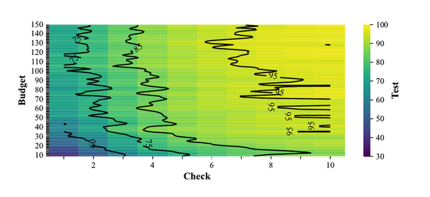

<a name="contents"></a>
# tut.md — Ten Lectures on Data-Lite AI, at the REPL

(c) 2026 Tim Menzies <timm@ieee.org>, MIT license.

# Writing Reusable Skills

This subject makes you a domain-engineering wizard. Imagine a
world where you talk to an LLM and it builds you a skill. You name
the task. The dialog layer — neural, chatty, forgiving — turns your
words into a spec.

Under the hood, something else runs. Solvers, trees, samplers,
statistics. A wide variety of tools, most of them not neural at
all. That under-the-hood layer is what this book writes.

Make it concrete. You want to buy a car. A good car accelerates
fast, drinks little fuel, and weighs little — a lighter car is
cheaper to build, so cheaper to buy. Someone offers you this one:

    Clndrs, Volume, HpX, Model, origin, Lbs-, Acc+, Mpg+
         4,    140,  92,    76,      1, 2572, 14.9,   30

What should an AI know about it? Whether the car is unusual. Whether
it is worth buying. Whether a better one exists. And if you must
buy this one, which single change helps most.

Here are ten ways an AI could help. Ask an LLM to code that second
column and you get 10K lines of glue around 1000K lines of
scikit-learn and pandas — a system you could not possibly understand.

| task                                            | skill                     |     %LOC | new LOC |
| ----------------------------------------------- | ------------------------- | -------: | ------: |
| Put 400 cars in one table; measure any gap      | remember (representation) |      45% |     150 |
| Guess the fuel use before we see the sticker    | guess (prediction)        |      17% |      57 |
| Say when "better" is real, and when it is noise | certify (certification)   |      12% |      40 |
| Decide on the spot as cars arrive one at a time | flow (streaming)          |       8% |      27 |
| Say why the bad cars are slow, or thirsty       | blame (diagnosis)         |       6% |      20 |
| Justify any verdict to a skeptical buyer        | justify (explanation)     |       4% |      13 |
| Find the best car, test-driving very few        | choose (optimization)     |       3% |      10 |
| Find the cheapest change that fixes this car    | fix (repair)              |       3% |      10 |
| Spot a strange car: a typo, or a scam           | spot (anomaly detection)  |       2% |       6 |
| Race our skills against the field's best        | race (baselining)         |       0% |       0 |
| **Totals**                                      |                           | **100%** | **333** |

Using the methods of this subject, those tasks cost the lines shown
on the right. That shape is what good domain engineering buys.
Skill i+1 reuses machinery already built for skills 1 through i.
The first skill pays for the data structure everything shares.
Certification comes early, before the experiments that need a
referee. By the end, a new skill rewires old parts; it does not add
new ones.

Do the domain engineering right and everything gets simple,
understandable, verifiable.

## Why look under the hood?

That plan runs against the current orthodoxy. Ryan Dahl (creator of
Node.js) says the era of human-written code is ending. Jensen Huang
(Nvidia CEO) advises the young against learning to code. Nobody
reads programs anymore — fly over the details, let the machine
drive.

This course disagrees, by demonstration. We read EZR: five short
Lua files, a few hundred lines each. They define a state-of-the-art
optimization and explanation tool that runs in milliseconds. EZR
summarizes data, draws explainable trees, spots anomalies, sorts
options by many goals at once, and optimizes under label budgets
that would bankrupt fancier methods.

Why read code, when a large model can write it? Large models are
extraordinary at generation. Nothing here disputes that. But big AI
is a rented telescope: powerful, and pointed by someone else. You
cannot inspect it. It changes without notice, so last year's result
may not run this year. It is wrong in confident ways, so every
output needs a human check. And each generation needs more power,
money, and cooling than the last.

The bill is already arriving. Baltes, Cheong and Treude read 1,154
developer posts about "AI slop" — Merriam-Webster's 2025 Word of the
Year — and found a tragedy of the commons: one person's productivity
gain becomes everyone else's review burden. The curl project shut
down its bug bounty because AI-written vulnerability reports ate
maintainer time and produced nothing valid.
([arXiv:2603.27249](https://arxiv.org/abs/2603.27249), local copy in
`etc/refs/`.)

There is an older warning. In 1983, Bainbridge cautioned [^bain83]
that if we automate the parts that are easy to automate, we leave
humans the residue: the hard cases, plus a monitoring role that
humans are cognitively terrible at, plus skill atrophy from not
doing the easy cases anymore. In 2024, CrowdStrike shipped a
malformed configuration file that crashed 8.5 million machines. The
file was live for 78 minutes; the bill came to $5.4 billion in
direct losses at Fortune 500 companies alone. It was skilled
programmers, reading crash dumps and boot loaders, who handled that
emergency.

So ask yourself: who do you want to be? The person we rely on in a
crisis, or the programmer sacked in the next reorganization? Tools
expertise gets you hired; judgment gets you promoted — and judgment
is only ever built by reading the details someone else was willing
to skip. That is the difference between the engineer who is called
at 3am and the one who is merely notified. Fly over the details and
you are qualified for exactly the job the machine already has. So
we go the other way: down, into a few hundred lines, until you can
say what the program does and why it is right. We train the
reviewers, not the reviewed.

[^bain83]: Bainbridge, Lisanne. "Ironies of Automation." *Automatica*, vol. 19, no. 6, 1983, pp. 775-79, https://doi.org/10.1016/0005-1098(83)90046-8.

## The work, and its wall

Look at what you will actually be paid to do. Fifty years of
software engineering research — test generation, release planning,
effort estimation, refactoring, configuration tuning, program
repair, scheduling — is almost never generation. It is **rank,
select, configure, schedule, estimate, prioritise**, over a table.

Every one of those jobs hits the same wall: **labels cost money.**
Unlabelled data is cheap. Accurate labels ("this is good", "this is
bad") are so slow and expensive that we often face a label famine:

- Human experts are slow at labelling, and get worse when rushed.
  Hours for a handful of cases.
- Historical logs are big but unreliable. In one study, 90% of
  labelled technical-debt "false positives" were themselves wrong.
- Automated labelling is crude (regex) or merely assistive (LLMs).
- Even a real oracle can be ruinous. Exhaustively exploring the
  **11** parameters of the x264 video encoder (compile each one,
  then run a large test suite) took **1,000+ hours**.

So we ask: what can you do with a few dozen evaluations, not a few
million? That is the question this course answers: **how much can
you learn from a few dozen labels?** The answer turns out to be
*most of it*. Lecture 0 shows where that number comes from, then
checks it against 17,737 real records.

## The whole course in one screen

Read a table. Name each column. Add `+` or `-` to the goals you
want to maximize or minimize. Here is a sample of such data. In
practice the goals are mostly "?", since labels are the thing we
cannot afford:

       x = controllables, observables               y = goals
    --------------------------------------      -----------------------
    d2h    Rank   OVR   PHY   Acceleration      Penalties+   Strength+
    0.02   322    82    82    71                88           94
    0.02   4      91    88    80                90           93
    ...
    0.99   5902   69    68    37                10           30
    0.99   7937   67    65    49                10           30

Pass EZR 17,737 such rows. It finds 15 rows worth labelling and
builds a model you can read:

         n   d2h Penalties+ Strength+
        15  0.34        59    75.07
         8  0.11     77.25    79.75  Rank <= 222
     ▲   5  0.07      81.6       83  |  Crossing >  79
         3  0.18        70    74.33  |  Crossing <= 79
         7  0.60     38.14    69.71  Rank >  222
         4  0.54     37.25    79.25  |  DEF >  60
     ▼   3  0.68     39.33       57  |  DEF <= 60

(Fyi: d2h is a measure of success. lower values are better.)

Three attributes matter, out of 57. And it is *fast*, which is what
happens when a model has almost nothing in it:

| step                            | time        |
| ------------------------------- | ----------- |
| read 17,737 rows                | 346 ms      |
| choose 15 rows worth labelling  | 98 ms       |
| **build the model**             | **11.9 ms** |
| score 1,024 unseen rows with it | 0.3 ms      |

How many labels is enough? For this and 127 other such problems
(from the MOOT repository [^moot]) we swept budgets from 1 to 150
and "checks" from 1 to 10, 100,000 times. One team builds a model
using some budget; another team uses that model to check related
data. Runs are scored by how much they improve things (100 = max
improvement). Above a budget of ~50 and a check of ~5, the contours
flatten at 95:

[^moot]: Menzies, T., Chen, T., Ye, Y., Ganguly, K. K., Rayegan, A., Srinivasan, S., & Lustosa, A. (2026, April). MOOT: a repository of many multi-objective optimization tasks. In Proceedings of the 23rd International Conference on Mining Software Repositories (pp. 584-589).



Fifty labels to build a model. Five or six to reuse someone else's.
Lecture 0 derives both numbers from one line of algebra, then tests
them.

The course thesis: every learner is a falsifiable bet about the
shape of your problem, and a few hundred readable lines are enough
to run the experiment yourself.

## Setup

Four steps: Lua, the code, the data, the prompt.

**1. Lua** (get the latest, 5.4):

    sudo apt install lua5.4 luajit rlwrap   # Debian, Ubuntu
    brew install lua luajit                 # macOS

Debian and Ubuntu name the binary `lua5.4`. Add a link, or the
commands below cannot find it:

    sudo ln -sf /usr/bin/lua5.4 /usr/local/bin/lua

Windows: use WSL. In PowerShell, as administrator:

    wsl --install

Reboot, set a username and password when Ubuntu first starts, then
run the Debian lines above inside it. From here on, everything in
this course happens inside that Ubuntu shell. Lua does run natively
on Windows (`scoop install lua`, or binaries from
luabinaries.sourceforge.net), but that build has no line editing at
the prompt.

**2. The code:**

    curl -fLO https://raw.githubusercontent.com/timm/src/main/ezr-lua/ezr-lua.zip
    unzip ezr-lua.zip
    cd ezr-lua
    make demo      # sanity check; three runs, each "failures: 0"

The zip holds the five `.lua` files, `play.lua`, `tut.md`, the
sample table, and the replay harness that checks every trace below.
The `curl … INSTALL.md | sh` line in the README is a different
thing: it fetches the `.lua` files alone, for embedding in your own
code, and leaves out the data this course needs.

**3. The data:**

    make players   # the 3.6MB table Lecture 0 uses
    git clone https://github.com/timm/moot ~/gits/moot
    export MOOT=$HOME/gits/moot

`make` on its own lists the rest. `make data` pulls the whole
126-table corpus, and `make all CORES=8` scores every table in it.

**4. The prompt:**

    lua -i play.lua

That last line is the one you will type a hundred times. It drops
you at an `ezr>` prompt with `the`, `Tbl`, `csv` and every other
function already in scope. `play.lua` exists only to do that: it
lifts the names out of the modules and hands you Lua's own
interactive prompt, which brings arrow keys, history and multi-line
input with it. Ctrl-D exits. Try it now:

    ezr> t = Tbl(csv())
    ezr> #t.rows          -- '#' means "length"
    398

On LuaJIT and Lua 5.1, put `=` in front of anything you want printed
(`=#t.rows`). Lua 5.2 and up print bare expressions on their own.

**If you want raw speed:** `luajit` runs this code ten to fifty
times faster than `lua`, and is worth having installed. But LuaJIT
implements Lua 5.1, so speed costs you the newer syntax. Write to
5.1 and your code runs under both:

| Avoid            | 5.4 only          | Write instead            |
|------------------|-------------------|--------------------------|
| `a // b`         | integer divide    | `math.floor(a/b)`        |
| `& \| ~ << >>`   | bitwise operators | `bit.band` etc, or avoid |
| `<const> <close>`| attributes        | plain `local`            |
| `math.type`      | integer subtype   | 5.1 has no integers      |
| `table.move`     | 5.3               | a `for` loop             |
| `string.pack`    | 5.3               | —                        |
| `utf8.*`         | 5.3               | —                        |

Two names moved, so shim them once at the top of the file:

    local unpack     = table.unpack or unpack
    local loadstring = loadstring or load

One gotcha will bite you before any of the above. In 5.4,
`print(6/2)` shows `3.0`; in LuaJIT it shows `3`. Every test that
compares printed output will differ between the two. So never print a
raw number — round it first:

    local function o(x)
      if type(x)=="number" then
        return x==math.floor(x) and string.format("%.0f",x)
                                or  string.format("%.3g",x) end
      ...

Then check both, every time:

    for lua in luajit lua5.4; do $lua l5.lua -e all; done

## Lua, and the port

Learning needs a little challenge — not a simple slide-and-forget
into your brain, but something that gives you pause to reflect. So
in this subject, you will port EZR from one language (Lua) to
another (Python), around 50 lines of code per week. Lua is a small,
Python-like language — a standard library of 9 modules, not 200.
Some people prefer Python because, unlike Lua, it comes with vast
and intricate toolkits. Other people prefer Lua for exactly that
reason.

Here is a taste: the whole random number generator, from
`ezr-lib.lua` (Park-Miller 1988). Every "random" number in this
course comes from these few lines:

```lua
Seed = 1234567891

-- Reseed with any integer; lands in 1..2^31-2.
function srand(n)
  Seed = floor(n or 1234567891) % 2147483647
  if Seed <= 0 then Seed = Seed + 2147483646 end end

-- No args: a float in [0,1). One arg n: an int in 1..n.
-- Two args: an int in lo..hi.
function rand(lo,hi,    x)
  Seed = (16807 * Seed) % 2147483647
  x = Seed / 2147483647
  if not lo then return x end
  if not hi then lo, hi = 1, lo end
  return lo + floor(x * (hi - lo + 1)) end
```

(Note the Lua idiom: names after the wide gap in an argument
list are locals, not arguments.)

Why teach in Lua? It is a language few of you know, and it is the
simplest to learn.

**It is small enough to read.** The whole toolkit is five files and
under 500 lines of code (without comments). You can hold it in your
head. That is the point of the course: you are not learning a
library, you are reading a system.

**It is fast, and it is tiny in memory** — useful when a Python
stack will not fit (an edge device, a phone, a build agent).
Measured over 128 data models, four runtimes, 512 runs, on an Apple
M4 (`REPORTcpu.md`):

| models           | runtime | total time | mean mem   | vs LuaJIT  |
| ---------------- | ------- | ---------- | ---------- | ---------- |
| small (<1k rows) | CPython | 37.5 s     | 25.7 MB    | 81x slower |
|                  | LuaJIT  | **0.46 s** | **3.3 MB** | 1x         |
| mid (1k–10k)     | CPython | 58.1 s     | 26.2 MB    | 19x slower |
|                  | LuaJIT  | **3.0 s**  | **6.3 MB** | 1x         |

**It runs everywhere.** Any Lua from 5.1 up, and LuaJIT, print
identical output — no runtime, no wheels, no virtual environment, no
GPU.

For the mid-term and final, you will debug tiny bugs in tiny Lua
scripts (and each week you will get zero-mark practice exercises in
that task). You will not be asked to WRITE Lua, but you will be
required to read it. (Aside: sure, you could use an LLM to automate
the port. But then would you learn anything? And how would you
perform in the exams?)

**Homework, standing assignment.** Reimplement this system in a
language of your choice (Python recommended), paced by the lectures:
by the end of week *k*, your program reproduces every REPL event
through that lecture's range. The RNG is a portable 10-line
Park-Miller generator (`rand` in `ezr-lib.lua`), so a correct port
prints the SAME numbers shown here — grading is diff. Match table
contents exactly; match floats to the printed precision.

## The map

The mechanics: numbered REPL events (`[1]>` onward), every one
executed against the real code by a replay harness — outputs shown
are real, never retyped. A language appendix (numbered from `[1000]>`)
teaches the Lua the sources use. Each lecture mixes lab blocks
(prompts + a check question) with woven theory, and ends with
exercises that reuse its prompts by number. One thread runs through
all ten: reasoning from small samples — what they show, what they
hide, how far to trust them.

| #                     | Lecture                          | REPL    | Ideas                                                                                                                                                         |
| --------------------- | -------------------------------- | ------- | ------------------------------------------------------------------------------------------------------------------------------------------------------------- |
| [0](#l0)              | A taste: 20 measurements         | —       | the arithmetic, and one worked scouting problem                                                                                                               |
| [1](#l1)              | Orientation & columns            | 1–16    | [SEED](#g-seed), [NOIR](#g-noir), [WEL](#g-wel), [CDF](#g-cdf), [LOG](#g-log)                                                                                 |
| [2](#l2)              | Tables, roles, forgetting        | 17–36   | [ROLE](#g-role), [STREAM](#g-stream)                                                                                                                          |
| [3](#l3)              | Distance & gap-to-heaven         | 37–53   | [MINK](#g-mink), [D2H](#g-d2h), [PARETO](#g-pareto)                                                                                                           |
| [4](#l4)              | Clustering by poles              | 54–69   | [POLE](#g-pole), [FASTMAP](#g-fastmap), [HALVE](#g-halve)                                                                                                     |
| [5](#l5)              | Discretization & cuts            | 70–84   | [CUT](#g-cut), [IG](#g-ig), [VAL](#g-val)                                                                                                                     |
| [6](#l6)              | Trees & XAI                      | 85–94   | [CART](#g-cart), [XAI](#g-xai), [PRUNE](#g-prune)                                                                                                             |
| [7](#l7)              | Active learning / acquire        | 95–108  | [ACQ](#g-acq), [AL](#g-al), [BO](#g-bo), [TS](#g-ts)                                                                                                          |
| [8](#l8)              | The holdout rig                  | 109–124 | [HOLD](#g-hold), [WIN](#g-win), [BASELINE](#g-baseline)                                                                                                       |
| [9](#l9)              | Statistics                       | 125–142 | [COHEN](#g-cohen), [KS](#g-ks), [CLIFF](#g-cliff), [SAME](#g-same), [POWER](#g-power), [SK](#g-sk)                                                            |
| [10](#l10)            | Apps, then DTLZ (advanced)       | 143–183 | [KNN](#g-knn), [ANOM](#g-anom), [NB](#g-nb), [KM](#g-km), [KPP](#g-kpp), [DTLZ](#g-dtlz), [SBSE](#g-sbse), [GA](#g-ga), [DE](#g-de), [SA](#g-sa), [LS](#g-ls) |
| [glossary](#glossary) | Acronyms & terms                 |         |                                                                                                                                                               |
| [appendix](#appendix) | Lua-101                          | 1000–   |                                                                                                                                                               |
| [refs](#refs)         | References                       |         |                                                                                                                                                               |

All ten lectures, the appendix, glossary, references, and the public
exam bank are complete; every trace is machine-verified against the
code by `etc/tut/repl.lua`.

## Exams

Questions sit at the end of each lecture. Migrated questions keep a
"(gate N)" tag: once you understand REPL prompt [N], you can answer
every question gated at or below N. Attempt (a) parts from memory
*before* opening the glossary — retrieval practice beats re-reading.
(b) parts plant exactly ONE mistake: name it, its consequence, and
the fix, in English, not code. Answers live in `tut/ans/`, released
one week behind their questions. A secret set (higher gates, no
public answers) is held outside the repo.

---
<a name="l0"></a>
# Lecture 0: A little maths to get started

No exercises here. No check questions, and no numbered events:
this lecture is me poking at data in front of you. Watch, then
decide whether the next ten lectures are worth your time.

## 0.1 An optimistic sum

All the code in this course exists to test one piece of
arithmetic. Here it is.

Sample `n` items at random. Let `p` be the chance that any one
item is good enough. The chance you found at least one good item
is

    C = 1 - (1-p)^n

Turn that around and you get the number of samples you need:

    n(p,C) = log(1-C) / log(1-p)

Now put numbers in it. Cohen says a difference below .35 times a
standard deviations is negligible — two things that close are
not worth telling apart (as we shall see this rule-of-thumb gives surpringly accurate results). 
Suppose solutions spread over one
dimension like a bell curve, so the range runs from -3 to +3
standard deviations. That is a width of 6. 


That is, according to Cohen, a negligibly small slice of
it is

    p = 0.35 / 6 = 5.83%

How many samples to be 95% sure of landing inside a slice that
size, next to the best?

    n(0.0583, 0.95) = log(0.05) / log(0.9417) = 49.8

**Fifty.** Not fifty thousand. Fifty.

Now the second sum. Team A spends those 50 samples and builds a
model. Team B takes the model and uses it to rank new candidate solutions.
Team B is no longer sampling blind — it is chopping a ranked
list. That wraps the same count in a log:

    log2(49.8) = 5.6

**Six.** Team A pays 50. Team B pays 6.

If that is even roughly right, the world is not a complicated
place. It can be read for the first time in fifty measurements,
and re-read thereafter in half a dozen. A model built from fifty
rows also fits in milliseconds, because there is almost nothing
there to fit.

The assumptions behind this math are  heroic: one dimension, a bell curve,
independent draws. Real data has none of those. So somebody
should check the number against real data.

Somebody did, at scale (yes, it was me). Look again at the contour plot in the
introduction (it is Figure 2 of
[arXiv:2606.03640](https://arxiv.org/abs/2606.03640)) which
swept budget from 1 to 150 and check from 1 to 10 over randomly
chosen tasks, 100,000 times, and scored each run on held-out
rows — exactly the team B case.

Above a budget of about 50 and a check of about 5, everything is
95 and flat. The paper's own summary: at
`(budget, check) = (50, 6)` the learner "usually achieves above
an 85% win", and "checking beyond 7 items seems not particularly
useful".

Fifty to build. Five or six to reuse. Two independent routes —
one a line of algebra, one a hundred thousand experiments —
arrive at the same pair of numbers.

## 0.2 The data

You cloned `moot` and exported `$MOOT` in the Setup section. Point
EZR at it:

    lua -i play.lua

    ezr> the.file = "$MOOT/optimize/behavior_data/all_players.csv"
    ezr> t = Tbl(csv())
    ezr> #t.rows
    17737

17,737 football players, 57 columns of ratings. Nobody wrote a
schema. Two column names end in `+`, and that is the entire
configuration: `Penalties+` and `Strength+`, both to maximise.

Let us look. Sort every row by `d2h` — its gap to the perfect
player, 0 is best — and print the top four and the bottom four,
with most of the 57 columns left out:

    d2h    Rank   OVR   PHY   Acceleration   Penalties+   Strength+
    0.02   322    82    82    71             88           94
    0.02   4      91    88    80             90           93
    0.02   222    83    81    42             88           93
    0.02   1525   76    82    54             86           92

    0.99   10108  65    68    29             11           30
    0.99   10108  65    65    15             11           30
    0.99   5902   69    68    37             10           30
    0.99   7937   67    65    49             10           30

**d2h, worked once.** _d2h_ is "distance to heaven". First,
normalization: each goal value maps to its position 0..1 inside
its own column (a bell-curve cdf; that code is `norm`, Lecture
1.6). "Heaven" is the best
position on every goal at once — here the vector (1,1), since
both goals maximize. A row's d2h is the Euclidaen distance to that
corner. Our top row, `Penalties+ 88, Strength+ 94`:

    88 -> position 0.99, gap to heaven 0.01
    94 -> position 0.98, gap to heaven 0.02
    d2h = sqrt((0.01^2 + 0.02^2) / 2) ≈ 0.02

That is, the top row is very close to heaven. 
The worst rows score 0.99: near the floor
of both columns, maximal gap on both.

Notice the `Rank` column, which is the catalogue's own opinion
of these players. Our best four are ranked 322, 4, 222 and 1525.
The catalogue is ranking something else. Your goals are not the
vendor's goals, which is why you sort by your own.

Now the problem. You are a scout. You cannot watch 17,737
players. Each one you assess costs a trip, a day, a trial.
**You can afford twenty.**

## 0.3 What twenty buys

The rig splits the pool in half, scouts 15 of the training half,
grows a tree, ranks the unseen half with it, then assesses the
top 5. Twenty assessments, total.

    ezr> the.budget = 20
    ezr> lab = t:acquirer(the.budget - the.check)
    ezr> #lab
    15

`acquirer` is an **active learner**. A passive learner takes the
data as it comes — all of it, or a blind random sample — and
never asks a question. An active learner reflects on the labels
it has seen so far to decide what to label next: label a few,
cull the pool away from the bad pole, label a few more. The
payoff is what it gets to *skip*. Most of any pool is irrelevant
to the search, and some of it is noise; a passive learner pays
to look at all of it, an active learner steers around it. That
is the whole bet of this course: reflection lets you reach a
solution on far less data than passive learning needs.

Score it. `win` is the percent of the gap between the median
and best known results that you
close. 100 means you
found the best of 17,737. 0 means you did no better than picking
from the middle.

**Worked once:** in this pool the best d2h is 0.02 and the
median is 0.54. Suppose a scouting run returns a player at
d2h = 0.07:

    win = 100 * (1 - (0.07 - 0.02) / (0.54 - 0.02)) ≈ 90

Ninety percent of the median-to-best gap, closed. A returned
median player scores 0; worse than median goes negative.

Twenty repeats, on the full pool; every random stream derives
from the default seed (`the.seed + j`, j = 1..20, the same idiom
as event `[118]`):

|          | our 20   | random 20 |
| -------- | -------- | --------- |
| worst    | 36.8     | 35.0      |
| 25th     | 71.3     | 67.4      |
| median   | 84.8     | 72.4      |
| 75th     | 93.0     | 78.9      |
| **mean** | **80.0** | **70.4**  |

Mean gap **+9.6**, and the three-test referee of Lecture 9 calls
that gap real, not noise. Read the worst row too: some single
runs lose to random. The averages favour us; no single run is
guaranteed.

## 0.4 Where the fifty went

Now check the arithmetic from 0.1. Sweep the budget, twenty
repeats per cell, all streams from the default seed:

| measurements | ours     | random   |
| ------------ | -------- | -------- |
| 12           | 68.0     | 56.5     |
| **20**       | **80.0** | 70.4     |
| 30           | 91.1     | 68.3     |
| **50**       | 83.6     | **79.6** |
| 80           | 94.6     | 87.9     |

Read the two bold numbers. According to the (albeit optimistic)
assumptions shown at the start of this lecture, blind sampling
should need about fifty measurements to land near the best. And
here random sampling needs **50** measurements to reach a win of
79.6 — on data that honours none of those assumptions.

Our method reaches 80.0 with **20**. That matches random's
fifty, for 2.5x fewer trips. So not _log2(50)=6_ as we might
have hoped, but still much less than 50. (Twenty repeats per
cell leaves visible noise — see the wobble at 30 and 50. The
trend, not any one cell, is the claim.)

That is the whole course in one table. The arithmetic prices
reading the world blind. Everything else in these ten lectures
is machinery for reading it with your eyes open.

## 0.5 Why, in one screen

> "If you cannot — in the long run — tell everyone what you have been doing, your doing has been worthless."   
-- Erwin Schrödinger

A scout who returns with a name and no reason gets sent back
out. So print the model:

    ezr> Tree(t, lab):show(t)
       
          n   d2hPenalties+Strength+
          15  0.34       59    75.07
           8  0.11    77.25    79.75  Rank <= 222
       ▲   5  0.07     81.6       83  |  Crossing >  79
           3  0.18       70    74.33  |  Crossing <= 79
           7  0.60    38.14    69.71  Rank >  222
           4  0.54    37.25    79.25  |  DEF >  60
       ▼   3  0.68    39.33       57  |  DEF <= 60

This is the tree from the introduction. Now you have seen it
earned. Read the best line (marked with ▲):
**if Rank <= 222 and Crossing > 79**, you are in the best group:
penalties 81.6, strength 83. The ▼ line is the group to avoid.

Three attributes out of 57. Short enough to put in a ticket,
argue about in a meeting, and hand to a scout who has never heard
of this course. Random sampling cannot do this. It returns a
winner and no reason, and for anything audited — money, health,
safety — an unexplainable pick is not shippable at any accuracy.

Three out of 57 is not luck either. Here we are working 127 data sets from MOOT.
The "win" number if how well Figure 3 of that same paper
counts the attributes these trees use across 120+ tasks offering
anywhere from a few dozen to over a thousand. The trees stay
**under ten, throughout**, and the win score does not fall as
the ignored columns pile up.

## 0.6 The tree is also a plan

The same seven lines answer three different jobs.

**Prediction.** Drop an unseen player down the tree and read the
leaf. No assessment, no cost.

    ezr> tr = Tree(t, lab)
    ezr> tr:leaf(t, t.rows[999])

**Selection.** Rank the 1,009 unseen players by their leaf, then
pay to assess only the top five.

    ezr> top = slice(keysort(rest, function(r)
                  return tr:leaf(t, r) end), 1, the.check)
    ezr> show(t:disty(keysort(top, t:Y())[1]))
    0.11

Best found, 0.11 from perfect. The true best in the pool is
0.04. Five assessments.

**Planning.** The tree says which knob to turn. A high-ranked
player with Crossing 75 is one branch away from the best group:
train crossing, not defence. Team A paid 15 to build this. Team
B pays 5 to use it — the six from 0.1, near enough.

## 0.7 Not one lucky table

    $ make all CORES=8
    126 tables, 8 at a time ...
    126 rows -> results.tsv

**Seven seconds.** Software configuration, hyper-parameter
tuning, effort estimation, health, finance, sales, systems.

In support of the above maths,
across all 126 tables and six budgets, a simple
random search does
surprisingly well (ties 26% of the time). We
can do better than than (see the "active elarning" described below
that wins 53% (over half) the time.  But our message here is not "active elarning is great"
but "surprisingly simple methods can be surprisingly effective" and
"why don't we routinely try them"?

## 0.8 The scale question

Assessing 17,737 players and picking a defensible best took
**0.4 seconds** on a laptop. No GPU, no cloud account, no
vendor, no per-token bill. The data never left the building.

That number sits oddly beside the going rate for AI: trillions
of parameters, hundreds of millions of dollars of compute. For
generating text and images, that price is real.

But look at what we actually ask AI to do. Fifty years of
search-based software engineering, from the founding paper of
1976 to the LLM hybrids of 2026, covers roughly this list:

| era       | what people wanted                                                                                                                                                         | how they got it                                              |
| --------- | -------------------------------------------------------------------------------------------------------------------------------------------------------------------------- | ------------------------------------------------------------ |
| 1976–1998 | test data, module boundaries                                                                                                                                               | direct search, hill climbing                                 |
| 1998–2011 | release planning, scheduling, test priority, program repair, effort estimation                                                                                             | genetic algorithms and programming, simulated annealing      |
| 2007–2024 | test-suite minimisation, module clustering, refactoring at 15 objectives, code smells, fairness, self-driving and CPS test selection, API fuzzing, microservice extraction | Pareto evolution: NSGA-II, NSGA-III, IBEA, MOEA/D, MOSA, MIO |
| 2015–2019 | cheap configuration and model tuning                                                                                                                                       | **active learning, random projection**                       |
| 2024–2026 | quantum test optimisation, LLM routing, LLM-driven testing, budget-aware portfolios                                                                                        | hybrids                                                      |

Generate a paragraph? Almost none of it. Every task on that list
is the rank-select-configure list from the introduction — work
over a table, and the shape this course fits.

So LLMs let us do some NEW things. What about everything elese we need to do?
Why not combine LLM's dialog generation (whihc is impressive) with some very simple under-the-hood tools?


Lets do tthat. Ten lectures, five files. Every number above is reproducible
from the code you already have.

Lecture 1 starts where all of these results start: a column that
knows its own kind, from its name, before it has seen a single
value.

---
<a name="l1"></a>
# Lecture 1: Orientation & columns

**Words to watch for:** [SEED](#g-seed), [NOIR](#g-noir), [WEL](#g-wel), [ENT](#g-ent), [CDF](#g-cdf), [LOG](#g-log).

You cannot reason about data you have not summarized. This lecture
opens the toolkit's front door: read a CSV into a table, let each
column decide whether it is a number or a symbol from its own name,
and watch four one-line summaries — center, spread, and a
cumulative-position score — fall out of a handful of lines. Nothing
here is deep. Everything here is load-bearing: every later lecture
stands on these columns.

**Where this bites.** A 2020 survey of data scientists (Anaconda,
*State of Data Science*) put ~45% of working time on data
loading and cleaning, before any modeling. The cheapest bug in the
building is a column read as the wrong type — a ZIP code averaged, a
label summed. So the first design decision in this code is: a column
knows its own kind, from its name, before it sees a single value.

## 1.1 Settings live in one table

Every knob lives in `the`, parsed once from the help string. Reading
`the.seed` before any random call, and reseeding from it, is how a
run becomes reproducible — the whole point of the homework diff.

    the = The(help)      -- in ezr-lib.lua
    function srand(n) Seed = floor(n or 1234567891) % 2147483647 ...

```lua
[1]> srand(the.seed);
[2]> the.seed
1234567891
[3]> the.file
auto93.csv
```

> **[NOIR](#g-noir) — the scales of measurement.** Stevens (1946) split data
> into Nominal, Ordinal, Interval, Ratio. This code keeps the
> cut that matters for arithmetic: symbols (Nominal — a mode, a
> count) versus numbers (Ratio — a mean, a spread). A column's role
> is fixed before data arrives, so no symbol is ever averaged.

> **[SEED](#g-seed) — the experimental method for random code.** A
> stochastic algorithm makes random choices, so one run proves
> nothing: rerun it and the answer moves. The fix is two rules.
> *Fix the seed to reproduce:* the same seed gives the same random
> stream, so any result — and any bug — can be replayed exactly, on
> any machine. *Vary the seed to generalize:* claims come from 20+
> runs under different seeds, reported as a distribution, never from
> one lucky run. Every experiment in this course does both:
> `srand(the.seed)` opens each run, and repeats derive their streams
> from it (`the.seed + j`). The stream itself comes from the
> ten-line Park-Miller generator you read in the introduction —
> `Seed = (16807 * Seed) % 2147483647` — the same numbers under any
> Lua, any OS, and any correct port. Lose the seed and you lose the
> experiment.

**Check.** After `[1]`, why does `the.seed` still print the same
number on your machine as on mine? (What did `[1]` guarantee?)

## 1.2 Read a table; row 1 is the header

`Tbl` folds a CSV stream into fresh columns. The first row names the
columns; every later row is coerced cell-by-cell and summarized.

```lua
function Tbl(src)
  src = iter(src)
  return adds(src, new(TBL, {rows={}, mid=nil,
                             cols=Cols(src())})) end
```

```lua
[4]> t = Tbl(csv())
[5]> #t.rows
398
[6]> show(t.cols.names)
{Clndrs Volume HpX Model origin Lbs- Acc+ Mpg+}
```

Read the header: 398 cars, eight columns. The names carry meaning we
decode next.

**Check.** `[5]` counts rows *after* the header. If the file has 399
lines, why does `#t.rows` print 398?

## 1.3 Roles are read from the names

A trailing `+` or `-` marks a goal (maximize / minimize); `!` marks a
class; an `X` suffix means "ignore"; anything else is an ordinary
input feature. `Cols` sorts the header into `x` (inputs) and `y`
(goals) once, so no later code re-parses names.

```lua
if s:find"!$" then klass = all[at]
elseif s:find"[+-]$" then y[#y+1] = all[at]
elseif s:sub(-1) ~= "X" then x[#x+1] = all[at] end
```

```lua
[7]> show(map(t.cols.y, function(c) return c.name end))
{Lbs- Acc+ Mpg+}
[8]> show(map(t.cols.x, function(c) return c.name end))
{Clndrs Volume Model origin}
```

Three goals, and they conflict: a car cannot always be light, quick,
AND economical. Holding several goals at once is the whole problem of
Lectures 3 and 10. Note `HpX` is absent from both lists — its `X`
suffix says "ignore me."

**Check.** From `[7]`/`[8]`, which columns would a change to `Mpg+`'s
name (say, to `MpgX`) move, and into which list?

## 1.4 A Num summarises a numeric column, in one pass

`NUM.add` keeps a running mean and a running sum-of-squared-deviations
with no stored list — Welford's method. `mid` returns the mean; `div`
the standard deviation.

```lua
function NUM.add(i,v,inc,   d)
  i.n = i.n + inc; d = v - i.mu
  i.mu = i.mu + inc * d / i.n
  i.m2 = i.m2 + inc * d * (v - i.mu); return v end
```

```lua
[9]> n = adds{2,4,4,4,5,5,7,9}
[10]> show{mu=n:mid(), sd=round(n:div())}
{:mu 5 :sd 2.14}
```

> **[WEL](#g-wel) — Welford's online variance.** Welford (1962) computes
> variance in one pass, updating mean and `m2` per value, never
> storing the data. It matters here twice: streaming tables that
> never hold history, and the forgetting trick of Lecture 2, where
> the same recurrence run backwards *removes* a row.

**Check.** `[10]` shows sd ≈ 2.14 for those eight numbers without a
second pass over them. Which field carries the information a second
pass would need, and what does `add` do to it each call?

## 1.5 A Sym summarises a symbolic column

Symbols cannot be averaged. `SYM.mid` returns the mode (commonest
value); `SYM.div` returns entropy — the spread of a distribution with
no arithmetic mean.

```lua
[11]> s = adds({"a","a","a","b","b","c"}, Sym())
[12]> s:mid()
a
[13]> round(s:div())
1.46
```

> **[ENT](#g-ent) — Shannon entropy.** Shannon (1948) measures a symbol
> distribution's disorder as −Σ p·log₂p, in bits. Here it is a
> symbol column's "spread," standing in for the standard deviation a
> mode cannot supply. A pure column scores 0; a uniform one scores
> log₂(k). Lecture 5 minimizes it to find good splits.

**Check.** Three `a`, two `b`, one `c` gives entropy ≈ 1.46 bits.
Without recomputing, will adding a fourth `a` raise or lower it, and
why?

## 1.6 norm maps a value to its position, 0..1

To compare a weight against an acceleration you first put both on a
common 0..1 scale. `NUM.norm` pushes a value through a logistic
squashing of its z-score — a smooth cumulative-position score that
never quite hits 0 or 1 and shrugs off outliers (the z is clamped to
±3).

```lua
function NUM.norm(i,v,   z)
  z = (v - i.mu) / (i:div() + TINY)
  return 1 / (1 + exp(-1.702 * max(-3, min(3, z)))) end
```

```lua
[14]> round(n:norm(2))
0.08
[15]> round(n:norm(5))
0.5
[16]> round(n:norm(9))
0.96
```

The mean (5) lands at 0.5, low values near 0, high near 1.

**PDF versus CDF.** Two pictures of one distribution. The *pdf*
(probability density) says how often each value occurs: for a
bell curve, common in the middle, rare in the tails. The *cdf*
(cumulative distribution) is the running sum of the pdf: the
**fraction of the population at or below x**. A pdf's y-axis is
relative frequency (peak ≈ 0.4 for a unit bell curve); a cdf's
y-axis always runs 0 to 1, and always passes through 0.5 at the
median. `norm` returns the cdf, not the pdf — a *position*, not
a frequency:

    pdf: how often is x?             cdf: what fraction is <= x?

    0.4|      .-"-.               1.0|            _.----
       |     /     \                 |          .'
    0.2|   _/       \_            0.5|         /
       |  /           \              |       .'
    0.0|_/             \_         0.0|__..-'
       +---+---+---+---+--           +---+---+---+---+--
        -2  -1   0   1   2            -2  -1   0   1   2
                z                             z

Same curve twice: the cdf at x is the area under the pdf to the
left of x. Steep cdf = dense pdf. Flat cdf tails = rare values.

> **[CDF](#g-cdf) / [LOG](#g-log) — cumulative position via a logistic.** A cumulative
> distribution function reports the fraction of a population at or
> below a value. This code approximates the normal CDF with a
> logistic curve (the 1.702 constant matches the two within ~1%),
> giving every column a shared 0..1 ruler for the distances of
> Lecture 3.

**Check.** `[15]` puts the mean at exactly 0.5. Why must ANY
cumulative-position score send the mean of a symmetric column there?

## Recap

REPL events covered: 1–16. A column knows its kind from its name
([NOIR](#g-noir)); numbers summarize in one streaming pass
([WEL](#g-wel)) as mean and sd; symbols summarize as mode and
entropy ([ENT](#g-ent)); `norm` puts any value on a shared 0..1
ruler ([CDF](#g-cdf)/[LOG](#g-log)). Next lecture folds these
columns into whole tables that can also *forget*.

**Coming attraction.** By Lecture 6 these summaries grow an
explainable tree you can print at the shell:

    lua ezr-eg.lua --show

**Exercises.**
1. Rerun `[9]`–`[10]` with `adds{2,4,4,4,5,5,7,90}` (a 9 to a 90).
   Which moves more, `mid` or `div`, and why does WEL make that
   cheap?
2. Predict `n:norm(5)` before running `[15]` for the list in
   exercise 1 — is it still 0.5? Explain from the definition of the
   mean.
3. Build a `Sym` of ten values that scores entropy 0, and one that
   scores the maximum for its number of distinct keys. State both
   before checking with `[13]`-style calls.
4. **Field trip.** Load `auto93.csv` yourself (`[4]`) and print
   `t.cols.x[1]` — read its `mu` and `n`. How many cylinders does the
   average car in this file have?

## Exam questions

The words to watch for are listed at the top of this lecture.

**Q0.** Define any three of the terms above, each with one sentence
and one limit case.

**Q1 — SEED.**
**1a.** What mistakes can a novice experimenter make with stochastic
algorithms?
**1b.** `rand()` returns a number 0..1; "set random seed" (`srand`)
restarts its stream. This code counts, twenty times, how many of 100
`rand()` calls exceed .75:

```lua
count = function(    n) n = 0
  for j = 1, 100 do if rand() > .75 then n = n + 1 end end
  return n end

u = {}
for j = 1, 20 do
  srand(the.seed)              -- set random seed; was: srand(the.seed + j)
  u[1+#u] = count() end
```

What do the 20 numbers in `u` have in common? Is that a bug? How
would you find it, and fix it?

**Q2 — Roles from names.**
**2a.** Give the column-name grammar: what do a trailing `+`, `-`,
`!`, `X`, and a leading uppercase letter each declare?
**2b.** `Cols` is refactored "for readability":

```lua
if     s:find"!$"     then klass = all[at]
elseif not s:find"X$" then x[#x+1] = all[at]
elseif s:find"[+-]$"  then y[#y+1] = all[at] end
```

Nothing crashes on `auto93.csv`. Where do `Lbs-`, `Acc+`, `Mpg+`
land now? What does `t.cols.y` hold, and what does the search
optimize from then on?

**Q3 — WEL.**
**3a.** The textbook standard deviation is
`sqrt(sum((x - mean(x))^2) / (n-1))` — it sums up how much the
numbers differ from their mean. Why is computing it that way slower
than Welford's method?
**3b.** A port copies Welford correctly — except one line:

```lua
function NUM.add(i,v,inc,   d)
  d = v - i.mu                       -- forgot: i.n = i.n + inc
  i.mu = i.mu + inc * d / i.n
  i.m2 = i.m2 + inc * d * (v - i.mu); return v end
```

What happens on the very first `add`? What do `mid` and `div` print
afterwards, and why does nothing ever crash?

**Q4 — ENT.**
**4a.** Write the entropy formula. It has two parts: `log2(1/p)` is
the search effort needed to find a thing. Why multiply that effort
by `p`?
**4b.** A port reasons "spread = how many kinds of symbol" and
writes:

```lua
function SYM.div(i,    k)
  k = 0; for _ in pairs(i.has) do k = k + 1 end
  return log(k, 2) end
```

For `{a,a,a,b,b,c}` this prints 1.58; the true entropy is 1.46.
Why?

**Q5 — NOIR.**
**5a.** Why does `SYM.norm` return its value untouched while
`NUM.norm` maps through a cdf? Answer with NOIR: which arithmetic
is legal on symbols?
**5b.** A port "completes the symmetry":

```lua
function SYM.norm(i,v) return v / 2 end     -- was: return v
```

One symbolic column holds `"1"`, `"2"`, `"3"`; another holds
`"usa"`, `"japan"`, `"europe"`. Which column fails loudly, which
fails *silently* (in Lua, `"1"/2` does a silent coercion of `"1"`
to 1, so this returns 0.5) — and what meaningless quantity does the
silent one feed into every distance of Lecture 3?

**Q6 — CDF.**
**6a.** What is the difference between a PDF and a CDF?
**6b.** Here are eight numbers, unsorted: `9, 4, 2, 5, 4, 7, 4, 5`.
Draw their CDF. Take special care labelling the y-axis.


**Q7 (gate 16).**
(a) `NUM.norm` sends a column's mean to 0.5. State, from the shape of
a cumulative-position score, why the mean of a symmetric column *must*
map there.
(b) A colleague normalizes a skewed "income" column with min-max
scaling instead of the logistic z-score, and a single billionaire
squashes everyone else into 0.0–0.02. What is the mistake, its
consequence, and the fix (name the property `NUM.norm` has that
min-max lacks)?


[contents](#contents)

---
<a name="l2"></a>
# Lecture 2: Tables, roles, forgetting

**Words to watch for:** [ROLE](#g-role), [STREAM](#g-stream).

Lecture 1 summarized single columns. Now we fold columns into a whole
table that keeps its rows, reports a centroid, and — the surprising
part — can *forget* a row as cheaply as it learned it. Forgetting is
not a party trick: it is what lets a model slide a window over a
stream, or undo a trial move during search, without ever rebuilding
from scratch.

**Where this bites.** Fraud and click-stream models age fast: last
month's normal is this month's anomaly. Teams that retrain nightly on
the full history pay for data they mean to expire. A summary that
subtracts as easily as it adds turns "retrain" into "forget the old
tail" — O(1) per row, not O(n).

## 2.1 A table is columns plus rows

Rebuilding in a fresh process (every lecture starts clean — so must
your port). `TBL.add` files each row and updates every column
summary; `#t.rows` counts the data past the header.

```lua
[17]> srand(the.seed);
[18]> t = Tbl(csv())
[19]> #t.rows
398
```

**Check.** Why does re-issuing `srand(the.seed)` at the top of every
lecture matter for the homework diff, even in a lecture with no
visible random call yet?

## 2.2 The centroid: every middle at once

`mids` maps `mid` over all columns — the mean of each number, the
mode of each symbol — giving the table's center in one row.

```lua
function TBL.mids(i)
  i.mid = i.mid or map(i.cols.all, "mid"); return i.mid end
```

```lua
[20]> show(t:mids())
{5.46 193.43 104.47 76.01 1 2970.42 15.57 23.84}
```

The average car: 5.46 cylinders, 2970 lbs, 23.8 mpg. Column 5
(`origin`) is symbolic, so its "middle" is the mode, 1.

> **[ROLE](#g-role) — features versus goals.** A supervised table splits
> columns into inputs (x) and outputs/goals (y). Keeping the split in
> the header — not in separate files — means every row carries its
> own labels-in-waiting, and any column can be read as either without
> a schema change. Lecture 3 scores rows by their y-columns alone.

**Check.** In `[20]`, which of the eight numbers is a mode rather
than a mean, and how could you tell from Lecture 1's `[8]` alone?

## 2.3 clone: same header, empty summaries

`clone` makes a new table with identical column roles but no rows —
the workhorse for splitting data (trees, holdouts, clusters) without
re-reading names or re-deciding types.

```lua
[21]> u = t:clone()
[22]> #u.rows
0
[23]> show(u.cols.names)
{Clndrs Volume HpX Model origin Lbs- Acc+ Mpg+}
```

**Check.** A clone starts with zero rows but full column structure.
Why is that exactly what a tree node needs when it splits its rows in
two (Lecture 6)?

## 2.4 Forgetting a Num, with Welford run backwards

The same recurrence that added a value ([WEL](#g-wel), Lecture 1)
runs in reverse to remove one. `NUM.__sub` subtracts a whole
sub-summary: build A+B, subtract B, recover A.

```lua
function NUM.__sub(i,j,   n,d)  -- tot - part -> new NUM
  n = i.n - j.n; d = j.mu - i.mu
  return new(NUM, {n=n, mu=(i.n*i.mu - j.n*j.mu)/n, ...})
```

```lua
[24]> a = adds{1,2,3,4,5}
[25]> b = adds{10,20,30}
[26]> ab = adds({10,20,30}, adds{1,2,3,4,5})
[27]> show{mu=ab.mu, n=ab.n}
{:mu 9.38 :n 8}
[28]> back = ab - b
[29]> show{mu=back.mu, sd=round(back:div())}
{:mu 3 :sd 1.58}
```

`back` recovers A's mean (3) and spread (1.58) exactly, having never
stored A's five numbers — only the combined summary and B's.

> **[STREAM](#g-stream) — subtractable summaries.** A summary is *invertible* when
> removing a datum costs the same as adding it. Welford's mean/m2
> pair qualifies; a stored median does not. Invertibility is what
> makes the tree of Lecture 6 cheap: moving a row across a split
> updates two summaries by ±1, never a rescan.

**Check.** `[29]` recovers A without A's data. What two summaries did
it subtract, and why could you NOT do this if `div` had stored the
raw list instead of `m2`?

## 2.5 Add fifty rows, then forget them

The whole-table version: `TBL.sub` folds a row out of every column
(and drops it from `rows`). Add 50 sampled rows to column 1, then
subtract them — the count and mean return to exactly where they
began.

```lua
[30]> c = t.cols.all[1]
[31]> show{n=c.n, mu=round(c.mu)}
{:mu 5.46 :n 398}
[32]> xtra = some(t.rows, 50)
[33]> for _,r in ipairs(xtra) do t:add(r) end
[34]> show{n=c.n, mu=round(c.mu)}
{:mu 5.46 :n 448}
[35]> for _,r in ipairs(xtra) do t:sub(r) end
[36]> show{n=c.n, mu=round(c.mu)}
{:mu 5.46 :n 398}
```

Watch `n`: 398 → 448 → 398. The mean is stable because we re-added
rows already like the population; the *count* is the honest witness
that add and subtract are true inverses.

**Check.** The mean printed 5.46 at all three steps. Why is `n` (not
`mu`) the trustworthy evidence that `sub` truly undid `add` here?
Design a two-line change to `[32]` that would make `mu` move visibly.

## Recap

REPL events covered: 17–36. Tables fold Lecture 1's columns
([ROLE](#g-role)) and report a centroid; `clone` copies structure
without data; and invertible summaries ([STREAM](#g-stream), built on
[WEL](#g-wel)) let a table forget a row as cheaply as it learned
it. Next: distance — turning these columns into a ruler between any
two rows, and a single "how good" score across all the goals at once.

**Coming attraction.** Forgetting is the engine under the anomaly
detector of Lecture 10:

    lua ezr-apps.lua --detect

**Exercises.**
1. Rerun `[24]`–`[29]` with `b = adds{10,20,30,40}`. Does `back`
   still recover A exactly? Why is the answer independent of B's
   contents?
2. After `[33]`, print `#t.rows` as well as `c.n`. Confirm both grew
   by 50; then predict both after `[35]`.
3. Modify `[32]` to `xtra = some(t.rows, 50)` from only the heaviest
   cars (hint: `keysort` by `Lbs-`), re-run add/sub, and explain why
   `mu` now dips then returns.
4. **Field trip.** Compute the centroid `[20]` of just the first 100
   rows (`t:clone(slice(t.rows,1,100))`) and compare Mpg+ to the full
   table. Are early rows thirstier or leaner?

## Exam questions

The words to watch for are listed at the top of this lecture.

**Q0.** Define any three of them, each with one sentence and one
limit case.

**Q1 (gate 29).**
(a) `NUM.__sub` recovers a sub-summary's mean and spread without the
original data. Which two stored fields make that possible, and why
would a stored median block it?
(b) A streaming dashboard keeps a 30-day rolling mean by re-summing
all 30 days of stored points every night. What is the inefficiency,
its consequence at scale, and the fix this course teaches?


**Q2 (gate 36).**
(a) After adding then subtracting 50 rows, `n` returned to 398 but
`mu` never visibly moved. Why is `n`, not `mu`, the trustworthy
witness that `sub` inverted `add`?
(b) A test asserts a forgetting routine works by checking only that
the mean is unchanged after add-then-remove. It passes even when
`sub` silently drops the row from the list but forgets to decrement
`n`. What is the mistake, its consequence, and the fix?


[contents](#contents)

---
<a name="l3"></a>
# Lecture 3: Distance & gap-to-heaven

**Words to watch for:** [MINK](#g-mink), [D2H](#g-d2h), [PARETO](#g-pareto).

Two rows, eight columns of mixed types — how far apart are they? And
the harder question this whole course turns on: given three goals
that fight each other, how *good* is a single row? This lecture builds
one ruler for inputs (`distx`) and one for goals (`disty`), and the
second is the quiet star: a single 0..1 number that says how close a
row sits to the unreachable best on every goal at once.

**Where this bites.** Buying a car, you juggle price, mileage, and
reliability; no listing wins them all. Ranking by any single column
lies. The multi-goal score here is the same tool a cloud team uses to
pick an instance type (cost vs latency vs memory) — it collapses a
Pareto trade-off into one sortable key, without pretending the
trade-off is gone.

## 3.1 A gap between two values, 0..1

Each column type defines its own `dist`. Symbols: 0 if equal, 1 if
not. Numbers: the absolute gap between the two values' normalized
positions ([CDF](#g-cdf), Lecture 1), so a spread-aware distance
falls in 0..1.

```lua
function NUM.dist(i,a,b)
  a, b = i:norm(a), i:norm(b); return abs(a - b) end
```

```lua
[39]> c = t.cols.all[1]
[40]> c:dist(4, 4)
0.0
[41]> round(c:dist(4, 8))
0.74
```

Four cylinders to eight is most of the way across this column's
range.

**Check.** `[40]` is 0 and `[41]` is 0.74. Why can a numeric `dist`
never exceed 1, given how `norm` bounds each value?

## 3.2 Minkowski folds column gaps into one

`minkowski` is the p-norm mean of the per-column gaps; `distx` applies
it over the input columns only. With `the.p = 2` it is ordinary
Euclidean distance, averaged so the result stays in 0..1 whatever the
column count.

```lua
function minkowski(cols,f,   d,n)
  d,n = 0,TINY
  for _,c in ipairs(cols) do n,d = n+1, d + f(c)^the.p end
  return (d/n)^(1/the.p) end
```

```lua
[42]> the.p
2
[43]> round(t:distx(t.rows[1], t.rows[1]))
0
[44]> round(t:distx(t.rows[1], t.rows[2]))
0.04
[45]> round(t:distx(t.rows[1], t.rows[398]))
0.82
```

Row 1 to itself is 0; to its neighbor, 0.04; to the last row, 0.82.
The ruler behaves.

> **[MINK](#g-mink) — the Minkowski distance.** Minkowski's p-norm unifies a
> family: p=1 is Manhattan (city blocks), p=2 is Euclidean (straight
> line), p→∞ is Chebyshev (the single worst gap). `the.p` is one
> knob that reshapes every distance, cluster, and tree downstream —
> the first falsifiable bet: *Euclidean geometry fits this data*,
> falsified when a p-sweep changes who is nearest whom.

**Check.** Set `the.p = 1` and predict whether `[45]` rises or falls
before running it. (Hint: how does averaging `f(c)^p` then taking the
p-th root treat one large gap as p grows?)

## 3.3 disty: the distance to heaven

Every goal column knows its `heaven` — 1 for a `+` goal (maximize),
0 for a `-` goal (minimize). `disty` normalizes each goal, measures
its gap to that column's heaven, and Minkowski-folds those gaps. Zero
means "best possible on every goal at once."

```lua
function TBL.disty(i,row)
  return minkowski(i.cols.y, function(y)
           return abs(y:norm(row[y.at]) - y.heaven) end) end
```

```lua
[46]> round(t:disty(t.rows[1]))
0.79
```

Row 1 sits 0.79 from heaven — a poor all-rounder.

> **[D2H](#g-d2h) / [PARETO](#g-pareto) — one score for many goals.** A solution is
> Pareto-optimal when no other beats it on every goal at once; the
> Pareto front is the set of such solutions, and reading it is the
> whole task of multi-objective work. "Distance to heaven" projects
> that front onto a single axis: the gap to an ideal corner that no
> real row reaches. It cannot show every trade-off a full front does
> — but it makes rows *sortable*, which is what Lectures 7–10 need.

**Check.** `disty` uses only the y-columns. Two cars with identical
weight, acceleration, and mpg but different engines get the same
`disty`. Why is that correct for ranking, and when might it hide
something you care about?

## 3.4 Sort the whole table by goodness

`Y` hands `disty` back as a plain key function, so `keysort` lines
every row up best-first. The extremes tell the story.

```lua
[47]> d = t:Y()
[48]> rows = keysort(t.rows, d)
[49]> round(d(rows[1]))
0.07
[50]> show(map(t.cols.y, function(c) return c.name end))
{Lbs- Acc+ Mpg+}
[51]> show(slice(rows[1], 6, 8))
{1985 21.5 40}
[52]> round(d(rows[#rows]))
0.96
[53]> show(slice(rows[#rows], 6, 8))
{4951 11 10}
```

The best car (`disty` 0.07): 1985 lbs, 21.5 s to speed, 40 mpg —
light, quick, economical. The worst (0.96): 4951 lbs, 11, 10 mpg —
heavy, sluggish, thirsty. One number sorted 398 cars across three
fighting goals, and the ends are exactly who you would pick and
reject by hand.

**Check.** `rows[1]` scores 0.07, not 0. What would a `disty` of
exactly 0 require of a row, and why does no real car in this file
reach it?

## Recap

REPL events covered: 37–53. Per-column `dist` becomes a whole-row
ruler through [MINK](#g-mink); goal columns fold into a single
gap-to-heaven score ([D2H](#g-d2h)/[PARETO](#g-pareto)) that sorts
every row best-first. This one sortable key is the foundation for
clustering (Lecture 4), active learning (Lecture 7), and the whole
optimization story.

**Coming attraction.** `disty` is the compass the optimizer follows:

    lua ezr-eg.lua --disty

**Exercises.**
1. Rerun `[44]`/`[45]` with `the.p = 1`, then `the.p = 4`. Tabulate
   how the near and far distances shift, and say which p most
   separates near from far here.
2. Print `disty` for `rows[199]` (a median car). Is it near 0.5?
   Explain why the median of a `disty` sort need not score 0.5.
3. Flip `Acc+` to `Acc-` in a copy of the header names and rebuild.
   Which car now leads the `[48]` sort, and why did heaven move?
4. **Field trip.** `keysort` all 398 cars by `disty` and print the
   top 5's `Mpg+`. Do the best-overall cars also top mpg alone, or
   does the multi-goal score reward a compromise?

## Exam questions

The words to watch for are listed at the top of this lecture.

**Q0.** Define any three of them, each with one sentence and one
limit case.

**Q1 (gate 45).**
(a) `distx` Minkowski-folds per-column gaps and stays in 0..1
whatever the column count. What does dividing by the column count
(inside `minkowski`) buy you when comparing tables of different
widths?
(b) A team computes row distance by summing raw feature differences
with no per-column normalization, so a "salary" column in dollars
drowns out an "age" column in years. What is the mistake, its
consequence, and the fix?


**Q2 (gate 53).**
(a) `disty` uses only the y-columns. Why is that correct for ranking
cars by overall goodness, and what does it deliberately ignore?
(b) An engineer builds `disty` over the *input* columns by mistake,
then reports that the "best" configurations are simply the most
average ones. What is the mistake, its consequence, and the fix?


[contents](#contents)

---
<a name="l4"></a>
# Lecture 4: Clustering by poles

**Words to watch for:** [POLE](#g-pole), [FASTMAP](#g-fastmap), [HALVE](#g-halve).

Distance (Lecture 3) lets us group rows that resemble each other —
without labels, without a grid search. The trick here is cheap: don't
compare every row to every other (that is O(n²)); find two far-apart
rows (poles) and project everyone onto the line between them. Recurse,
and a whole clustering tree falls out of nothing but `distx`.

**Where this bites.** Customer segmentation, image-patch grouping,
log triage — all start by carving a big undifferentiated pile into a
few coherent groups. Classic k-means demands you name k and pay for
many full passes. Pole-based halving names nothing and touches only a
sample per split, which is why it scales to tables k-means chokes on.

## 4.1 Halve on two far poles, best pole first

`halve` samples the rows, finds a far pair with `poles` (a
FastMap-style projection), orders everyone by their projection, and
cuts at the median. It returns the two poles `a`,`b` and the two
halves — and it puts the pole nearer heaven first.

```lua
function TBL.halve(i,rows,   fun,a,b,n)
  fun,a,b = i:poles(some(rows, the.few))
  rows = keysort(rows, fun); n = floor(#rows/2)
  return a, b, slice(rows,1,n), slice(rows,n+1) end
```

```lua
[56]> a, b, lo, hi = t:halve(t.rows)
[57]> show{lo=#lo, hi=#hi, total=#lo + #hi}
{:hi 199 :lo 199 :total 398}
[58]> round(t:disty(a))
0.12
[59]> round(t:disty(b))
0.87
```

A clean split (199/199), and the two poles sit at opposite ends of
goodness: `a` at 0.12 (near heaven), `b` at 0.87 (far). We found a
good car and a bad car with no labels beyond these two.

> **[POLE](#g-pole) / [FASTMAP](#g-fastmap) — projection onto a far pair.** Faloutsos &
> Lin's FastMap (1995) places points on a line by their distance to
> two "pivot" objects, approximating an expensive embedding with O(n)
> distance calls. Here the pivots are the far pair, and the
> projection orders rows for a median cut. Today's bet: *the axis
> between two extremes captures the main variation* — falsified when
> the data's real structure is a ring or a spiral, where no single
> line separates it.

**Check.** `halve` calls `poles` on `some(rows, the.few)`, a sample,
not all rows. What does that trade away, and why is it usually a good
trade for finding *far* poles specifically?

## 4.2 The good half really is better

The split is not cosmetic. Average `disty` over each half: the `lo`
half beats the `hi` half on the goals, even though `halve` only ever
looked at input columns to make the cut.

```lua
[60]> round(adds(map(lo, t:Y())).mu)
0.36
[61]> round(adds(map(hi, t:Y())).mu)
0.69
```

Splitting purely on *inputs* sorted the rows on their *goals*. That
is the free lunch clustering sometimes buys: structure in x that
tracks quality in y.

**Check.** `halve` used only `distx` (inputs), yet the halves differ
in mean `disty` (goals). What assumption about the data makes that
possible, and how would you detect a dataset where it fails (the
halves come out 0.5 vs 0.5)?

## 4.3 Node: recurse the halving into a tree

`Node` applies `halve` again to each half until groups get small
(`the.stop`), building a binary tree of clusters. Rows are conserved:
every original row lands in exactly one leaf.

```lua
[62]> nd = Node(t)
[63]> leaves = 0; rows = 0
[64]> walk = function(x) if x.lo then walk(x.lo); walk(x.hi) else leaves = leaves + 1; rows = rows + #x.here.rows end end;
[65]> walk(nd)
[66]> show{leaves=leaves, rows=rows}
{:leaves 8 :rows 398}
```

Eight leaves, 398 rows accounted for — no row lost, none double
counted.

> **[HALVE](#g-halve) — recursive bisection.** Repeatedly splitting a set on its
> principal axis is the shared skeleton of k-d trees, hierarchical
> clustering, and the decision trees of Lecture 6. The difference is
> only the split rule: geometry here, goal-purity there. Same
> recursion; the homework is porting it once and reusing it.

**Check.** `[66]` shows leaves × (rows per leaf) summing to 398. Why
does `walk` counting `#x.here.rows` only at leaves (not internal
nodes) avoid double-counting?

## 4.4 leaf: drop a row to its cluster

`NODE.leaf` walks a row down the tree, at each node going to whichever
pole it is nearer. The landing leaf is that row's neighborhood.

```lua
[67]> leaf1 = nd:leaf(t.rows[1])
[68]> #leaf1.here.rows
50
[69]> round(t:disty(leaf1.here.rows[1]))
0.5
```

Row 1 lands in a 50-row cluster of cars like it.

**Check.** `leaf` chooses `lo` or `hi` at each node by comparing
`distx(row, a)` to `distx(row, b)`. Why must it use the SAME two
poles the tree was *built* with, and where are those stored?

## Recap

REPL events covered: 54–69. Two far poles ([POLE](#g-pole)/
[FASTMAP](#g-fastmap)) project rows onto a line for a median cut; the
good half is genuinely better on the goals; recursion
([HALVE](#g-halve)) grows a cluster tree that conserves every row;
and `leaf` drops any row into its neighborhood. Lecture 5 swaps the
geometric split for a goal-purity split — the seed of decision trees.

**Coming attraction.** The same recursion, split on goal purity
instead of geometry, prints as an explainable tree:

    lua ezr-eg.lua --tree

**Exercises.**
1. Rerun `[56]`–`[59]` after `the.few = 32`, then `the.few = 256`.
   Do the pole distances stabilize? What does that say about how many
   samples "find a far pole" needs?
2. Raise `the.stop` and re-count leaves `[66]`. Sketch the relation
   between `the.stop` and leaf count; predict the leaves at
   `the.stop = 64`.
3. Drop `rows[398]` (the worst car) through `[67]`. Is its leaf
   `disty` near 0.5 like row 1's, or worse? Interpret.
4. **Field trip.** Grow the `Node` tree and print each leaf's mean
   `disty`. Is there a single "best cluster," and how big is it
   relative to the 50-row leaf in `[68]`?

## Exam questions

The words to watch for are listed at the top of this lecture.

**Q0.** Define any three of them, each with one sentence and one
limit case.

**Q1 (gate 61).**
(a) `halve` split purely on inputs, yet the two halves differed in
mean `disty` (0.36 vs 0.69). What assumption about the data makes
that free lunch possible?
(b) A colleague concludes from one 0.36-vs-0.69 split that "input
clustering always finds good rows," and applies it to a dataset where
inputs and goals are unrelated. What is the mistake, its consequence,
and the fix (name the check that would have warned them)?


[contents](#contents)

---
<a name="l5"></a>
# Lecture 5: Discretization & cuts

**Words to watch for:** [CUT](#g-cut), [IG](#g-ig), [VAL](#g-val).

Lecture 4 split rows by geometry. Now we split by *purpose*: find the
one place, in one input column, where cutting the data most separates
good rows from bad. This is the atom of a decision tree — and, run
once, already a useful thing: it names the single most informative
threshold in your data.

**Where this bites.** "At what mileage does a used car's value fall
off a cliff?" "Above what request rate does p99 latency break?" Every
such question asks for a *cut* — a threshold that carves one variable
so the outcome on each side is as pure as possible. Get the cut
right and you have an explanation a manager can act on; get it from
eyeballing a scatter plot and you have folklore.

## 5.1 The champion cut

`bestcut` scans every input column, asks each for its purest split
(numbers try thresholds between sorted values; symbols try each key),
and feeds all candidates to one `least` reducer that keeps the single
best. It returns `{score, column-index, cut-value}`.

```lua
function TBL.bestcut(i,rows,Y,acc,best)
  for _,c in ipairs(i.cols.x) do i:cuts(rows,c,Y,acc,best) end
  return best() end
```

```lua
[72]> b = t:bestcut(t.rows, t:Y(), Num, least())
[73]> c = t.cols.all[b[2]]
[74]> c.name
Volume
[75]> round(b[3])
262
[76]> round(b[1])
0.14
```

The most informative split in 398 cars: engine `Volume ≤ 262`. One
line named the variable and the threshold that best sorts good cars
from bad.

> **[CUT](#g-cut) — supervised discretization.** Turning a continuous column
> into "≤ v vs > v" by the split that most purifies an outcome is
> supervised discretization (Fayyad & Irani, 1993, used entropy for
> exactly this). It is the recursive step of CART trees and the
> feature-engineering move behind rule learners. Today's bet: *one
> axis-aligned threshold carries real signal* — falsified when the
> boundary is diagonal (two features only matter together).

**Check.** `bestcut` never builds a list of candidate cuts — it
streams them into `least`. Why does that matter for a column with
10,000 distinct values, and what would the naive "collect then sort"
version cost?

## 5.2 Apply the cut

`divide` sends each row left or right by `c:holds` (`≤ v` for
numbers). Rows are conserved.

```lua
[77]> yes, no = t:divide(t.rows, c, b[3])
[78]> show{yes=#yes, no=#no, total=#yes + #no}
{:no 99 :total 398 :yes 299}
```

299 smaller-engined cars on one side, 99 big blocks on the other.

**Check.** The cut `Volume ≤ 262` put 299 rows in `yes`. From the
centroid in `[20]` (mean Volume 193), why is the majority on the `≤`
side unsurprising?

## 5.3 The sides differ in goodness

The split earns its keep: the small-engine side averages far nearer
heaven than the big-engine side.

```lua
[79]> round(adds(map(yes, t:Y())).mu)
0.42
[80]> round(adds(map(no, t:Y())).mu)
0.84
```

Smaller engines, better cars (lighter, thriftier) — 0.42 vs 0.84. The
threshold discovered a real regularity in the fleet.

**Check.** Both sides were scored by `disty` (goals), but the cut was
chosen on an *input* column. How is that different from
"test-on-train" leakage, which Lecture 8 warns against?

## 5.4 val: why 262 wins

`val` scores a split by the size-weighted average diversity of its
two sides — spread for numbers, entropy for symbols. Lower is purer.
The winning split's `val` (0.14) sits well below the undivided
table's diversity (0.23): the cut removed real disorder.

```lua
function val(a,b)
  return (a:div()*a.n + b:div()*b.n) / (a.n + b.n + TINY) end
```

```lua
[81]> lo = adds(map(yes, t:Y()))
[82]> hi = adds(map(no, t:Y()))
[83]> round(val(lo, hi))
0.14
[84]> round(adds(map(t.rows, t:Y())):div())
0.23
```

> **[IG](#g-ig) / [VAL](#g-val) — impurity reduction.** Information gain is
> (parent impurity − weighted child impurity); a cut is worth making
> when that gap is positive. `val` is the child term; comparing it to
> the parent's 0.23 is the gain (here ≈ 0.09). Quinlan's ID3/C4.5
> built entire trees by greedily maximizing this. Lecture 6 does the
> same, recursively.

**Check.** The gain here is 0.23 − 0.14 ≈ 0.09. A second cut deeper
in the tree shows gain 0.01. Why might you still make the 0.01 cut —
and what course principle (Lecture 6) tells you when to *stop*?

## Recap

REPL events covered: 70–84. `bestcut` streams every candidate
threshold through one reducer to name the single most purifying split
([CUT](#g-cut)); `divide` applies it; `val` scores a split's
purity, and its gap to the parent's diversity is the information gain
([IG](#g-ig)/[VAL](#g-val)). Recurse this and you have a tree —
Lecture 6.

**Coming attraction.** Stack these cuts and print the result:

    lua ezr-eg.lua --cuts

**Exercises.**
1. Rerun `[72]` with `the.leaf = 40`. Does the champion cut move off
   `Volume`? Explain via `big` (both sides must hold ≥ `the.leaf`).
2. Compute the information gain (parent 0.23 − `val`) for a cut you
   force on `Clndrs` instead. Is it above or below `Volume`'s 0.09?
3. Feed `bestcut` only `slice(t.rows, 1, 50)`. Does the winning column
   change? What does that say about cuts from small samples
   (Lecture 9's theme)?
4. **Field trip.** Print the yes/no mean `Mpg+` (not `disty`) for the
   `Volume ≤ 262` split. By how many miles per gallon do small
   engines lead?

## Exam questions

The words to watch for are listed at the top of this lecture.

**Q0.** Define any three of them, each with one sentence and one
limit case.

**Q1 (gate 76).**
(a) `bestcut` streams every candidate threshold through one `least`
reducer instead of building a list. On a column with 10,000 distinct
values, what does that save?
(b) A rule-mining script collects all candidate cuts into an array,
sorts it, and takes the top one — and runs out of memory on a
wide, high-cardinality table. What is the mistake, its consequence,
and the fix?


**Q2 (gate 84).**
(a) The winning cut's `val` (0.14) sits below the parent's diversity
(0.23); the gap (~0.09) is the information gain. Why does a positive
gain mean the cut removed real disorder?
(b) A modeler keeps splitting until every leaf is pure, reporting
zero training impurity as success. What is the mistake, its
consequence on unseen data, and the fix (name the course principle)?


[contents](#contents)

---
<a name="l6"></a>
# Lecture 6: Trees & XAI

**Words to watch for:** [CART](#g-cart), [XAI](#g-xai), [PRUNE](#g-prune).

Stack Lecture 5's cut, recursively, and you get a decision tree: a
model you can *read*. This lecture grows one over the gap-to-heaven
score, prints it, uses it to predict an unseen row's goodness, and
then does the thing most tutorials skip — enumerates every pruning to
find the smallest tree that still explains the data.

**Where this bites.** A bank must tell a customer *why* the loan was
denied; a clinician must defend *why* the model flagged a scan. "The
neural net said so" is not an answer regulators (or juries) accept.
A tree whose every branch is a threshold on a named feature is an
explanation by construction — the whole field of XAI trying to buy
back, expensively, what a small tree gives for free.

## 6.1 Grow the tree

`Tree` recurses `bestcut`/`divide`, stopping at `the.maxd` depth or
`the.leaf` rows. Each node summarizes its rows' `disty`.

```lua
[87]> tr = Tree(t, t.rows)
[88]> tr.leafs
14
```

Fourteen leaves — fourteen distinct "kinds of car," each a rule path.

**Check.** `Tree` stops at `the.maxd` or when a side would fall below
`the.leaf`. Which limit is protecting *interpretability*, and which
is protecting against *overfitting* (Lecture 8)?

## 6.2 Read the tree

`show` prints one row per node: count, `d2h` (mean gap to heaven),
each goal's mean in its own column, then the branch condition trailing
right. `*` marks the best leaf, `!` the worst.

```lua
[89]> tr:show(t)
    n   d2h     Lbs-     Acc+     Mpg+
  398  0.53  2970.42    15.57    23.84
  299  0.42  2583.54    16.49    26.86  Volume <= 262
  123  0.29  2099.59    16.85    31.71  |  Volume <= 112
    4  0.63   2398.5    13.25       20  |  |  Clndrs <= 3
  119  0.28  2089.54    16.97     32.1  |  |  Clndrs >  3
*  22  0.17  1910.59    18.35    33.64  |  |  |  Volume <= 85
   97  0.30  2130.12    16.66    31.75  |  |  |  Volume >  85
  176  0.52  2921.76    16.25    23.47  |  Volume >  112
   ...
   99  0.84  4138.89    12.77    14.75  Volume >  262
   84  0.87  4200.01    12.49    13.69  |  Model <= 77
!  39  0.91  4321.33    11.54    11.79  |  |  |  Model <= 73
   ...
```

Read the best leaf (`*`): 22 cars with `Volume ≤ 112`, `Clndrs > 3`,
`Volume ≤ 85` — averaging 1911 lbs and 33.6 mpg, `d2h` 0.17. The
worst (`!`): 39 heavy cars, 11.8 mpg, `d2h` 0.91. The path IS the
explanation: small four-cylinder engines make the best all-round
cars in this fleet.

> **[CART](#g-cart) / [XAI](#g-xai) — trees you can read.** Breiman's CART (1984) grows a
> recursive-partition model whose every decision is a named
> threshold. "Explainable AI" is the modern name for wanting exactly
> that: a model whose reasoning a human can audit. The trade — trees
> lose a little accuracy to fully-connected models — is the price of
> a defense you can say out loud.

**Check.** Every internal row's `n` equals the sum of its two
children's `n` (299 = 123 + 176). Why is that a useful *audit* that
the tree partitioned rather than duplicated rows?

## 6.3 Predict by walking to a leaf

`TREE.leaf` sends a row down the branches and returns its leaf's mean
`disty` — a prediction. For row 1, the tree guesses 0.81; the true
`disty` is 0.79.

```lua
[90]> round(tr:leaf(t, t.rows[1]))
0.81
[91]> round(t:disty(t.rows[1]))
0.79
```

A two-hundredths miss, from a model you can print on one screen.

**Check.** The tree predicted 0.81 for a row whose true score is
0.79 — but it was trained *on* row 1. Why is this NOT yet evidence
the tree generalizes, and what would Lecture 8 do differently to find
out?

## 6.4 Prune: the smallest tree that still works

`walk` visits every pruning of the grown tree (each subtree collapsed
or kept). Scoring all 256 of them, the best keeps only 5 leaves at
`val` 0.17 — nearly a third the size of the full 14-leaf tree, no
worse on the score.

```lua
[92]> n = 0; best = nil
[93]> tr:walk(function(w) n = n + 1; if not best or w.val < best.val or (w.val == best.val and w.leafs < best.leafs) then best = w end end);
[94]> show{prunings=n, full_leafs=tr.leafs, best_leafs=best.leafs, best_val=round(best.val)}
{:best_leafs 5 :best_val 0.17 :full_leafs 14 :prunings 256}
```

> **[PRUNE](#g-prune) — Occam's razor, enumerated.** Post-pruning removes
> branches that do not earn their complexity, trading fit for
> simplicity (CART's cost-complexity pruning does this with a
> penalty term). Here it is brute force: enumerate every pruning,
> keep the smallest that ties the best score. Today's bet: *the
> simplest model that fits will generalize best* — falsified when the
> signal genuinely needs all 14 leaves, and pruning to 5 drops
> accuracy on unseen rows.

**Check.** The best pruning has 5 leaves and the same `val` as trees
with more. Given two prunings with equal `val`, `[93]` prefers fewer
leaves. State the course principle that tie-break encodes, in one
sentence.

## Recap

REPL events covered: 85–94. Recursive cuts grow a readable tree
([CART](#g-cart)/[XAI](#g-xai)); `show` prints the rules and
flags best/worst leaves; `leaf` predicts by walking a row down; and
enumerating prunings ([PRUNE](#g-prune)) finds the smallest tree
that still explains the data. Next: stop grading rows we can see, and
start *choosing which rows to label* — active learning.

**Coming attraction.** Spend a tiny label budget to rank unseen data:

    lua ezr-eg.lua --acquire

**Exercises.**
1. Regrow with `the.maxd = 2` and re-print `[89]`. Which
   best-leaf rule survives the shallower tree, and what detail is
   lost?
2. Predict `[90]` for `rows[398]` (worst car). Does the tree's guess
   land near its true 0.96? Which leaf catches it?
3. Raise `the.leaf` to 20 and recount prunings `[94]`. Does the best
   pruning shrink below 5 leaves? Interpret via Occam.
4. **Field trip.** Read the `*` leaf's rule path off `[89]` and find
   a real car in `auto93.csv` that satisfies it. Does its mpg beat
   the fleet mean (23.8) from `[20]`?

## Exam questions

The words to watch for are listed at the top of this lecture.

**Q0.** Define any three of them, each with one sentence and one
limit case.

**Q1 (gate 94).**
(a) Given two prunings with equal `val`, the code keeps the one with
fewer leaves. State the principle that tie-break encodes.
(b) A team selects its final tree by lowest *training* error and
ships the full 14-leaf version. On new cars it does worse than the
5-leaf pruning. What is the mistake, its consequence, and the fix?


[contents](#contents)

---
<a name="l7"></a>
# Lecture 7: Active learning — spend labels wisely

**Words to watch for:** [ACQ](#g-acq), [AL](#g-al), [BO](#g-bo), [TS](#g-ts).

Until now every row arrived pre-scored. Reality is stingier: scoring
a row can mean a wet-lab assay, a week-long benchmark, a human
grader. So the question flips from "what does the data say?" to
"which few rows should I pay to label?" This lecture's `acquire` labels
a handful, culls the pool toward the promising pole, and repeats —
finding a near-best row after touching a small fraction of the data.

**Where this bites.** Tuning a compiler, a chemical process, or a
deep net's hyperparameters, each trial costs hours of compute. A
2017 config-tuning study (Nair et al.) found that ranking software
configurations well needed only *dozens* of measured samples, not the
thousands a full grid demands. Active learning is how you buy a good
answer when every answer has a price tag.

## 7.1 The label budget

`the.budget` caps how many rows may be scored. `acquirer` returns the
labelled set, best-first.

```lua
[97]> #t.rows
398
[98]> the.budget
50
```

**Check.** The budget is 50 against 398 rows. Why is "labels spent,"
not "rows in the file," the cost that matters in the scenarios above?

## 7.2 Acquire: label, cull, loop

`acquirer` shuffles the rows, labels a few, sorts the pool toward the
best pole found so far, keeps the promising `keepf` fraction, and
loops until the budget is spent — reshuffling and re-anchoring on the
best/worst seen if a pool dries early.

```lua
while #rows >= 2*the.leaf do
  more, new = min(the.more, cap - #lab), {}
  ...
  rows = slice(keysort(rows, (i:poles(new, lo, hi))),
             1, max(1, floor(the.keepf * #rows))) end
```

```lua
[99]> y = t:Y()
[100]> lab = t:acquirer(the.budget)
[101]> #lab
50
```

> **[ACQ](#g-acq) / [AL](#g-al) / [BO](#g-bo) — buy the label that teaches most.** Active
> learning (Settles, 2009) lets the model choose its next query
> instead of taking labels in file order. Bayesian optimization is
> the continuous cousin: fit a cheap surrogate, then sample where it
> promises the most gain. Both rest on an *acquisition function* — a
> rule for "where next." Here the rule is geometric: cull toward the
> pole nearest heaven.

**Check.** `acquire` never scores a row twice (a `seen` set guards
it). Why is that guard essential to *counting* the budget honestly —
and what would double-scoring do to the "labels spent" claim?

## 7.3 Fifty labels find a near-best car

The best of the 50 labelled rows scores 0.09 — against the true best
of all 398, which is 0.07. Thirteen percent of the labels, essentially
the right answer.

```lua
[102]> round(y(lab[1]))
0.09
[103]> round(y(keysort(t.rows, y)[1]))
0.07
```

> **[TS](#g-ts) — Thompson's old idea.** Thompson (1933) proposed choosing an
> action in proportion to the probability it is best — balancing
> *exploiting* the current best guess against *exploring* uncertain
> options. Every acquisition rule since is a variation on that
> balance. `acquire`'s reshuffle-and-re-anchor when a pool dries is
> its exploration valve.

**Check.** `acquire` labelled 50 rows and returned them sorted; the
best is 0.09, not the true 0.07. Name one row the method could only
have found by *luck*, and explain why 0.09-not-0.07 is a feature, not
a bug, of a budget-bounded search.

## 7.4 The labelled set spans good to bad

`acquirer` returns labels sorted best-first, so the pool it explored
runs from near-heaven to mediocre — it did not only sample winners.

```lua
[104]> round(y(lab[1]))
0.09
[105]> round(y(lab[#lab]))
0.68
```

Seeing bad rows matters: the poles need a far anchor to project
against.

**Check.** Why would an acquirer that labelled ONLY good-looking rows
(no 0.68 tail) actually find *worse* answers? Tie your reason to the
poles of Lecture 4.

## 7.5 More budget, smaller gap

Double the budget to 100 and the best labelled row matches the true
best exactly (0.07). Diminishing returns, honestly shown.

```lua
[106]> the.budget = 100
[107]> lab2 = t:acquirer(the.budget)
[108]> show{labels=#lab2, best=round(y(lab2[1]))}
{:best 0.07 :labels 100}
```

Is active selection actually *better* than spending those 100 labels
at random? A single run cannot say — the honest, repeated comparison
is Lecture 8's job.

**Check.** Going 50 → 100 labels moved the best from 0.09 to 0.07.
Extrapolate: would 200 labels help much? What does that curve's shape
tell you about when to STOP buying labels?

## Recap

REPL events covered: 95–108. `acquire` spends a label budget by
labelling a few rows, culling the pool toward the good pole
([ACQ](#g-acq)/[AL](#g-al)/[BO](#g-bo)), and looping with
an explore/exploit valve ([TS](#g-ts)). Fifty labels found a
near-best car; a hundred nailed it. Whether that beats random needs a
rig — Lecture 8.

**Coming attraction.** The honest active-vs-random showdown, repeated
20 times:

    lua ezr-eg.lua --holdouts

**Exercises.**
1. Rerun `[100]`/`[102]` at `the.budget = 30` and `= 200`. Plot best
   vs budget; where does the curve flatten?
2. Halve `the.keepf` (cull harder) and re-check `[102]`. Faster or
   worse? Explain the explore/exploit cost of aggressive culling.
3. Set `the.more = 1` (one label per round). Does the best improve or
   degrade at fixed budget? Why might labelling in bigger batches
   waste budget?
4. **Field trip.** Print `lab[1]`'s full row and compare it to the
   tree's `*` leaf rule from `[89]`. Did active learning rediscover
   the small-four-cylinder winner?

## Exam questions

The words to watch for are listed at the top of this lecture.

**Q0.** Define any three of them, each with one sentence and one
limit case.

**Q1 (gate 108).**
(a) `acquire` guards against scoring a row twice with a `seen` set.
Why is that guard essential to counting the label budget honestly?
(b) A hyperparameter search re-evaluates some configs it already
measured because its "seen" check compares configs by object
identity, not value, so equal-but-rebuilt configs slip through. What
is the mistake, its consequence on the budget, and the fix?


[contents](#contents)

---
<a name="l8"></a>
# Lecture 8: The holdout rig

**Words to watch for:** [WIN](#g-win), [HOLD](#g-hold), [BASELINE](#g-baseline).

A model that scores well on the data it trained on has proven
nothing. This lecture builds the rig that keeps everyone honest: train
on one half, rank the *unseen* half, spend a few labels to check the
top of that ranking, and score the result on a 0–100 scale. Then the
lecture does what most tool demos refuse to — runs the whole thing 20
times against a random baseline and lets a statistics test say
whether the winner really won.

**Where this bites.** The 2023 reproducibility reckoning in ML (and
the older one in psychology) traces to two habits: reporting the run
that looked best, and skipping the baseline. A holdout split answers
"does it generalize?"; a repeated baseline answers "is it better than
doing nothing clever?" Skip either and you ship folklore with a
confidence interval.

## 8.1 The win score

`wins` converts `disty` into a 0–100 grade: 100 is the best row seen,
0 is the median, negatives are worse-than-median. It makes runs
comparable across datasets with different `disty` ranges.

```lua
[111]> t.rows = some(t.rows, the.cap)
[112]> #t.rows
398
[113]> W = t:wins()
[114]> best = keysort(t.rows, t:Y())[1]
[115]> round(W(best))
100
```

> **[WIN](#g-win) — a normalized, capped score.** Reporting raw error hides
> whether "0.14" is good. Rescaling to "% of the way from median to
> best" makes results legible and cross-dataset comparable — the same
> reason optimization papers report normalized regret, not raw
> objective values.

**Check.** `W(best)` is exactly 100 and the median maps to 0. Why
does anchoring the scale to *this dataset's* best-and-median make two
different datasets' win scores comparable, where raw `disty` would
not?

## 8.2 One holdout

`holdout` shuffles, trains on half via a labelling strategy `how`
(default: active `acquirer`), grows a tree, ranks the unseen test
half, and returns the best of the top `the.check`. It asserts it never
overspends the budget.

    train = slice(rows,1,n); test = slice(rows,n+1)
    lab   = how(i:clone(train), the.budget - the.check)
    assert(#lab + the.check <= the.budget)
    t     = Tree(i, lab)
    top   = slice(keysort(test, function(r) return t:leaf(i,r) end),
              1, the.check)

```lua
[116]> b = t:holdout()
[117]> show{disty=round(t:disty(b)), win=round(W(b))}
{:disty 0.14 :win 85.68}
```

One honest pass: the row it picked from data it had never scored lands
at win 86 — most of the way to best.

> **[HOLD](#g-hold) — train/test separation.** The holdout (Stone, 1974,
> formalized cross-validation) is the oldest defense against fooling
> yourself: never grade a model on rows it learned from. Every
> `assert` in this function is a tripwire against the subtle leak of
> spending more budget than declared.

**Check.** `holdout` ranks the test half with a tree grown ONLY on
the train half. Name the exact line that would introduce
test-on-train leakage if you deleted it, and what the win score would
do (up or down) as a result.

## 8.3 The honest comparison: 20 runs

A single run is an anecdote. `go` runs 20 seeded holdouts and sorts
the wins; `L` uses active `acquire`, `R` uses the first `cap` rows
(random order = a random baseline).

```lua
[118]> go = function(how, u) u = {}; for j=1,20 do srand(the.seed+j); u[1+#u]=W(t:holdout(how)) end; return sorted(u) end
[119]> L = go()
[120]> R = go(function(t2,cap) return slice(t2.rows, 1, cap) end)
[121]> ml = round(sum(L, function(x) return x end)/20)
[122]> mr = round(sum(R, function(x) return x end)/20)
[123]> show{active=ml, random=mr}
{:active 84.68 :random 86.93}
```

> **[BASELINE](#g-baseline) — beat random, or admit you didn't.** The most
> informative line in any results table is the dumb baseline. A 2019
> reproducibility study of recommender-system papers (Dacrema et al.)
> found most "state of the art" methods lost to well-tuned trivial
> baselines. If your clever method cannot beat random selection, the
> cleverness is decoration.

**Check.** Active scored 84.68, random 86.93 — random is *higher*.
Before Lecture 9, would you report "random beats active" from these
two numbers? What single question must you answer first?

## 8.4 Is the gap real?

Two means differ — but 84.68 vs 86.93, over 20 noisy runs, might be
nothing. `same` (Lecture 9) runs three effect-size tests and reports
whether the two samples are statistically indistinguishable.

```lua
[124]> same(L, R) and "tie" or (ml > mr and "active wins" or "random wins")
tie
```

**A tie.** On this easy, fully-labelled dataset, active learning does
not beat random selection — and, crucially, does not *lose* to it
either: the gap is noise. This is the honest result, and it is the
whole point of the rig. Active learning earns its keep where labels
are genuinely expensive and the data is hard — the external-model
world of Lecture 10 — not on 398 pre-scored cars where random already
does fine. A rig that only ever confirmed the clever method would be
worthless; this one is willing to say "no difference."

**Check.** The verdict is "tie," yet the means differ by ~2 points.
Explain how `same` can call a 2-point gap a tie, and why reporting
the raw means WITHOUT this test would have been a (small) research
crime.

## Recap

REPL events covered: 109–124. `wins` grades on a legible 0–100 scale
([WIN](#g-win)); `holdout` trains and tests on separate halves
([HOLD](#g-hold)); and 20 repeated runs against a random
[BASELINE](#g-baseline), judged by `same`, delivered an honest tie —
the rig's willingness to say "no difference" is what makes its
occasional "yes" trustworthy. Lecture 9 opens the statistics that
made the call.

**Coming attraction.** The effect-size tests behind that "tie":

    lua ezr-eg.lua --same

**Exercises.**
1. Rerun `[119]`–`[123]` at `the.budget = 20`. Does the tie hold when
   both methods get fewer labels? Which degrades faster?
2. Replace the random baseline in `[120]` with "worst-first"
   (`keysort` by `disty` descending, take `cap`). Predict the win
   before running; explain.
3. Delete the `assert` in `holdout` and set `the.check = the.budget`.
   What leaks, and how would the win score lie?
4. **Field trip.** Run the 20-run comparison on a harder MOOT table
   (e.g. `csv"$MOOT/optimize/misc/auto93.csv"` vs a config dataset).
   Does active ever break the tie? Note which datasets it wins on.

## Exam questions

The words to watch for are listed at the top of this lecture.

**Q0.** Define any three of them, each with one sentence and one
limit case.

**Q1 (gate 124).**
(a) Active scored 84.68, random 86.93, and `same` returned "tie."
Explain how a 2-point gap can be a tie.
(b) A blog post reports "our method beats random, 86.9 vs 84.7" from
a single 20-run holdout, with no significance test. What is the
mistake, its consequence, and the fix?


[contents](#contents)

---
<a name="l9"></a>
# Lecture 9: Statistics — the noise floor and the eps gate

**Words to watch for:** [COHEN](#g-cohen), [CLT](#g-clt), [KS](#g-ks), [CLIFF](#g-cliff), [SAME](#g-same), [POWER](#g-power), [SK](#g-sk).

This is the deepest lab, because it is where most published results
go wrong. Lecture 8 asked "is 84.68 different from 86.93?" and a
function answered "no." Now we open that function. Three ideas do the
work: two samples from the *same* source still score a nonzero
difference (the noise floor); the *same* real difference is invisible
at n=10 and glaring at n=2000 (statistical power); and a difference
smaller than your measurement noise is not a difference at all (the
eps gate).

**Where this bites.** The replication crisis — psychology's, then
medicine's, then ML's — is mostly two mistakes this lecture inoculates
against: calling noise a discovery, and calling an undetectable-but-
real effect "no effect." The A/B test that "won" on 200 users and
vanished on 2 million; the drug whose effect was real but too small to
matter — both are failures to distinguish a difference that is *real*
from one that is *large enough to act on*.

## 9.1 Effect size: identical is zero, shifted is large

`cohen` reports the gap between two means in pooled-standard-deviation
units — a scale-free "how many sigmas apart." Identical lists: 0. A
+3 shift on unit-spread data: 1.9 (a large effect).

```lua
function cohen(xs,ys,   x,y,n,m,sd)
  x,y = adds(xs), adds(ys); n,m = x.n, y.n
  sd = sqrt(((n-1)*x:div()^2 + (m-1)*y:div()^2)/(n+m-2))
  return abs(x.mu - y.mu) / (sd + TINY) end
```

```lua
[126]> round(cohen({1,2,3,4,5}, {1,2,3,4,5}))
0
[127]> round(cohen({1,2,3,4,5}, {4,5,6,7,8}))
1.9
```

> **[COHEN](#g-cohen) — effect size, not p-value.** Cohen's d (1969) measures
> *how big* a difference is, in standard-deviation units, independent
> of sample size. This is the number that matters for decisions: a
> p-value shrinks to "significant" with enough data even for a
> trivial effect, but d does not move. Report d, act on d.

**Check.** `cohen` is scale-free: multiply both lists by 1000 and it
is unchanged. Why does that property make it safer than reporting the
raw mean difference (which *would* change)?

## 9.2 The noise floor

Draw two samples from the *same* Gaussian. They are not identical —
sampling jitter gives them a small but nonzero effect size (0.11 here)
— yet `same` correctly calls them indistinguishable.

```lua
[128]> g = function(n, mu, u) u={}; for j=1,n do u[j]=(mu or 0)+math.sqrt(-2*math.log(1-rand()))*math.cos(2*math.pi*rand()) end; return sorted(u) end
[129]> x = g(500, 0)
[130]> y = g(500, 0)
[131]> round(cohen(x, y))
0.11
[132]> same(x, y)
true
```

> **[CLT](#g-clt) — why the floor exists.** The central limit theorem says a
> sample mean scatters around the true mean with spread σ/√n. So two
> honest samples of the same thing *always* differ by a little; the
> noise floor is that scatter. Any threshold for "different" must sit
> above it, or you will discover differences in coin flips.

**Check.** `[131]` is 0.11, not 0, for two samples of the *same*
distribution. If a paper reported cohen = 0.11 as evidence its method
differs from a baseline, what would you ask to see before believing
it?

## 9.3 The eps gate: `same` ANDs three tests

`same` calls two samples the same only if all three agree they are
close: Cohen's d (means), Cliff's delta (rank imbalance), and a
normalized KS (max CDF gap). Sweep a growing shift and watch which
test trips first — KS breaks at 0.30 while Cohen still says "close"
to 0.50; `same`, being an AND, follows the strictest.

```lua
[135]> for _,mu in ipairs{0, .1, .2, .3, .35, .5, 1} do ... end
 0.00   true  true   true |  true
 0.10   true  true   true |  true
 0.20   true  true   true |  true
 0.30   true false   true | false
 0.35   true false   true | false
 0.50  false false  false | false
 1.00  false false  false | false
```

> **[KS](#g-ks) / [CLIFF](#g-cliff) / [SAME](#g-same) — agree, or it isn't real.** The
> Kolmogorov–Smirnov statistic is the largest gap between two
> cumulative distributions; Cliff's delta counts how often one
> sample outranks the other. Combining three tests with AND
> (Cohen + Cliff + KS) is deliberately conservative — it declares a
> difference only when means, ranks, AND shapes all agree, so a
> single over-eager test cannot manufacture a finding.

**Check.** At shift 0.30, KS says "different" but Cohen says "close,"
and `same` returns false. Rewrite `same` to use OR instead of AND —
at which shift would it now first cry "different," and why is that
the more dangerous rule for a researcher?

## 9.4 Statistical power: the same effect, two sample sizes

A fixed 0.2 shift is a *real* difference. At n=10 the test detects it
in only 15 of 30 trials — half the time it hides under the noise
floor. At n=2000 it is caught every time. The difference did not
change; the power to see it did.

```lua
[136]> rate = function(n, u) u=0; for j=1,30 do srand(the.seed+j); local x=g(n,0); local y=map(x,function(v) return v+0.2 end); if not same(sorted(x),sorted(y)) then u=u+1 end end; return u end
[137]> show{n=10, detected=rate(10), of=30}
{:detected 15 :n 10 :of 30}
[138]> show{n=2000, detected=rate(2000), of=30}
{:detected 30 :n 2000 :of 30}
```

> **[POWER](#g-power) — absence of evidence isn't evidence of absence.** A
> statistical test's power is its chance of catching a real effect;
> it climbs with sample size. An underpowered "no difference" (n=10
> here) means "we couldn't see it," not "it isn't there." Half of
> the n=10 runs missed a difference that is unmistakable at n=2000.

**Check.** At n=10 the 0.2 shift was "detected" 15/30 times. A team
runs it ONCE at n=10, gets "same," and concludes their change is
harmless. State their error using the word *power*, and the one-line
fix.

## 9.5 Ranking many treatments

`ranks` sorts groups by their median and walks up, giving the next
group a new rank only when `same` says it truly differs from the
current best — so statistical ties share a rank. Here `a` and `b`
(shifts 0 and 0.05) tie at rank 0 and are both winners; `c` (shift 2)
and `e` (shift 4) separate into ranks 1 and 2.

```lua
[139]> d = {a=g(20,0), b=g(20,0.05), c=g(20,2), e=g(20,4)}
[140]> r = ranks(d)
[141]> show(r.ranks)
{:a 0 :b 0 :c 1 :e 2}
[142]> show(r.winners)
{a b}
```

> **[SK](#g-sk) — Scott-Knott ranking.** Scott & Knott (1974) rank many
> treatments into statistically distinct groups, so a results table
> shows "these three tie for first, then a gap, then the rest" —
> never a spurious strict ordering of indistinguishable methods.
> This is the right way to report a 21-optimizer bake-off: ranks,
> not a leaderboard of noise.

**Check.** `a` (shift 0) and `b` (shift 0.05) share rank 0. Given
Lecture 9's other lessons, at what sample size might `b` break away
from `a` into its own rank — and would that make `b` *better*, or
just *distinguishable*?

## Recap

REPL events covered: 125–142. Effect size ([COHEN](#g-cohen))
measures how big, not just whether; the noise floor ([CLT](#g-clt))
means same-source samples always differ a little; `same`
([KS](#g-ks)/[CLIFF](#g-cliff)/[SAME](#g-same)) ANDs three
tests to stay conservative; power ([POWER](#g-power)) means small
samples miss real effects; and [SK](#g-sk) ranking groups
statistical ties. This is the machinery that kept Lecture 8 honest.
Lecture 10 spends it on the real payoff: apps, then an external-model
optimizer where labels genuinely cost.

**Coming attraction.** The full apps suite, one call each:

    lua ezr-apps.lua --all

**Exercises.**
1. Rerun the sweep `[135]` with 1000-sample `x`. Does KS trip at a
   *smaller* shift than at n=256? Connect to power `[137]`.
2. Change `same` to require only 2 of 3 tests to agree. Re-run `[135]`
   and report the new first-different shift. Safer or riskier?
3. Add a group `f=g(20,0.1)` to `[139]`. Does it join `a`/`b`'s
   winning rank or break away? Predict from `[135]`'s 0.10 row.
4. **Field trip.** Take the `L` and `R` win-lists from Lecture 8
   (`[119]`/`[120]`) and run `cohen`, `ks`, `cliffs` on them
   separately. Which of the three came closest to calling active vs
   random "different"?

## Exam questions

The words to watch for are listed at the top of this lecture.

**Q0.** Define any three of them, each with one sentence and one
limit case.

**Q1 (gate 131).**
(a) Two samples from the *same* Gaussian scored Cohen's d = 0.11, not
0. Name the theorem that explains why same-source samples always
differ a little.
(b) A paper claims a real effect from d = 0.11 between its method and
a baseline, each measured once. What must you demand before believing
it, and why (use the phrase *noise floor*)?


**Q2 (gate 138).**
(a) A fixed 0.2 shift was detected 15/30 times at n=10 but 30/30 at
n=2000. Did the effect change? What did?
(b) A team runs an A/B test once on 12 users, sees "no significant
difference," and ships the change as "proven harmless." State their
error using the word *power*, and the one-line fix.


[contents](#contents)

---
<a name="l10"></a>
# Lecture 10: Apps, then DTLZ (advanced)

**Words to watch for:** [KNN](#g-knn), [ANOM](#g-anom), [NB](#g-nb), [KM](#g-km), [KPP](#g-kpp), [DTLZ](#g-dtlz), [SBSE](#g-sbse), [GA](#g-ga), [DE](#g-de), [SA](#g-sa), [LS](#g-ls).

Everything so far was substrate. This lecture cashes it in. Four small
functions — one per classic task — ride the columns, distances, and
trees of Lectures 1–6 to become a predictor, an anomaly detector, a
classifier, and a clusterer. Then, as the advanced coda, we cut the
cord to the CSV entirely: an external model whose rows are born
unlabelled, scored only when examined — the shape of every real
optimization where a label costs money.

**Where this bites.** The same four verbs — predict, flag, classify,
group — cover most of what "AI" means in a product: a recommender
(predict), fraud detection (flag), a support-ticket router
(classify), customer segments (group). That they share one 500-line
substrate is the course's closing argument: you did not learn four
tools, you learned one, four times.

## 10.1 The Fortune Teller: knn prediction

`knn` guesses a row's `disty` from its k nearest neighbors' — no
model, just the distances of Lecture 3. Over 32 probes it errs 0.05;
guessing the global mean errs 0.20. Four times better, from
neighbors alone.

```lua
[146]> mu = adds(map(t.rows, y)).mu
[147]> e1 = 0; e2 = 0
[148]> for _=1,32 do local r=t.rows[rand(#t.rows)]; e1=e1+math.abs(t:knn(r)-y(r)); e2=e2+math.abs(mu-y(r)) end
[149]> show{knn_err=round(e1/32), mean_err=round(e2/32)}
{:knn_err 0.05 :mean_err 0.2}
```

> **[KNN](#g-knn) — k nearest neighbors.** Cover & Hart (1967) proved a
> startlingly strong bound: as data grows, 1-NN's error is at most
> twice the best any classifier can achieve. No training, no model —
> the data *is* the model. It rides entirely on Lecture 3's `distx`.

**Check.** `knn` beats the mean-guess because neighbors share
structure. On what kind of dataset would `knn` collapse to the
mean's 0.20 error, and how does that connect to Lecture 4's
"halves come out 0.5 vs 0.5" failure?

## 10.2 The Bouncer: anomaly detection

`anomaly` scores each row by its distance to its nearest *other* row,
normalized 0..1 — 1 is loneliest. The pack sits near 0.3; one row
stands out at 0.99.

```lua
[150]> det = t:anomaly()
[151]> ss = sorted(map(t.rows, det))
[152]> show{lo=round(ss[1]), mid=round(ss[math.floor(#ss/2)+1]), hi=round(ss[#ss])}
{:hi 0.99 :lo 0.29 :mid 0.32}
```

> **[ANOM](#g-anom) — isolation by distance.** Anomalies are points far from
> everything else; scoring nearest-neighbor gaps is the classic
> unsupervised detector (the idea under LOF, Breunig 2000). The
> streaming summaries of Lecture 2 let this run on data too big to
> store — forget the old tail, keep scoring.

**Check.** The median row scores 0.32, the loneliest 0.99. Why is the
*gap* between mid and hi (not the hi value itself) the real signal
that row is anomalous?

## 10.3 The ER Nurse: naive Bayes

`classify` runs test-then-train: predict each incoming row from
what's been seen, then fold it in — one streaming pass, no held-out
split. On the diabetes data it hits 73% accuracy over 759 guesses.

```lua
[153]> d = Tbl(csv"$MOOT/classify/diabetes.csv")
[154]> seen = d:classify()
[155]> show{acc=round(acc(seen)), guesses=#seen}
{:acc 0.73 :guesses 759}
```

> **[NB](#g-nb) — naive Bayes.** Assume features are independent given the
> class (the "naive" bit — usually false, yet it works), and pick the
> class with the highest product of per-feature likelihoods. Domingos
> & Pazzani (1997) explained the paradox: NB classifies well even
> when its probability estimates are junk, because it needs only the
> *argmax* to be right.

**Check.** `classify` predicts a row *before* training on it (test-
then-train). Why does that ordering make its 73% an honest estimate
of future accuracy, unlike training then scoring the same rows?

## 10.4 The Curator: k-means and k-means++

`kmeans` assigns rows to nearest centroids and recenters, iterating;
rows are conserved. `kpp` seeds the centroids far apart with
distance-squared-weighted picks, so clusters start well separated
(min gap 0.15 here).

```lua
[156]> cs = t:kmeans()
[158]> show{clusters=#cs, rows=n}
{:clusters 8 :rows 398}
[159]> cents = t:kpp()
[162]> show{seeds=#cents, min_gap=round(lo)}
{:min_gap 0.15 :seeds 8}
```

> **[KM](#g-km) / [KPP](#g-kpp) — k-means and its ++ seeding.** Lloyd's k-means (1957)
> is the workhorse clusterer; its weakness is bad random seeds.
> k-means++ (Arthur & Vassilvitskii, 2007) picks seeds with
> probability ∝ distance², provably tightening the result. Both ride
> Lecture 3's `distx` and Lecture 2's `mids`.

**Check.** `kpp` picks each seed with chance proportional to its
squared distance from existing seeds. Why squared, not linear — what
would linear weighting do to the occasional far outlier?

## 10.5 ADVANCED — DTLZ: when labels cost

Now the real world. `Dtlz` builds a pool of 1000 rows whose inputs
are random and whose goals are `"?"` — unlabelled. There is no CSV; a
model computes goals only when a row is scored. This is the seam where
an expensive simulator or lab assay plugs in.

```lua
[163]> the.model
dtlz2
[164]> z = Dtlz()
[165]> #z.rows
1000
[166]> z.rows[1][z.cols.y[1].at]
?
```

Row 1's goal is born blank. Ask for its `disty` and the seam fires:
the model runs, the goal fills in, the column summary folds it —
after which the row is labelled.

```lua
[167]> round(z:disty(z.rows[1]))
0.5
[168]> z.rows[1][z.cols.y[1].at] ~= "?"
true
```

Now optimize the black box under the label budget of Lecture 7. Fifty
labels out of 1000 possible rows drive `disty` down to 0.29.

```lua
[169]> lab = z:acquirer(the.budget)
[170]> show{labels=#lab, best=round(z:disty(lab[1]))}
{:best 0.29 :labels 50}
```

> **[DTLZ](#g-dtlz) / [SBSE](#g-sbse) — the optimization benchmark, and its field.**
> Deb, Thiele, Laumanns & Zitzler (2005) designed the DTLZ suite:
> scalable multi-objective problems with *known* Pareto fronts, so a
> search can be graded against ground truth. Search-Based Software
> Engineering (Harman & Jones, 2001) is the discipline of treating
> SE tasks — test generation, configuration, planning — as exactly
> this kind of search. Today's bet, the course's last: *a few
> readable lines plus a label budget beat brute force when labels are
> dear* — falsified only when labels are so cheap you should just
> measure them all (Lecture 8's tie).
>
> A translation table, for reading that literature: what SBSE calls a
> *fitness function* is our `disty`; its *evaluation budget* is our
> label budget; its *search space* is just this table's x columns;
> and its *metaheuristics* — genetic algorithms, simulated
> annealing, differential evolution — are stochastic samplers of
> that space (raced head-to-head in the next section). Same
> machinery, different vocabulary.

**Check.** A DTLZ row is born `"?"` and labelled only when `disty` is
called. Why is that lazy-labelling essential when each label is a
one-hour benchmark — and what does `acquirer` spending only 50 of
1000 possible labels save, in that world?

## 10.6 ADVANCED — the drag race: four classic optimizers

The literature the last vignette pointed at runs on *optimizers*:
samplers that hunt good rows without measuring everything. Four
classics now live in `ezr-apps.lua`. First, their referee. Lecture
3's `disty` squashes all goals to one number; the older, stricter
test is domination ([PARETO](#g-pareto)): one row dominates another
when it is no worse on every goal and better on at least one. The
two ends of the `disty` sort settle instantly:

```lua
[171]> s = keysort(t.rows, t:Y())
[172]> t:dominates(s[1], s[#s])
true
[173]> t:dominates(s[#s], s[1])
false
```

But domination is a partial order. Sample random pairs and, often,
*neither* side wins — which is exactly why `disty` exists:

```lua
[174]> n = 0; for _ = 1,64 do local a,b = t.rows[rand(#t.rows)], t.rows[rand(#t.rows)]; if not (t:dominates(a,b) or t:dominates(b,a)) then n = n + 1 end end
[175]> n .. " of 64 random pairs: neither dominates"
19 of 64 random pairs: neither dominates
```

Now the racers. Each invents mutant rows, and a mutant has no
labels — so it is graded by its nearest real row's `disty` (the
table is the oracle). `ga` evolves a population with domination
tournaments; `de` blends three rows per kid; `sa` accepts some bad
moves early; `ls` is better-or-bust. One lap each:

```lua
[176]> round(t:disty(t:ga()))
0.15
[177]> round(t:disty(t:de()))
0.09
[178]> round(t:disty(t:sa()))
0.1
[179]> round(t:disty(t:ls()))
0.15
```

One lap proves nothing (Lecture 9). So race them — five laps each,
plus `any`: just keep the best of 20 random rows. Lecture 9's
`ranks` groups the statistical ties:

```lua
[180]> d, r = t:race()
[181]> med = function(v) return round(sorted(v)[3]) end
[182]> show{ga=med(d.ga), de=med(d.de), sa=med(d.sa), ls=med(d.ls), any=med(d.any)}
{:any 0.15 :de 0.09 :ga 0.1 :ls 0.09 :sa 0.14}
[183]> show(r.winners)
{de}
```

Notice: the dumb baseline `any` medians 0.15 — one rank off the
winner, for a fraction of the code and evaluations. Whether that
gap is worth an optimizer's machinery is this course's whole
argument, now runnable in one line.

> **[GA](#g-ga) / [DE](#g-de) / [SA](#g-sa) / [LS](#g-ls) — the classic metaheuristics.**
> Holland (1975) evolved populations by mutation, crossover and
> selection (here, selection by domination); Storn & Price (1997)
> sped that up by extrapolating between current members (`a +
> F*(b-c)`); Kirkpatrick et al. (1983) escaped local optima by
> accepting some bad moves, boldly at first, rarely near the end;
> and greedy local search is the control they all must beat. SBSE
> runs on these engines. Here they meet the same referee as
> everything else in this course: `disty`, a budget, and Lecture
> 9's statistics.

**Check.** `[182]` shows `ls` and `de` share the best median, yet
`[183]` crowns only `de`. What did `same` see in the five laps
that split them? (Hint: Lecture 9's gate reads more than the
middle number.)

## Recap

REPL events covered: 143–183. One substrate became four tools —
prediction ([KNN](#g-knn)), anomaly ([ANOM](#g-anom)),
classification ([NB](#g-nb)), clustering
([KM](#g-km)/[KPP](#g-kpp)) — then an external-model
optimizer ([DTLZ](#g-dtlz)/[SBSE](#g-sbse)) that labels only on
demand, and a drag race where the classic metaheuristics
([GA](#g-ga)/[DE](#g-de)/[SA](#g-sa)/[LS](#g-ls)) barely beat
best-of-20-random. The course thesis, discharged: a few hundred readable lines
run the experiment yourself.

**Capstone exercise.** Pick one MOOT optimization dataset
(`$MOOT/optimize/...`). (a) Grow and print its tree `[89]`; read off
the best-leaf rule. (b) Run the 20-times active-vs-random holdout
`[119]`–`[124]`; report the `same` verdict. (c) State, in three
sentences, whether active learning earned its keep on *this* dataset
and why — citing the label cost, the win gap, and the significance
call. This is the whole course in one page: read the code, run the
rig, believe only what survives the statistics.

**Standing homework.** Your port now has a target for every lecture.
By the schedule in the [contents](#contents) table, reproduce every
event 1–183; the RNG guarantees identical numbers. A green diff is a
correct reimplementation of a data-lite AI toolkit — written by you,
not flown over.

**Where this sits in 2026.** The frontier is not "classical *or*
LLM" but "classical *then* LLM": Srinivasan & Menzies (2026) report
that seeding an LLM with the survivors of a cheap classical
optimizer — the same acquire-style loop as Lecture 7 — beats the
LLM working alone, while spending fewer tokens (see
[refs](#refs)). That combination of sophisticated little algorithms
and large models is the sequel to this course; what you built here
is its first half.

## Exam questions

The words to watch for are listed at the top of this lecture.

**Q0.** Define any three of them, each with one sentence and one
limit case.

**Q1 (gate 170).**
(a) A DTLZ row is born `"?"` and labelled only when `disty` is
called. Why is that laziness essential when a label is a one-hour
benchmark?
(b) A researcher benchmarks an optimizer by pre-computing all 1000
labels up front "to save time," then reports it needed only 50. What
is the mistake, its consequence for the claim, and the fix?


[contents](#contents)

---
<a name="appendix"></a>
# Appendix: Lua-101

Just enough Lua to read the sources — the constructs they actually
use, nothing more, ordered by how hard they bite a Python reader.
Numbered from 1000 so lecture edits never disturb these. Pure
language: no project code, no data; paste into a bare `lua -i`.

## A quick tour

Before the details, all of it at once. Skim this now; every line is
explained by some section below. Save as `demo.lua`, run
`lua demo.lua`:

```lua
-- demo.lua : most of Lua in ~30 lines
local the = {name="demo", n=1000, seed=1}          -- config table, string+int keys
local new, fun, sum                                -- all functions local, up front
local Num = {}                                     -- a class

function new(kl,t)                                 -- from ezr-lib: class table is
  kl.__index = kl; return setmetatable(t,kl) end   -- also its metatable

function Num.new(txt,at)                           -- default args via 'or'
  return new(Num, {txt=txt or "x", at=at or 0, n=0, mu=0, m2=0}) end

function Num.add(i,x)                              -- Welford; 'i' is self
  i.n = i.n + 1
  local d = x - i.mu
  i.mu = i.mu + d/i.n; i.m2 = i.m2 + d*(x - i.mu)
  return i end

function Num.sd(i) return i.n<2 and 0 or (i.m2/(i.n-1))^0.5 end

function Num.__tostring(i)
  return ("%s{mu=%.3f sd=%.3f}"):format(i.txt, i.mu, i:sd()) end
Num.__add = Num.add                                -- operator overload
function Num.__sub(i,j,    k,n,d)                  -- Welford backwards:
  n, d = i.n - j.n, j.mu - i.mu                    -- "all minus part"
  k = Num.new(i.txt, i.at)
  k.n, k.mu = n, (i.n*i.mu - j.n*j.mu)/n
  k.m2 = i.m2 - j.m2 - d*d*i.n*j.n/n
  return k end

function fun(f)                                    -- nil -> identity
  if f == nil          then return function(v) return v end end
  if type(f) == "function" then return f end
  return function(t) return t[f] end end           -- else key -> getter

function sum(t, f,    n)                           -- trailing args = locals
  f, n = fun(f), 0
  for _,v in ipairs(t) do n = n + f(v) end; return n end

all = Num.new("age") + 20 + 30 + 40
print(all)                                         --> age{mu=30.000 sd=10.000}
print(all - (Num.new("age") + 30))                 --> age{mu=30.000 sd=14.142}
print(sum{3, 4, 5})                                --> 12
kids = {{name="aarav",age=1}, {name="sai",age=2}, {name="dev",age=3}}
print(sum(kids, "age"))                            --> 6
```

Same output under `lua` and `luajit`. Now the details.

First, the one-screen syntax map:

| Python                  | Lua                                    |
| ----------------------- | -------------------------------------- |
| `!=`                    | `~=`                                   |
| `"a" + "b"` (error)     | `"a" .. "b"` (concat)                  |
| `x += 1`                | `x = x + 1` (no `+=`)                  |
| `None`                  | `nil`                                  |
| `d["k"]` raises KeyError| `t.k` is just `nil`, never an error    |
| `del d[k]`              | `t[k] = nil`                           |
| `len(t)`                | `#t`                                   |
| `# comment`             | `-- comment`                           |
| indentation blocks      | `do/then ... end`                      |

## A.1 Tables are the only structure

A Lua table is list, dict, and object at once. `#t` is the list
length; string keys make it a record.

```lua
[1000]> t = {10, 20, 30}
[1001]> #t
3
[1002]> t[1]
10
[1003]> t.name = "cars";
[1004]> t.name
cars
```

Lua indexes from 1, not 0 — why every loop in the sources reads
`for j=1,#t`.

## A.2 Two iterators, one warning

`ipairs` walks the list part, in order, and stops at the first
gap. `pairs` walks every key — **in no defined order**. Python
dicts remember insertion order; Lua tables do not, and the order
can change between Lua versions.

```lua
[1005]> u = {10, 20, jump=99}
[1006]> #u
2
[1007]> out = ""; for _,v in ipairs(u) do out = out .. v .. " " end;
[1008]> out
10 20
```

`#u` and `ipairs` never see `jump`. When the sources iterate
`pairs` (as in `SYM.cuts`, Lecture 5), nothing downstream may
depend on the visit order — a fact the seed guarantee quietly
relies on.

## A.3 Only `nil` and `false` are falsy

The trap that bites Pythonistas first. In Lua, `0` and `""` are
**true**. And `and`/`or` do not return booleans — they return one
of their operands, which is how this codebase writes its ternaries
and defaults.

```lua
[1009]> 0 and "zero is TRUE" or "zero is false"
zero is TRUE
[1010]> "" and "empty is TRUE" or "empty is false"
empty is TRUE
[1011]> nil and 1 or 2
2
[1012]> true and nil or "surprise"
surprise
[1013]> x = nil
[1014]> x = x or "default"
[1015]> x
default
```

`x and y or z` is Lua's `y if x else z` — read it everywhere in the
sources (`sign = big and -1 or 1`; the leaf markers in `TREE.show`).
`[1012]` is its one failure mode: when the middle value is falsy,
you always get `z`. `x = x or default` (`[1014]`) fills in missing
arguments — `Y = Y or tbl:Y()` in `Tree`.

## A.4 Metatables make objects

`setmetatable` with `__index` pointing at a table of methods gives
you classes. `a:speak()` is sugar for `a.speak(a)`. This is exactly
`new` in `ezr-lib.lua` — re-read it now.

```lua
[1016]> Animal = {}
[1017]> Animal.__index = Animal
[1018]> function Animal.new(sound) return setmetatable({sound=sound}, Animal) end
[1019]> function Animal.speak(self) return self.sound .. "!" end
[1020]> a = Animal.new("moo")
[1021]> a:speak()
moo!
```

## A.5 Closures capture locals

A function remembers the locals in scope when it was made. `counter`
returns a function with its own private `n` — the pattern behind
`least` (Lecture 5) and `Y` (Lecture 3), which carry state in a
closure instead of a field.

```lua
[1022]> function counter(  n) n = 0; return function() n = n + 1; return n end end
[1023]> c = counter()
[1024]> c()
1
[1025]> c()
2
[1026]> c()
3
```

## A.6 A `for` loop can drive any function

Where Python has generators, Lua has plain closures: `for x in f do`
calls `f()` each lap and stops at `nil`. This is `csv` in Lecture 1
— a closure over an open file, one row per call.

```lua
[1027]> function upto(n,  j) j = 0; return function() j = j + 1; if j <= n then return j end end end
[1028]> out = ""; for j in upto(3) do out = out .. j .. " " end;
[1029]> out
1 2 3
```

## A.7 Hidden locals after the comma

The sources declare scratch locals as extra parameters after a big
gap of spaces — `function f(x,    tmp)`. They are never passed; the
gap just flags "these are locals, not arguments." A house style, not
a language feature. (`counter` and `upto` above already used it.)

```lua
[1030]> adder = function(x,   sofar) sofar = (sofar or 0) + x; return sofar end
[1031]> adder(5)
5
```

## A.8 Varargs and multiple returns

`...` collects extra arguments; a function may return several values.
`lo, hi = minmax(...)` is how `poles` (Lecture 4) and `halve` hand
back two things at once.

```lua
[1032]> function minmax(...) local t = {...}; table.sort(t); return t[1], t[#t] end
[1033]> lo, hi = minmax(3, 1, 4, 1, 5, 9, 2)
[1034]> lo
1
[1035]> hi
9
```

## A.9 Parens are optional, twice

A call whose only argument is one string literal or one table
literal may drop its parens. Not a typo — a rule. The sources use
both forms constantly: `match"^%s*(.-)%s*$"`, `the:also"help"`,
`show{lo=lo, hi=hi}`.

```lua
[1036]> f = function(x) return x end
[1037]> f"hello"
hello
[1038]> #f{1, 2}
2
```

One asymmetry: a *method* on a string literal needs parens around
the literal — `("x"):sub(1)` works, `"x":sub(1)` is a syntax error.

## A.10 String patterns coerce cells

Lua patterns (not full regexes) trim and classify CSV cells. `%s` is
whitespace; `(.-)` is a lazy capture; `$` anchors the end. These four
calls ARE the column-role logic of Lecture 1.

```lua
[1039]> ("  42 "):match"^%s*(.-)%s*$"
42
[1040]> tonumber("3.14")
3.14
[1041]> ("Mpg+"):find"[+-]$"
4	4
[1042]> ("HpX"):sub(-1)
X
```

`find` returns the start and end positions of the match (4, 4 for the
single trailing char) — truthy, which is all the role code needs.

## A.11 Globals by default, and `_ENV`

Python's rule: assignment inside a function makes a *local*. Lua's
rule is the reverse — assignment makes a **global**, unless you say
`local`. One missing keyword and a function leaks state:

```lua
[1043]> function leaky() leak = 1 end
[1044]> leaky()
[1045]> leak
1
```

That leak went into the *environment*: an ordinary Lua table where
every global name lives. Which table that is can be swapped. Now,
and only now, the strangest line in the sources — near the top of
every file — is readable:

    local _ENV = setmetatable({}, {__index = require"ezr-lib"})

It replaces the environment with a fresh table whose missing names
fall through (`__index`) to the library, and through it to Lua's
own globals. After that line, every `function name(...)` in the
file "leaks" into that fresh table on purpose — defining a function
and exporting it in one stroke. The file's last line, `return _ENV`,
hands the table to `require`, and that is the whole module system:
no `class`, no `import`, no `self.__dict__` — one table, one
metatable, one return. (It is also why `lua -i ezr.lua` shows you
nothing, and `lua -i play.lua` exists: the names live in that
private table, and `play.lua` copies them out.)

## A.12 Re-read the source

You now have every construct. `("Lbs-"):find"-$"` is the exact test
inside `Num` that sets a column's heaven to 0 (minimize):

```lua
[1046]> ("Lbs-"):find"-$"
4	4
```

## Check yourself

Five questions, one per trap. Answer before running.

1. What does `0 and "a" or "b"` return, and why is the answer
   different from Python's `"a" if 0 else "b"`? Name the one
   value besides `false` that Lua treats as false.
2. Given `u = {10, 20, jump=99}`: what is `#u`? Which of
   `ipairs(u)` / `pairs(u)` visits `jump`? Why must no code in
   this course depend on the order `pairs` visits keys — and
   which guarantee of Lecture 1 would break if it did?
3. `f"hello"` and `show{lo=1, hi=9}` compile. `"x":sub(1)` does
   not, but `("x"):sub(1)` does. State the two rules at work.
4. After `c = counter(); d = counter()`, the calls `c()`, `c()`,
   `d()` return 1, 2, 1. Where does each counter keep its count,
   and why can no caller read or reset it directly?
5. `minmax` returns two values. What does `lo = minmax(3, 1, 4)`
   leave in `lo`, and what happened to the second value? What
   does `print(minmax(3, 1, 4))` print?

**Deliberately skipped:** coroutines, `goto`, integer/float split
(5.3+), the `os`/`io` libraries beyond `io.lines`, and metamethods
other than `__index`/`__tostring`/`__sub`. The sources use none of
them. Reference: Lua 5.1 short reference (see [refs](#refs)).

[contents](#contents)

---
<a name="glossary"></a>
# Glossary

Each acronym appears in exactly one vignette, at its first executable
use; every later mention links here. Listed in discovery order:
the order the REPL first meets each idea.

| Acro                              | Expansion                        | One line                                                   | First use     | Ref              |
| --------------------------------- | -------------------------------- | ---------------------------------------------------------- | ------------- | ---------------- |
| <a name="g-seed"></a>SEED         | Reproducible randomness          | Fix the seed to replay a run; vary it to trust a claim     | [L1.1](#l1)   | Park-Miller 1988 |
| <a name="g-noir"></a>NOIR         | Nominal/Ordinal/Interval/Ratio   | Scales of measurement; symbol vs number here               | [L1.1](#l1)   | Stevens 1946     |
| <a name="g-wel"></a>WEL           | Welford's online variance        | Mean and variance in one pass, no stored data              | [L1.4](#l1)   | Welford 1962     |
| <a name="g-ent"></a>ENT           | Shannon entropy                  | A symbol column's spread, in bits                          | [L1.5](#l1)   | Shannon 1948     |
| <a name="g-cdf"></a>CDF           | Cumulative distribution          | Fraction of a population at or below a value               | [L1.6](#l1)   | —                |
| <a name="g-log"></a>LOG           | Logistic squashing               | Logistic approximates the normal CDF (±1%)                 | [L1.6](#l1)   | —                |
| <a name="g-role"></a>ROLE         | Feature vs goal                  | x-inputs and y-goals, split from the header                | [L2.2](#l2)   | —                |
| <a name="g-stream"></a>STREAM     | Subtractable summary             | Removing a datum costs the same as adding it               | [L2.4](#l2)   | Welford 1962     |
| <a name="g-mink"></a>MINK         | Minkowski distance               | p-norm family: p=1 Manhattan, p=2 Euclidean                | [L3.2](#l3)   | —                |
| <a name="g-d2h"></a>D2H           | Distance to heaven               | One 0..1 score: gap to the ideal on every goal             | [L3.3](#l3)   | —                |
| <a name="g-pareto"></a>PARETO     | Pareto optimality                | No other solution beats it on every goal                   | [L3.3](#l3)   | —                |
| <a name="g-pole"></a>POLE         | Far-pair poles                   | Project rows onto the line between two extremes            | [L4.1](#l4)   | Faloutsos 1995   |
| <a name="g-fastmap"></a>FASTMAP   | FastMap projection               | Place points by distance to two pivots                     | [L4.1](#l4)   | Faloutsos 1995   |
| <a name="g-halve"></a>HALVE       | Recursive bisection              | Split on the principal axis, recurse                       | [L4.3](#l4)   | —                |
| <a name="g-cut"></a>CUT           | Supervised discretization        | The threshold that most purifies an outcome                | [L5.1](#l5)   | Fayyad 1993      |
| <a name="g-ig"></a>IG             | Information gain                 | Parent impurity − weighted child impurity                  | [L5.4](#l5)   | Quinlan 1986     |
| <a name="g-val"></a>VAL           | Split purity                     | Size-weighted mean diversity of a cut's two sides          | [L5.4](#l5)   | Quinlan 1986     |
| <a name="g-cart"></a>CART         | Classification & regression tree | A tree whose every split is a named threshold              | [L6.2](#l6)   | Breiman 1984     |
| <a name="g-xai"></a>XAI           | Explainable AI                   | Models whose reasoning a human can audit                   | [L6.2](#l6)   | Breiman 1984     |
| <a name="g-prune"></a>PRUNE       | Tree pruning                     | Occam: smallest tree that still fits                       | [L6.4](#l6)   | Breiman 1984     |
| <a name="g-acq"></a>ACQ           | Acquisition function             | Rule for which unlabelled row to score next                | [L7.2](#l7)   | Settles 2009     |
| <a name="g-al"></a>AL             | Active learning                  | Model chooses its own next label                           | [L7.2](#l7)   | Settles 2009     |
| <a name="g-bo"></a>BO             | Bayesian optimization            | Fit a surrogate, sample where it promises most             | [L7.2](#l7)   | Settles 2009     |
| <a name="g-ts"></a>TS             | Thompson sampling                | Choose in proportion to chance-of-being-best               | [L7.3](#l7)   | Thompson 1933    |
| <a name="g-win"></a>WIN           | Win score                        | % of the way from median to best; capped [-100,100]        | [L8.1](#l8)   | —                |
| <a name="g-hold"></a>HOLD         | Holdout / cross-validation       | Never grade a model on rows it trained on                  | [L8.2](#l8)   | Stone 1974       |
| <a name="g-baseline"></a>BASELINE | Dumb baseline                    | Beat random, or admit you didn't                           | [L8.3](#l8)   | Dacrema 2019     |
| <a name="g-cohen"></a>COHEN       | Cohen's d                        | Mean gap in pooled-sd units; size, not p-value             | [L9.1](#l9)   | Cohen 1969       |
| <a name="g-clt"></a>CLT           | Central limit theorem            | Sample means scatter as σ/√n — the noise floor             | [L9.2](#l9)   | —                |
| <a name="g-ks"></a>KS             | Kolmogorov–Smirnov               | Largest gap between two CDFs                               | [L9.3](#l9)   | —                |
| <a name="g-cliff"></a>CLIFF       | Cliff's delta                    | Rank-imbalance effect size, 0..1                           | [L9.3](#l9)   | Cliff 1993       |
| <a name="g-same"></a>SAME         | Conservative sameness            | AND three effect-size tests before crying "different"      | [L9.3](#l9)   | —                |
| <a name="g-power"></a>POWER       | Statistical power                | Chance of catching a real effect; climbs with n            | [L9.4](#l9)   | —                |
| <a name="g-sk"></a>SK             | Scott-Knott ranking              | Group statistical ties into one rank                       | [L9.5](#l9)   | Scott 1974       |
| <a name="g-knn"></a>KNN           | k nearest neighbors              | The data is the model; ≤2× best error (1-NN)               | [L10.1](#l10) | Cover 1967       |
| <a name="g-anom"></a>ANOM         | Anomaly by distance              | Loneliest row = farthest from its nearest neighbor         | [L10.2](#l10) | Breunig 2000     |
| <a name="g-nb"></a>NB             | Naive Bayes                      | Argmax of per-feature likelihoods; right despite bad probs | [L10.3](#l10) | Domingos 1997    |
| <a name="g-km"></a>KM             | k-means                          | Assign to nearest centroid, recenter, repeat               | [L10.4](#l10) | Lloyd 1957       |
| <a name="g-kpp"></a>KPP           | k-means++                        | Seed centroids with chance ∝ distance²                     | [L10.4](#l10) | Arthur 2007      |
| <a name="g-dtlz"></a>DTLZ         | DTLZ benchmark suite             | Scalable multi-objective problems, known fronts            | [L10.5](#l10) | Deb 2005         |
| <a name="g-sbse"></a>SBSE         | Search-based SE                  | SE tasks as optimization problems                          | [L10.5](#l10) | Harman 2001      |
| <a name="g-ga"></a>GA             | Genetic algorithm                | Evolve a population: mutate, cross, keep dominators        | [L10.6](#l10) | Holland 1975     |
| <a name="g-de"></a>DE             | Differential evolution           | Kid = a + F·(b−c); replaces its parent if better           | [L10.6](#l10) | Storn 1997       |
| <a name="g-sa"></a>SA             | Simulated annealing              | Accept some bad moves, boldly early, rarely late           | [L10.6](#l10) | Kirkpatrick 1983 |
| <a name="g-ls"></a>LS             | Local search                     | Greedy (1+1): keep only improvements                       | [L10.6](#l10) | —                |

[contents](#contents)

---
<a name="refs"></a>
# References

- Arthur & Vassilvitskii 2007, *k-means++: The Advantages of Careful
  Seeding*, SODA. https://dl.acm.org/doi/10.5555/1283383.1283494
- Breiman, Friedman, Olshen & Stone 1984, *Classification and
  Regression Trees*, Wadsworth.
  https://doi.org/10.1201/9781315139470
- Breunig, Kriegel, Ng & Sander 2000, *LOF: Identifying Density-Based
  Local Outliers*, SIGMOD. https://doi.org/10.1145/342009.335388
- Cliff 1993, *Dominance Statistics*, Psychological Bulletin.
  https://doi.org/10.1037/0033-2909.114.3.494
- Cohen 1969, *Statistical Power Analysis for the Behavioral
  Sciences*, Academic Press.
  https://doi.org/10.4324/9780203771587
- Cover & Hart 1967, *Nearest Neighbor Pattern Classification*, IEEE
  Trans. Information Theory. https://doi.org/10.1109/TIT.1967.1053964
- Dacrema, Cremonesi & Jannach 2019, *Are We Really Making Much
  Progress?*, RecSys. https://doi.org/10.1145/3298689.3347058
- Deb, Thiele, Laumanns & Zitzler 2005, *Scalable Test Problems for
  Evolutionary Multiobjective Optimization*, in
  *Evolutionary Multiobjective Optimization*, Springer.
  https://doi.org/10.1007/1-84628-137-7_6
- Domingos & Pazzani 1997, *On the Optimality of the Simple Bayesian
  Classifier under Zero-One Loss*, Machine Learning.
  https://doi.org/10.1023/A:1007413511361
- Faloutsos & Lin 1995, *FastMap*, SIGMOD.
  https://doi.org/10.1145/223784.223812
- Fayyad & Irani 1993, *Multi-Interval Discretization of
  Continuous-Valued Attributes*, IJCAI.
  https://dl.acm.org/doi/10.5555/1623264.1623359
- Harman & Jones 2001, *Search-Based Software Engineering*,
  Information and Software Technology.
  https://doi.org/10.1016/S0950-5849(01)00189-6
- Holland 1975, *Adaptation in Natural and Artificial Systems*,
  U. Michigan Press.
  https://doi.org/10.7551/mitpress/1090.001.0001
- Kirkpatrick, Gelatt & Vecchi 1983, *Optimization by Simulated
  Annealing*, Science.
  https://doi.org/10.1126/science.220.4598.671
- Lloyd 1982 (1957), *Least Squares Quantization in PCM*, IEEE Trans.
  Information Theory. https://doi.org/10.1109/TIT.1982.1056489
- Nair, Menzies, Siegmund & Apel 2017, *Using Bad Learners to Find
  Good Configurations*, FSE. https://doi.org/10.1145/3106237.3106238
- Park & Miller 1988, *Random Number Generators: Good Ones Are Hard
  to Find*, CACM. https://doi.org/10.1145/63039.63042
- Quinlan 1986, *Induction of Decision Trees*, Machine Learning.
  https://doi.org/10.1007/BF00116251
- Scott & Knott 1974, *A Cluster Analysis Method for Grouping Means*,
  Biometrics. https://doi.org/10.2307/2529204
- Settles 2009, *Active Learning Literature Survey*, Univ. Wisconsin
  TR-1648. https://minds.wisconsin.edu/handle/1793/60660
- Shannon 1948, *A Mathematical Theory of Communication*, Bell System
  Technical Journal.
  https://doi.org/10.1002/j.1538-7305.1948.tb01338.x
- Srinivasan & Menzies 2026, *Better Together, in the Right Order:
  Classical-then-LLM Optimization for SE*, arXiv.
  https://arxiv.org/abs/2607.02583
- Stevens 1946, *On the Theory of Scales of Measurement*, Science.
  https://doi.org/10.1126/science.103.2684.677
- Stone 1974, *Cross-Validatory Choice and Assessment of Statistical
  Predictions*, JRSS-B.
  https://doi.org/10.1111/j.2517-6161.1974.tb00994.x
- Storn & Price 1997, *Differential Evolution — A Simple and
  Efficient Heuristic for Global Optimization over Continuous
  Spaces*, J. Global Optimization.
  https://doi.org/10.1023/A:1008202821328
- Thompson 1933, *On the Likelihood that One Unknown Probability
  Exceeds Another*, Biometrika.
  https://doi.org/10.1093/biomet/25.3-4.285
- Welford 1962, *Note on a Method for Calculating Corrected Sums of
  Squares and Products*, Technometrics.
  https://doi.org/10.1080/00401706.1962.10490022
- Lua 5.1 Short Reference, Lauer.
  https://thomaslauer.com/download/luarefv51single.pdf

[contents](#contents)

---
