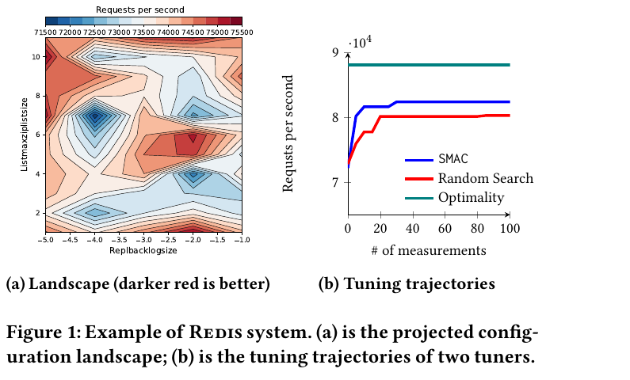

title: Glossary: SE for AI
icon: 📖
footer: This page is [designed to last](http://jeffhuang.com/designed_to_last/).

# A glossary of tiny lectures

## Every entry: 30 seconds to five minutes

#### By [Tim Menzies](https://timm.fyi), published 2026-08-22, updated 2026-08-22

**Summary:** *Terms from this subject, each written as a tiny
lecture: a hook, the idea, the math if any, then the code.
General theory comes first (Principles), then the weekly terms in
the order the course meets them, each week opening with its new
acronyms. Code samples are verbatim from
[ezr.lua](https://github.com/txt/seai26f/blob/main/src/ezr-lua/ezr.lua),
[ezr-lib.lua](https://github.com/txt/seai26f/blob/main/src/ezr-lua/ezr-lib.lua)
and
[101.py](https://github.com/txt/seai26f/blob/main/src/101.py).*

--- #principles

### Principles

---

General theory, before any specifics. New acronyms: SSOT.

-

**Mechanism-policy**: Separate the *what* (policy: small,
declarative, easy to change) from the *how* (mechanism: code that
obeys any policy). Then one mechanism serves a thousand policies.
Everywhere in this course:

| policy (a little data)              | mechanism (code)           |
|-------------------------------------|----------------------------|
| the doc string options text in 101.py | the regx that parses it  |
| row 1 of a csv (*Lbs-*, *Acc+* ...) | the csv reader, *Cols*, *heaven*, *disty* |
| keys of the *eg* demo table         | the *go()* dispatcher      |
| the settings table *the*            | every function reading it  |

Change the policy line, never the mechanism: a new dataset is a
new header row, not new code.

-

**SSOT (single source of truth)**: Say each fact once; derive
everything else. E.g. define the options ONCE, in a help string;
parse settings out of that string; then code and documentation
can never drift apart:

<pre>def settings(doc):   pat = r"--(\w+)\s+[^=\n]*=\s*(\S+)"   return o(**{k: thing(v) for k,v in re.findall(pat, doc)})  the = settings(__doc__)</pre>

Other SSOTs here: the README schedule (all dates), row 1 of a csv
(all column roles). SSOT is mechanism-policy's best friend: the
single source is the policy.

-

**Protocol (duck typing)**: A set of method names that many types
agree to answer, so callers need never ask which type they hold
("if it quacks like a duck..."). Duck typing with a contract. The
columnProtocol (week 1) is this course's main one; *dist* alone
is another (any object answering *dist* can sit in a cluster).

-

**Pareto frontier**: *"Give me the fruitful error any time, full
of seeds, bursting with its own corrections. You can keep your
sterile truth for yourself."* &mdash; Vilfredo Pareto.

With many goals there is rarely one best row
&mdash; lighter cars brake worse. Row *a* *dominates* *b* if *a*
is at least as good on every goal and better on one. The frontier
(the o's) is whatever nothing dominates:

<pre>y2 (less is better) | |      .            .          . |           .               .        . = dominated |   o             .     . |                .            . |      o               . |         o        .        . |            o          . |              o   o         . |                    o    o      o +---------------------------------------- y1 (less is better)</pre>

Report the frontier and let the customer pick their trade-off.

-

**Pareto evolve**: The classic way to find frontiers:
evolutionary search. Keep a population; rank rows by domination
(frontier = rank 1, peel it off, next frontier = rank 2, ...);
prefer low ranks, break ties by staying spread out; breed the
survivors; repeat. Three generations, each frontier pushing
closer to heaven at the origin:

<pre>y2 |  1               1 |     2                  1     1 = generation 1's frontier |  3     2                     2 = generation 2, bred from 1 |    3       2         1       3 = generation 3, bred from 2 |      3        2 |       3   3       2     1 |            3   3      2 +------------------------------ y1         each generation marches toward (0,0)</pre>

NSGA-II and SPEA2 (see the tool talks) are this loop with
different tie-breakers.

-

**Pareto eval (HV, Spread, GD, IGD)**: How good is a found
frontier? Four usual scores:

| metric | asks                                                    | want  |
|--------|---------------------------------------------------------|-------|
| HV     | hypervolume dominated (area behind the frontier, up to a reference point) | big   |
| Spread | how evenly your points cover the frontier               | small |
| GD     | mean gap from YOUR points to the true frontier (are you close?) | small |
| IGD    | mean gap from the TRUE frontier's points to yours (did you cover it all?) | small |

HV and Spread read off one picture &mdash; the colon region is
the hypervolume; the gaps between neighboring o's, scored for
evenness, are the Spread:

<pre>y2 | o::::::::::::R      R = reference point |    o::::::::::      : = hypervolume HV (bigger = better) | &lt;--&gt; o:::::::: |         o:::::      &lt;--&gt; = gaps between neighbors; | &lt;-----&gt;   o:::             Spread scores their evenness |             o:: +------------------- y1</pre>

GD and IGD are the same arrow, pointed opposite ways:

<pre>     x = TRUE frontier    o = your points y2 | x                  GD:  each o walks to its nearest x |   x   &lt;--- o            (how close are YOUR points?) |     x |  o ---&gt; x          IGD: each x walks to its nearest o |       x    x  &lt;--- o    (how much truth did you COVER? |                          one clump of o's scores well on +------------------- y1    GD but terribly on IGD)</pre>

Note the trap: HV, GD and IGD need the very thing search is
looking for (a reference point or the true frontier), so they are
research-report scores, not steering signals.

In software engineering the fix is the <b>reference optimum</b>:
we never know the true best (nobody has godlike knowledge of, say,
every compiler configuration), so "optimal" means best-seen-so-far.
For evaluation, pool the frontiers found by every algorithm in the
study into one combined <b>reference front</b>, and score each
algorithm by its gap (GD/IGD) to that. It is not truth &mdash; it
is the best anybody found &mdash; and it is the only frontier you
will ever actually have.

-

**Pareto zoom effect**: Across 100+ SE optimization tasks,
Pareto-optimal solutions are RARE (about 0.6% of configurations)
and CLUMPED &mdash; a tiny island, tight in decision space (85%
of datasets) and huddled near the ideal corner of objective space
(88% of datasets). Real example, the Redis configuration
landscape (from the PromiseTune paper): the dark-red good region
is a small fraction of a rugged space, and tuners that wander it
(SMAC, random search) plateau far below the optimum:

So frontier-chasing evolvers and global Bayesian methods spend
most of a small labelling budget wandering the huge ungood
region; a greedy regional search that zooms toward the island
wins or ties in 84-89% of cases, running 2-3 orders of magnitude
faster. The opposite of frontier reasoning is an *aggregation
function* &mdash; collapse all goals to one number and chase
that. *disty* (week 2) is this course's aggregation function:
zoom, don't wander.

@ [Ganguly & Menzies: Zoom, don't wander: Why regional search outperforms Pareto reasoning and global optimization in budget-constrained SBSE](https://arxiv.org/abs/2605.09658). Kishan Kumar Ganguly, Tim Menzies. arXiv:2605.09658, 2026.

@ [Chen & Chen: PromiseTune: Unveiling causally promising and explainable configuration tuning](https://arxiv.org/abs/2507.05995). Pengzhou Chen, Tao Chen. ICSE 2026. arXiv:2507.05995.

.

--- #week0

### Week 0: the port, warm-up

---

New acronyms: TDD, RNG, regx, pdf, cdf.

-

**TDD (test-driven development)**: Red, green, refactor: write a
failing test (red), write just enough code to pass (green), then
clean up with the tests as a safety net (refactor). This code's
dialect: every demo reseeds, prints, then asserts — no crash means
pass — and the harness never dies mid-suite. *run* traps a failing
demo and prints its stack dump, so *--all* can count failures and
keep going:

<pre>function run(funs,w,    ok,msg)   srand(the.seed)   if funs[w] then     ok, msg = xpcall(funs[w], debug.traceback)     if not ok then print(msg) end     return ok end end</pre>

The *eg* table is the whole test framework: demos are just
entries, so adding a test is one assignment, no registration
ceremony:

<pre>eg = {}                        -- the demo table  eg["--col"] = function(    n)  -- green: watch, then lock in   n = adds{1,2,3,4,5}   print(show{mu=n:mid(), sd=n:div()})   assert(n:mid() == 3) end  eg["--ent"] = function(    s)   s = adds({"a","a","b"}, Sym())   assert(abs(s:div() - 0.918) &lt; 0.01) end  eg["--broke"] = function()     -- red: prints a stack dump;   assert(2 + 2 == 5) end       -- --all counts it, moves on</pre>

But beware: test suites are code, with their own maintenance bill —
suites of 30 to 50 percent of total code size are not uncommon. So
be choosy. A test with zero assertions tests nothing: keep the
assert. Mere line coverage can mislead — touching a line is not
checking its meaning; prefer a few detailed checks on the code's
semantics over many shallow ones. And keep long-running tests out
of the suite: slow suites do not get run, and an unrun suite
protects nothing.

-

**Python slices**: *x[lo:hi]* is items *lo* to *hi-1*; blanks
mean "from the start" or "to the end"; negatives count from the
end:

<pre>x = [a, b, c, d, e]      0  1  2  3  4      &lt;- index     -5 -4 -3 -2 -1      &lt;- negative index  x[:2]  = [a, b]         x[2:]  = [c, d, e] x[-2:] = [d, e]         x[1:3] = [b, c] x[:]   = a copy of x</pre>

In 101.py: *s[:1]=="-"* (first char), *s[1:]* (the rest),
*a[2:]* (strip a leading "--").

-

**Python f-strings**: *f"..."* runs the braced parts as code;
after a colon comes a format spec, which may itself be computed:

| write                  | get                          |
|------------------------|------------------------------|
| f"{x:.0f}"             | x, zero decimals             |
| f"{x:.{the.round}f}"   | x, *the.round* decimals      |
| f":{k} {say(v)}"       | any expression allowed       |

That second row is why *--round=4* changes every number 101.py
prints: one policy value, one printing mechanism.

-

**Python doc strings**: A string as the first statement of a file
(or def) is stored, not executed: *__doc__*. 101.py's doc string
is its usage message (*-h* just prints it) AND its settings table
&mdash; *settings(__doc__)* regx-scrapes the defaults out of the
help text. One string: help, defaults, documentation. That is
SSOT and mechanism-policy in thirteen lines of Python.

-

**Python environ**: *os.environ* is a dict of the shell's
variables. Lets one default live outside the code, per machine:

<pre>MOOT = (os.environ.get("MOOT") or         os.path.expanduser("~/gits/moot"))</pre>

Set MOOT in your shell and 101.py finds your data; set nothing
and a sane default fires.

-

**Python argv**: *sys.argv* is the command line, split on spaces:
*argv[0]* the script name, the rest yours. 101.py walks it twice
&mdash; first pass updates settings from *--key=val*, second runs
any named tests:

<pre>for a in sys.argv[1:]:   if a[:2]=="--" and "=" in a:     k,v = a[2:].split("=",1)     if k in vars(the): setattr(the, k, thing(v)) for a in sys.argv[1:]:   if (n := "test_"+a) in funs:     random.seed(the.seed); funs[n]()</pre>

Note that last line; see RNG, next.

-

**RNG (random number generator)**: Computers do not roll dice.
An RNG is a deterministic formula that *looks* random; from the
same seed, the same stream, forever. This course uses the
Park-Miller minimal standard (one multiply, one modulo):

<pre>Seed = (16807 * Seed) % 2147483647</pre>

The point of need: RESET the seed before every run. Then every
experiment replays exactly &mdash; same seed, same "random"
numbers, same result &mdash; on your machine, your grader's, and
in Lua or Python alike (ports are graded by diff-ing the two
streams). 101.py does this before every test:

<pre>random.seed(the.seed); funs[n]()   # reset, then run</pre>

Forget the reset and your "bug" changes every run. Reset, and
science becomes repeatable.

-

**regx (regular expressions)**: Little languages for matching
text. Just enough for 101.py and the Lua at its side (Lua
patterns use "%" where Python uses "\", and "-" where Python
uses "*?"):

| means                    | python           | lua              |
|--------------------------|------------------|------------------|
| word char (letter/digit) | \w               | %w               |
| whitespace / non-space   | \s and \S        | %s and %S        |
| letter / lowercase       | [a-zA-Z]         | %a and %l        |
| any chars, lazy          | .*?              | .-               |
| start / end of string    | ^ and $          | ^ and $          |
| one char from a set      | [^=\n]           | [+-]             |
| capture a group          | ( )              | ( )              |
| all matches              | re.findall       | s:gmatch         |
| find / replace           | re.search, re.sub | s:find, s:gsub  |
| a literal dot            | \.               | %.               |

The two worked examples, one per language &mdash; 101.py scraping
its *--key ... = default* pairs from its doc string, ezr picking
a column's kind off its first letter:

<pre>pat = r"--(\w+)\s+[^=\n]*=\s*(\S+)"              # 101.py return (name:find"^%l" and Sym or Num)(name,at)  -- ezr.lua</pre>

-

**Gaussian (mean, second moment)**: The bell curve:

<pre>                *  *              *        *            *            *           *              *         *                  *      *                        * *  *                             *  * --------+-----------+-----------+----       mu-sd        mu         mu+sd          (68% of the data falls           within mu +/- 1*sd)</pre>

Summarized by two moments: the first moment &mu; (the mean,
*mu*) and, from the second moment, the spread (*m2* = sum of
squared deviations, so *sd = &radic;(m2/(n-1))*). Two tricks make
these course-critical: both update *incrementally*, one value at
a time (welford, week 1); and two summaries *subtract* without
resampling. From ezr-eg1's *--without* demo: pour {10,20,30}
into a summary of {1,2,3,4,5}, subtract a summary of {10,20,30},
and mu and sd of {1..5} come back exactly. Learn, unlearn, in
O(1) &mdash; no stored data (see stream, week 1).

-

**pdf (probability density function)**: The bell curve, or any
curve like it: the relative likelihood of each value. For a
normal with mean &mu; and deviation &sigma;, the likelihood of
*x* falls off as the square of its distance from the mean:

- f(x) = 1/(&sigma;&radic;(2&pi;)) &middot; e-(x-&mu;)&sup2;/(2&sigma;&sup2;)

This code never evaluates a pdf directly &mdash; only areas under
it matter, and those come from the cdf.

-

**cdf (cumulative distribution function)**: The fraction of a
population at or below a value: the area under the pdf up to
*x*. Monotone, 0..1 &mdash; which makes it a natural normalizer:
*norm* maps any cell to "what fraction of this column sits below
you?". The normal cdf has no closed form, so ezr uses a logistic
approximation (good to about &plusmn;1%), with the z-score
clamped to &plusmn;3:

- cdf(z) &approx; 1 / (1 + e-1.702z)

<pre>function NUM.norm(i,v,    z)   if v == "?" then return v end   z = (v - i.mu) / (i:div() + TINY)   return 1 / (1 + exp(-1.702 * max(-3, min(3, z)))) end</pre>

A bonus, for later: discretization rides on this for free. To
turn any number into a small bin id, take
*floor(the.bins &middot; num:norm(23))* &mdash; since norm is the
cdf, equal-width slices of 0..1 give (roughly) equal-frequency
bins of the data.

.

--- #week1

### Week 1: columns, streaming, forgetting

---

New acronyms: noir.

-

**noir**: Nominal, Ordinal, Interval, Ratio (Stevens 1946): the
four scales of measurement. This code collapses them to two:
symbols you can only count (nominal) and numbers you can subtract
(interval and up). One header letter decides which:

<pre>-- Column kind from the first letter: lowercase makes a SYM, -- uppercase a NUM. function Col(name,at)   return (name:find"^%l" and Sym or Num)(name,at) end</pre>

@ [Stevens: On the theory of scales of measurement](https://www.science.org/doi/10.1126/science.103.2684.677). S.S. Stevens. Science 103, 2684 (1946), 677-680.

-

**Num**: The summary of a numeric column: count *n*, mean *mu*,
and *m2* (the sum of squared deviations from the mean, from which
the standard deviation falls out). Nothing else is stored &mdash;
not the data, just three numbers. A trailing "-" in the name
means "goal: minimize".

<pre>function Num(name,at)   name = name or ""   return new(NUM, {at=at or 1, name=name, n=0, mu=0, m2=0,                    heaven = name:find"-$" and 0 or 1}) end</pre>

That last line, in Python, uses the True/False-is-1/0 trick
(bools ARE ints, so arithmetic on a test needs no if):

<pre>heaven = 1 - (name[-1] == "-")   # True==1, False==0</pre>

-

**Sym**: The summary of a symbolic column: count *n* and a table
of counts *has*. Again, no data kept &mdash; just the histogram.

<pre>function Sym(name,at)   return new(SYM, {at=at or 1, name=name or "", n=0, has={}}) end</pre>

-

**columnProtocol**: Num and Sym answer the same eight questions
&mdash; one polymorphic protocol, two implementations. Everything
downstream (tables, distance, trees, cuts) talks to the protocol,
never to the type:

| question | Num answers                  | Sym answers          |
|----------|------------------------------|----------------------|
| add      | welford update of mu, m2     | bump a count in *has* |
| sub      | welford, run backwards       | drop a count         |
| mid      | mean                         | mode                 |
| div      | standard deviation           | entropy              |
| norm     | cdf position, 0..1           | identity             |
| dist     | gap of normed values         | 0 if same else 1     |
| holds    | x &le; v                     | x == v               |
| reset    | zero mu, m2                  | empty *has*          |

Two samples, both sides of *add*. Note the shared conventions:
"?" (missing) is ignored on the way in, and *inc=-1* runs the
summary backwards (see stream):

<pre>function NUM.add(i,v,inc,    d)   if v == "?" then return v end   inc  = inc or 1   i.n  = i.n + inc   d    = v - i.mu   i.mu = i.mu + inc * d / i.n   i.m2 = i.m2 + inc * d * (v - i.mu); return v end  function SYM.add(i,v,inc)   if v == "?" then return v end   inc = inc or 1   i.n = i.n + inc   i.has[v] = inc + (i.has[v] or 0)   if i.has[v] &lt;= 0 then i.has[v] = nil end   return v end</pre>

-

**welford**: Welford's 1962 one-pass update: mean and variance
from a stream, no stored data, no catastrophic cancellation.
After each value *v*:

- n' = n+1
- d = v - &mu;
- &mu;' = &mu; + d/n'
- m2' = m2 + d(v - &mu;')

then *sd = &radic;(m2/(n-1))*. The NUM.add code above is exactly
these four lines. Run with *inc=-1* the algebra inverts, which is
what makes summaries subtractable.

@ [Welford: Note on a method for calculating corrected sums of squares and products](https://doi.org/10.1080/00401706.1962.10490022). B.P. Welford. Technometrics 4, 3 (1962), 419-420.

-

**stream**: A summary you can update &mdash; and un-update
&mdash; one datum at a time, in constant memory. The *inc*
argument (+1 or -1) means adding is O(1) and so is deleting, so
any add-and-forget sweep over *n* items runs in linear time.
Remember that: it matters later. Trees will score EVERY possible
split of a sorted column in one linear pass &mdash; adding each
row to the summary on one side of the cut while forgetting it
from the other &mdash; where naive rebuilding would cost
O(n&sup2;). It is also why *(a+b)-b == a* is a testable law
(*--without*, *--sub* in ezr-eg1).

<pre>function NUM.reset(i) i.n, i.mu, i.m2 = 0, 0, 0 end function SYM.reset(i) i.n, i.has = 0, {} end</pre>

-

**mid (mode, mean)**: The most frequent symbol: a Sym's answer to
*mid* ("what is typical here?"). The **mean is the same question
asked of numbers** &mdash; both are one value standing in for the
whole column. That is why *mid* is one protocol slot, not two
functions with different names:

<pre>function SYM.mid(i,    hi,out)   hi = -1   for k, n in pairs(i.has) do     if n &gt; hi then hi, out = n, k end end   return out end  function NUM.mid(i) return i.mu end</pre>

-

**diversity (entropy, standard deviation)**: Shannon 1948: the
spread of a symbol column, in bits &mdash; the mean surprise of
drawing from counts *pk = nk/n*:

- e = -&sum; pk log2 pk

All-same symbols: 0 bits. Uniform over *k* symbols:
log2 k bits. **Variance (or sd) is the same question
asked of numbers** &mdash; "how far is this column from settled?"
&mdash; which is why *div* ("diversity") is one protocol slot
with two spellings:

<pre>function SYM.div(i)   return sum(i.has, function(n,    p)     p = n / i.n     return -p * log(p) / log(2) end) end  function NUM.div(i)   return i.n &lt; 2 and 0 or sqrt(max(i.m2,0) / (i.n-1)) end</pre>

The two analogies are one design rule: every protocol slot names
a question; each type answers in its own dialect. Central
tendency: mean, mode. Diversity: sd, entropy. Trees built on
*div* therefore handle numeric and symbolic goals with the same
code.

@ [Shannon: A mathematical theory of communication](https://doi.org/10.1002/j.1538-7305.1948.tb01338.x). Claude Shannon. Bell System Technical J. 27 (1948), 379-423.

.

--- #week2

### Week 2: tables, distance, gap to heaven

---

New acronyms: none. New terms: Tbl, minkowski, distx, heaven,
disty.

-

**Tbl**: Rows, plus the column summaries those rows built. Row 1
of any source is the header, and the header alone decides each
column's kind (noir) and role: a trailing "!" is the class, "+"
or "-" a goal (a y column), "X" is ignored, the rest are the x
(independent) columns.

<pre>function Tbl(src)   src = iter(src)   return adds(src, new(TBL, {rows={}, mid=nil,                              cols=Cols(src())})) end  function Cols(names,    all,x,y,klass)   all, x, y = {}, {}, {}   for at, s in ipairs(names) do     all[at] = Col(s, at)     if s:find"!$" then klass = all[at]     elseif s:find"[+-]$" then y[#y+1] = all[at]     elseif s:sub(-1) ~= "X" then x[#x+1] = all[at] end end   return new(COLS, {names=names,all=all,x=x,y=y,klass=klass}) end</pre>

-

**minkowski**: Minkowski's p-norm, folding many per-column gaps
*gc* (each 0..1) into one 0..1 number:

- d = ( (1/n) &sum; gcp )1/p

p=1 is the Manhattan distance (all gaps count equally), p=2
Euclidean; as p grows, the largest single gap dominates. *the.p*
defaults to 2.

<pre>function minkowski(cols,f,    d,n)   d, n = 0, TINY   for _, c in ipairs(cols) do n, d = n+1, d + f(c) ^ the.p end   return (d / n) ^ (1 / the.p) end</pre>

Note the design: minkowski never touches the data. It takes a
function *f* and calls *f(c)* per column, on demand &mdash; a
higher-order, lazy style. Each caller passes its own little
lambda (distx measures row gaps, disty measures gaps to heaven),
and no intermediate list of gaps is ever built. The Python
analog is a generator expression, computing each term only as
it is summed:

<pre>d = (sum(f(c)**p for c in cols) / len(cols)) ** (1/p)</pre>

-

**distx**: The gap between two rows, over the x columns only:
each column measures its own 0..1 gap (*dist* in the
columnProtocol), and minkowski folds them. An unknown "?" assumes
the worst: symbols that might differ, do; a missing number is
pushed to whichever end is further away.

<pre>function SYM.dist(i,a,b)   if a == "?" and b == "?" then return 1 end   return a ~= b and 1 or 0 end  function NUM.dist(i,a,b)   if a == "?" and b == "?" then return 1 end   a, b = i:norm(a), i:norm(b)   if a == "?" then a = b &gt; 0.5 and 0 or 1 end   if b == "?" then b = a &gt; 0.5 and 0 or 1 end   return abs(a - b) end  function TBL.distx(i,row1,row2)   return minkowski(i.cols.x, function(c)            return c:dist(row1[c.at], row2[c.at]) end) end</pre>

-

**heaven**: The best value a goal column can hope for, in
normalized 0..1 space: 0 for a minimize goal (trailing "-"), 1
for a maximize goal (trailing "+"). Decided in one line, at
column birth:

<pre>heaven = name:find"-$" and 0 or 1</pre>

-

**disty**: The gap from a row's goals to heaven: each y column
measures |norm(v) - heaven|, and minkowski folds them. 0 = best
possible row, 1 = worst. No model, no weights, no training
&mdash; sort rows by disty and the best float to the top
(*--disty* in ezr-eg2). disty is an *aggregation function*, the
zooming rival to frontier-chasing (see the Pareto zoom effect,
above). Later weeks make disty the thing that costs money: it
reads the goal columns, and goals are labels.

<pre>function TBL.disty(i,row)   if i.model and row[i.cols.y[1].at] == "?" then     i:label(row) end   return minkowski(i.cols.y, function(y)            return abs(y:norm(row[y.at]) - y.heaven) end) end</pre>

.
