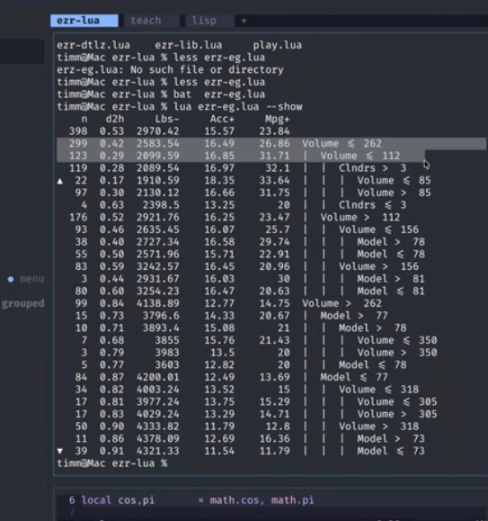

title: hello.md delta — notes for the next rewrite
icon: 📝

# hello.md delta

What the Aug 17 2026 lecture said that hello.md does not.
Source: Panopto transcript, compared against hello.md.
Fold these in next time hello.md is rewritten.

---

### New rat trick: active learning (label less, learn more)

Do not learn from all the data. Build a tiny model, then use it
to carefully select what to label next. This way we get to
ignore the uninformative, noisy, superfluous, redundant data —
which, in practice, is most of the data. Active learners build
competent models from just a handful of examples (the ~50 from
the maths below), even when exploring tens of thousands of
variables. In class this got a long riff (the used-car lot: X
values are free to see, Y values cost a test drive) that the
current "Pick your battles" section only hints at. Promote it to
a trick of its own.

---

### New rat trick: check the straw men

Always baseline the sophisticated thing against the dumbest
possible thing. "My career is my straw men": again and again the
simple baseline turns out to be good enough, and the ceremony of
the complex method was not worth it. Related to, but distinct
from, reuse-then-refactor: that trick shrinks code you keep;
this trick deletes methods you never needed.

---

### New SE rat trick: exploit the repeated structure of SE data

Why does simple keep winning on software data? Because software
is built to be maintained by someone else, so it is written in
expected patterns — it has nothing like the variability of
natural phenomena (for a truly natural process, go to the center
of the sun). Quote Prem on the naturalness hypothesis
([Hindle, Barr, Su, Gabel & Devanbu, CACM 2016](https://earlbarr.com/publications/naturalness_cacm.pdf)):

"Programming languages, in theory, are complex, flexible and
powerful, but, 'natural' programs, the ones that real people
actually write, are mostly simple and rather repetitive; thus
they have usefully predictable statistical properties that can
be captured in statistical language models and leveraged for
software engineering tasks."

---

### Intro additions

- The 1986 origin story: Australia, second AI winter, farm-herd
  profitability in dollars per square meter per day; experts
  running fingers down columns of abnormal runs; the
  runs-language whose output beat the experts who fed it their
  knowledge. Hooked ever since.
- Bainbridge, Ironies of Automation (1983): automate the easy
  parts and humans keep the hard residue plus a monitoring role
  they are cognitively bad at (~30 minutes of useful attention).
  Modern form: "Have you watched a Claude loop run? You are now
  a Bainbridge person."
- The junior-programmer pipeline: LLMs replace juniors, not
  seniors; ask any company how it will find seniors in ten years
  if nobody trains juniors — no answer. Train the reviewers, not
  the reviewed.
- Jevons paradox, the "even if you reject every bubble argument"
  closer: cheaper coal burned more coal; the new expressway is
  the new traffic jam; cheap AI ends up scarce.

---

### "Keep it simple, keep it stochastic" additions

- Random does not mean crazy: a random variable comes from a
  known distribution with a mean and a variance — structure you
  can exploit.
- PSO as a maintenance model: the particles never stop, so when
  the world changes the swarm re-converges. That is the
  interesting property, not the flocking.
- Augment with the surprise result: trees learned from ~50
  carefully selected examples, converted into a tree less than
  20 lines long, tame problems with thousands of columns and
  tens of thousands of rows.

---

### "Near enough" maths-section additions

- Reward-free RL made concrete: an autonomous car with a 20-year
  life must satisfy laws not yet written — that is why it costs
  10^15 samples.
- Best-arm made concrete: Las Vegas, one slot machine slightly
  biased; knowing the goal is what collapses 10^15 to ~10^4.
- Label cost made concrete: human experts label about ten
  examples an hour, then get called away; rush them and the
  labels rot.

---

### Meteorite-list additions

EU specifics beyond the AI Act link: moving data between France
and Germany is already a regulated act; Europe pulling back from
US clouds on the fear that Microsoft hands German data to the
American government.

---

### New section after the intro: a sampler of the methods

Show, do not promise. The live demo: `lua ezr-eg.lua --show` on
auto93 — 398 cars, baseline means on row one, best row marked
with an up-arrow, worst with a down-arrow, constraints
accumulating down the tree, each split holding half the data.
Then the 5,000-row configuration data set where 3 of 17 choices
control everything. "In 30 years of software analytics: a small
number of variables matter, and the rest can go to hell."
Screenshot saved at [tree-demo.png](tree-demo.png):

(This content lived in the retired l0.md; nothing on the current
site teaches how to read the tree.)

---

### Bookkeeping when rewriting

- "Four rat tricks" becomes seven (reuse/refactor; simple and
  stochastic; near enough; seams; + active learning; check the
  straw men; exploit SE structure). Fix the summary paragraph
  and the "here are four rat tricks" line.
- Separate note: in class the 491 project was described as a
  neurosymbolic coding task (combine symbolic and neural at a
  seam; few histograms; no report). uproj.md still says
  shrinking-code demos. Reconcile.
