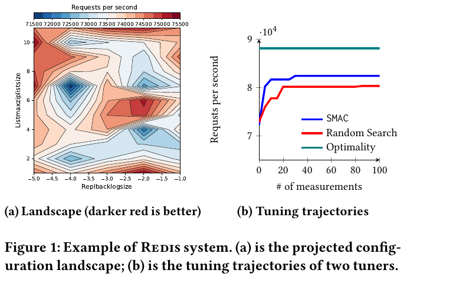
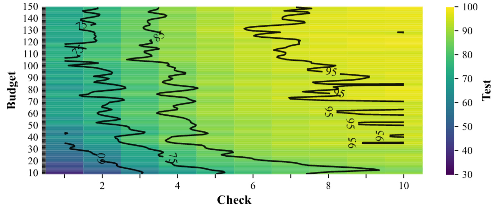

<p align="center">
  <a href="https://github.com/txt/seai26f/blob/main/README.md"></a>
  <a href="https://github.com/txt/seai26f/blob/main/docs/lect/policies.md"></a>
  <a href="#"></a>
  <a href="https://moodle-courses2527.wolfware.ncsu.edu/course/view.php?id=11951&bp=s"></a>
  <a href="https://moodle-courses2527.wolfware.ncsu.edu/course/view.php?id=13665&bp=sfroge"></a>
  <a href="https://ncsu.hosted.panopto.com/Panopto/Pages/Sessions/List.aspx#folderID=a8560b36-2071-4a70-8c3a-b4a4017e9ff5"></a>
  <a href="https://discord.gg/uQgTnGsfR"></a>
  <a href="https://github.com/txt/seai26f/blob/main/LICENSE.md"></a></p>
<h1 align="center">:cyclone: CSC491/591: SE for AI <br>NC State, Fall '26</h1>


# Glossary

Every entry is a tiny lecture — 30 seconds to five minutes: a
hook, the idea, the math if any, then the code. General theory
comes first (Principles), then the weekly terms in temporal
order, each week opening with its new acronyms. Code samples
are verbatim from
[ezr.lua](https://github.com/txt/seai26f/blob/main/src/ezr-lua/ezr.lua),
[ezr-lib.lua](https://github.com/txt/seai26f/blob/main/src/ezr-lua/ezr-lib.lua)
and
[101.py](https://github.com/txt/seai26f/blob/main/src/101.py).

## Principles

New acronyms: [SSOT](#ssot).

### mechanism-policy

Separate the *what* (policy: small, declarative, easy to change)
from the *how* (mechanism: code that obeys any policy). Then one
mechanism serves a thousand policies. Everywhere in this course:

| policy (a little data)              | mechanism (code)          |
| ----------------------------------- | ------------------------- |
| `__doc__` options text in 101.py    | the regx that parses it   |
| row 1 of a csv (`Lbs-`, `Acc+`...)  | the csv reader, `Cols`, `heaven`, `disty` |
| keys of the `eg` demo table         | the `go()` dispatcher     |
| `the` settings table                | every function reading it |

Change the policy line, never the mechanism: a new dataset is a
new header row, not new code.

<a name="ssot"></a>

### SSOT (single source of truth)

Say each fact once; derive everything else. E.g. define the
options ONCE, in a help string; parse settings out of that
string; then code and documentation can never drift apart:

```python
def settings(doc):
  pat = r"--(\w+)\s+[^=\n]*=\s*(\S+)"
  return o(**{k: thing(v) for k,v in re.findall(pat, doc)})

the = settings(__doc__)
```

Other SSOTs here: the README schedule (all dates), row 1 of a
csv (all column roles). SSOT is
[mechanism-policy](#mechanism-policy)'s best friend: the single
source is the policy.

<a name="ducktype"></a>

### protocol (duck typing)

A set of method names that many types agree to answer, so
callers need never ask which type they hold ("if it quacks like
a duck..."). Duck typing with a contract. The
[columnProtocol](#columnprotocol) is this course's main one;
`dist` alone is another (any object answering `dist` can sit in
a cluster).

### Pareto frontier

> "Give me the fruitful error any time, full of seeds, bursting
> with its own corrections. You can keep your sterile truth for
> yourself." — Vilfredo Pareto

With many goals there is rarely one best row — lighter cars
brake worse. Row `a` *dominates* `b` if `a` is at least as good
on every goal and better on one. The frontier (`o`) is whatever
nothing dominates:

```
y2 (less is better)
|
|      .            .          .
|           .               .        . = dominated
|   o             .     .
|                .            .
|      o               .
|         o        .        .
|            o          .
|              o   o         .
|                    o    o      o
+---------------------------------------- y1 (less is better)
```

Report the frontier and let the customer pick their trade-off.

### Pareto evolve

The classic way to find frontiers: evolutionary search. Keep a
population; rank rows by domination (frontier = rank 1, peel it
off, next frontier = rank 2, ...); prefer low ranks, break ties
by staying spread out; breed the survivors; repeat. Three
generations, each frontier pushing closer to heaven at the
origin:

```
y2
|  1               1
|     2                  1     1 = generation 1's frontier
|  3     2                     2 = generation 2, bred from 1
|    3       2         1       3 = generation 3, bred from 2
|      3        2
|       3   3       2     1
|            3   3      2
+------------------------------ y1
        each generation marches toward (0,0)
```

NSGA-II and SPEA2 (see the tool talks) are this loop with
different tie-breakers.

### Pareto eval (HV, Spread, GD, IGD)

How good is a found frontier? Four usual scores:

| metric | asks                                        | want |
| ------ | ------------------------------------------- | ---- |
| HV     | hypervolume dominated (area behind frontier, up to a reference point) | big  |
| Spread | how evenly your points cover the frontier   | small |
| GD     | mean gap from YOUR points to the true frontier (are you close?) | small |
| IGD    | mean gap from the TRUE frontier's points to yours (did you cover it all?) | small |

HV and Spread read off one picture — the colon region is the
hypervolume; the gaps between neighboring o's, scored for
evenness, are the Spread:

```
y2
| o::::::::::::R      R = reference point
|    o::::::::::      : = hypervolume HV (bigger = better)
| <--> o::::::::
|         o:::::      <--> = gaps between neighbors;
| <----->   o:::             Spread scores their evenness
|             o::
+------------------- y1
```

GD and IGD are the same arrow, pointed opposite ways:

```
     x = TRUE frontier    o = your points
y2
| x                  GD:  each o walks to its nearest x
|   x   <--- o            (how close are YOUR points?)
|     x
|  o ---> x          IGD: each x walks to its nearest o
|       x    x  <--- o    (how much truth did you COVER?
|                          one clump of o's scores well on
+------------------- y1    GD but terribly on IGD)
```

Note the trap: HV, GD and IGD need the very thing search is
looking for (a reference point or the true frontier), so they are
research-report scores, not steering signals.

In software engineering the fix is the **reference optimum**: we
never know the true best (nobody has godlike knowledge of, say,
every compiler configuration), so "optimal" means best-seen-so-far.
For evaluation, pool the frontiers found by every algorithm in the
study into one combined **reference front**, and score each
algorithm by its gap (GD/IGD) to that. It is not truth — it is the
best anybody found — and it is the only frontier you will ever
actually have.

### Pareto zoom effect

Ganguly & Menzies, ["Zoom, Don't Wander"
(2026)](https://arxiv.org/abs/2605.09658): across 100+ SE
optimization tasks, Pareto-optimal solutions are RARE (about
0.6% of configurations) and CLUMPED — a tiny island, tight in
decision space (85% of datasets) and huddled near the ideal
corner of objective space (88%). Real example, the Redis
configuration landscape (from
[PromiseTune](https://arxiv.org/abs/2507.05995), Chen & Chen,
ICSE 2026): the dark-red good region is a small fraction of a
rugged space, and tuners that wander it (SMAC, random search)
plateau far below the optimum:



So frontier-chasing evolvers and global Bayesian methods spend
most of a small labelling budget wandering the huge ungood
region; a greedy regional search that zooms toward the island
wins or ties in 84-89% of cases, running 2-3 orders of magnitude
faster. The opposite of frontier reasoning is an *aggregation
function* — collapse all goals to one number and chase that.
[disty](#disty) is this course's aggregation function: zoom,
don't wander.

### synonyms (one machine, many tasks)

<a name="synonyms"></a>
Data mining textbooks give a chapter each to classification,
regression, optimization, anomaly detection, planning,
explanation, privacy. Buse & Zimmermann (ICSE 2012, Fig 6) give
analytics nine boxes: trends, alerts, forecasting;
summarization, overlays, goals; modeling, benchmarking,
simulation. The claim of this course is that most of those boxes
are **synonyms** — different words for one machine, the
recursive cluster tree, plus a few lines each:

| box | what it is, once you hold a cluster tree |
|-----|------------------------------------------|
| classification | walk a new row to its leaf, report the leaf's mode |
| regression | same walk, report the leaf's mean |
| optimization | sort poles by y, recurse only into the better half ([sway](#sway-the-sampling-way)) |
| anomaly, alerts | leaf found, but the row sits far outside that leaf's spread ([certification envelope](#certification-envelope)) |
| benchmarking | anomaly detection with the reference population as the data: is this car yard near the good cluster? |
| forecasting, simulation | mutate rows the way you think the world will move ("three wheels, not four"), drop them back down the tree, see which leaf catches them |
| goals, overlays | *y = f(x)*: change x, re-drop, read the new y |
| summarization | read the tree — each leaf already names a group of similar rows |
| privacy | publish only the leaves' exemplars ([data collapse](#data-collapse)) |
| explanation | the tree IS the explanation ([XAI](#xai)) |

That table is a testable claim, not a slogan. **The Menzies
hypothesis**: if the architecture is right, coding skill *i+1*
needs less new code than skill *i*, so a plot of %-new-code per
step falls toward zero. The rival prediction, for a fresh LLM
asked each skill cold, with no instruction to reuse: a thousand
lines of new glue per skill, ten separate programs. That is
exactly the experiment the [ugrad
project](https://github.com/txt/seai26f/blob/main/docs/submit/uproj.md)
runs — and it is a real experiment, so the hypothesis can lose.

### cluster naming (knowledge acquisition)

<a name="clusternaming"></a>
Structure first, words second. Cluster with no y at all, then
take two far-apart leaves to a human oracle and ask one
question: *how do these differ?* The answers come back as
vocabulary ("these are cheap to run, those are quick off the
line") — so a handful of comparisons buys the names for the
whole tree. Be warned: unsupervised structure does not respect
our nouns. Sometimes a cluster is a real, repeatable group with
no name in anyone's language yet, and finding those is the point
rather than the bug.

### weak indicators

<a name="weakindicators"></a>
A heuristic is evidence, not truth. [fastmap](#fastmap) says
"these two rows are far apart" using two sweeps instead of n²
comparisons; it is usually right and sometimes wrong. The
discipline: never bet everything on one weak indicator — either
ask it more times, or act on it more gently.

Both moves show up in [sway](#sway-the-sampling-way): the
original (.5, 2) strategy trusts fastmap absolutely (throw away
half the data on the word of two labels), while the newer
(.66, 4) keeps two-thirds and spends four labels per level —
a gentler cull, steadied by more evidence. A large Monte Carlo
study preferred the hedged version. The same logic lets
[halve](#halve) pick poles from a 128-row sample: a weak
indicator read cheaply, many times, beats one expensive oracle.

### data collapse (prototypes, root-n columns)

<a name="data-collapse"></a>
Big data is mostly repetition. Models are built from evidence,
and evidence means many rows saying the same thing — so the rows
collapse to a few dozen **prototypes** (often a tenth, a
hundredth, of the data) with no loss to the model. Columns
collapse too: for any one target, only about $\sqrt{n}$ of $n$
columns carry the signal. Multiply the two collapses and the
useful part of a large table is a tiny corner of it.

This is the folk version of the **Johnson-Lindenstrauss lemma**:
$n$ dimensions can be mapped down to a far smaller $m$ while
distances change by only a small $\epsilon$ — which is why
clustering on a projection ([fastmap](#fastmap)) works at all.
It also runs in the world: the color of the wall behind you is
in your data and is not in your model, until you step onto a
highway and the speed of the thing behind you becomes the only
column that matters. Context decides which columns are live.

Two uses of the corner:

- **Privacy** (Peters' LACE): do not share the data, share the
  corner — the prototypes of the important columns. Everything
  removed is 100% private by construction, and the corner itself
  can be mutated within the structural rules that hold there,
  giving ~95% privacy over the ~1% you do release.
- **Reading a literature**: bibliometrics finds the same shape.
  In a field of $N$ researchers, about $\sqrt{N}$ produce the
  artifacts half the field uses. Do not read 1,000 papers; find
  the 30 that the rest are washing bottles for (see
  [knee](#knee)).

### certification envelope

<a name="certification-envelope"></a>
A learner asked about something it has never seen will answer
anyway, confidently, with nothing in its reply to say *this is
outside everything I was built from*. Clustering fixes that for
free. Each leaf knows the typical distance between its own rows.
Walk a new row down to its leaf and compare: close, answer
normally; far outside that leaf's spread, answer AND flash a red
light — *here is my guess, and here is why you should not
believe it.*

Why this matters. On 2003-02-01 the shuttle Columbia broke up on
re-entry, killing seven astronauts, because foam shed at launch
had punched a hole in the wing's leading edge. On orbit, NASA
asked a debris model called Crater how much damage such a strike
would do. Crater had been calibrated on projectiles of roughly
3 cubic inches. The foam that hit Columbia was estimated at
about 1,200 cubic inches — some 400 times outside the model's
evidence — and Crater answered anyway. An envelope check
("volume far beyond anything I was fitted on, do not use this
number") is a handful of lines around the model, and it was the
one line of output nobody had.

### knee

<a name="knee"></a>
Sort any "how much is enough" curve, draw the chord from its
first point to its last, and the **knee** is the point furthest
from that chord — the place where extra effort stops buying
much. Note the geometry: point-to-line distance, the same
arithmetic as [projection](#projection).

Standard use in this course: sort a literature search by
citation count and read only above the knee. One 249-paper
search kneed at 23 papers, all with 31+ citations — an evening's
reading instead of a semester's. Same trick on a learning curve
(how many labels before the score flattens?) or on sorted cut
scores (how many cuts are worth keeping?).

## Week 0: the port, warm-up

New acronyms: [TDD](#tdd-test-driven-development),
[RNG](#rng), [regx](#regx),
[pdf](#pdf-probability-density-function),
[cdf](#cdf-cumulative-distribution-function).

### TDD (test-driven development)

Red, green, refactor: write a failing test (red), write just
enough code to pass (green), then clean up with the tests as a
safety net (refactor). This code's dialect: every demo in the eg
files reseeds, prints, then asserts — no crash means pass — and
the harness never dies mid-suite. `run` traps a failing demo and
prints its stack dump, so `--all` can count failures and keep
going:

```lua
function run(funs,w,    ok,msg)
  srand(the.seed)
  if funs[w] then
    ok, msg = xpcall(funs[w], debug.traceback)
    if not ok then print(msg) end
    return ok end end
```

The eg table is the whole test framework: demos are just entries,
so adding a test is one assignment, no registration ceremony:

```lua
eg = {}                        -- the demo table

eg["--col"] = function(    n)  -- green: watch, then lock in
  n = adds{1,2,3,4,5}
  print(show{mu=n:mid(), sd=n:div()})
  assert(n:mid() == 3) end

eg["--ent"] = function(    s)
  s = adds({"a","a","b"}, Sym())
  assert(abs(s:div() - 0.918) < 0.01) end

eg["--broke"] = function()     -- red: prints a stack dump;
  assert(2 + 2 == 5) end       -- --all counts it, moves on
```

But beware: test suites are code, with their own maintenance
bill — suites of 30 to 50 percent of total code size are not
uncommon. So be choosy:

- A test with zero assertions tests nothing. Keep the assert.
- Mere line coverage can mislead: touching a line is not
  checking its meaning. Prefer a few detailed checks on the
  code's semantics over many shallow ones.
- Keep long-running tests out of the suite. Slow suites do not
  get run, and an unrun suite protects nothing.

### python slices

`x[lo:hi]` is items `lo` to `hi-1`; blanks mean "from the start"
or "to the end"; negatives count from the end:

```
x = [a, b, c, d, e]
     0  1  2  3  4      <- index
    -5 -4 -3 -2 -1      <- negative index

x[:2]  = [a, b]         x[2:]  = [c, d, e]
x[-2:] = [d, e]         x[1:3] = [b, c]
x[:]   = a copy of x
```

In 101.py: `s[:1]=="-"` (first char), `s[1:]` (the rest),
`a[2:]` (strip a leading `--`).

### python f-strings

`f"..."` runs the `{...}` parts as code; after a `:` comes a
format spec, which may itself be `{computed}`:

```python
f"{x:.0f}"           # x, zero decimals
f"{x:.{the.round}f}" # x, the.round decimals
f":{k} {say(v)}"     # any expression allowed
```

That second line is why `--round=4` changes every number 101.py
prints: one policy value, one printing mechanism.

### python docstrings (__doc__)

A string as the first statement of a file (or def) is stored,
not executed: `__doc__`. 101.py's docstring is its usage
message (`-h` just prints it) AND its settings table —
`settings(__doc__)` regx-scrapes the defaults out of the help
text. One string: help, defaults, documentation. That is
[SSOT](#ssot) and [mechanism-policy](#mechanism-policy) in
thirteen lines of Python.

### python environ

`os.environ` is a dict of the shell's variables. Lets one
default live outside the code, per machine:

```python
MOOT = (os.environ.get("MOOT") or
        os.path.expanduser("~/gits/moot"))
```

Set `MOOT=/somewhere` in your shell and 101.py finds your data;
set nothing and a sane default fires.

### python argv

`sys.argv` is the command line, split on spaces: `argv[0]` the
script name, the rest yours. 101.py walks it twice — first pass
updates settings from `--key=val`, second runs any named tests:

```python
for a in sys.argv[1:]:
  if a[:2]=="--" and "=" in a:
    k,v = a[2:].split("=",1)
    if k in vars(the): setattr(the, k, thing(v))
for a in sys.argv[1:]:
  if (n := "test_"+a) in funs:
    random.seed(the.seed); funs[n]()
```

Note that last line; see [RNG](#rng), next.

<a name="rng"></a>

### RNG (random number generator)

Computers do not roll dice. An RNG is a deterministic formula
that *looks* random; from the same seed, the same stream,
forever. This course uses the Park-Miller minimal standard (one
multiply, one modulo):

```lua
Seed = (16807 * Seed) % 2147483647
```

The point of need: RESET the seed before every run. Then every
experiment replays exactly — same seed, same "random" numbers,
same result — on your machine, your grader's, and in Lua or
Python alike (ports are graded by diff-ing the two streams).
101.py does this before every test:

```python
random.seed(the.seed); funs[n]()   # reset, then run
```

Forget the reset and your "bug" changes every run. Reset, and
science becomes repeatable.

### python reflection (self-registering tests)

How does a new demo join the command line? In Lua, by hand:
`eg["--tree"] = function() ... end`. Python can do the
registration itself, since `globals()` is just a dict of every
top-level name:

```python
def test_tree():
  "recursive contrast splits; leaves show row counts"
  show(tree(Tbl(csv(the.file))))

eg = {"-" + k[5:]: f for k, f in globals().items()
      if k.startswith("test_")}

def run(f): # reseed, call f, catch crashes
  seed(the.seed)
  try: f()
  except Exception: traceback.print_exc()

if __name__ == "__main__":
  for j, s in enumerate(sys.argv):
    if f := eg.get("-" + s.lstrip("-")): run(f)
    elif (k := s.lstrip("-")) in the:
      the[k] = atom(sys.argv[j + 1])
```

Four tricks, top to bottom:

1. **Self-registration.** The dict comprehension scans
   `globals()`, keeps every name starting `test_`, strips the
   prefix (`k[5:]`) and maps the flag `-tree` to the function
   itself. Write `def test_x` and `-x` exists; delete it and the
   flag is gone. [Mechanism-policy](#mechanism-policy) again:
   the policy is a naming convention, the mechanism two lines.
   And the docstring rides along as the flag's help text
   (`f.__doc__`).
2. **run() = reseed, then shield.** Reseed first, so every demo
   replays exactly (see [RNG](#rng)). Then `try/except`: a
   crashing demo prints its full stack (`traceback`) and the
   loop moves on, so one failure cannot hide the others.
3. **The `__main__` guard.** Dispatch fires only when this file
   is the script the user ran; importing it defines everything
   and runs nothing (Lua's `go(eg)` plays the same role).
4. **One pass over argv.** The walrus `:=` names a value inside
   the test (`if f := ...`). `lstrip("-")` accepts `-tree` or
   `--tree`. A flag naming a test runs it; a flag naming a
   settings key takes the NEXT argument (`sys.argv[j + 1]`),
   coerces it with `atom`, and updates `the`. Order matters:
   `python x.py -seed 42 -tree` resets the seed before the
   test fires.

<a name="regx"></a>

### regx (regular expressions)

Little languages for matching text. Just enough for 101.py and
the Lua at its side (Lua patterns use `%` where Python uses
`\`, and `-` where Python uses `*?`):

| means                    | python      | lua        |
| ------------------------ | ----------- | ---------- |
| word char (letter/digit) | `\w`        | `%w`       |
| whitespace / non-space   | `\s` `\S`   | `%s` `%S`  |
| letter / lowercase       | `[a-zA-Z]`  | `%a` `%l`  |
| any chars, lazy          | `.*?`       | `.-`       |
| start / end of string    | `^` `$`     | `^` `$`    |
| one char from a set      | `[^=\n]`    | `[+-]`     |
| capture a group          | `( )`       | `( )`      |
| all matches              | `re.findall`| `s:gmatch` |
| find / replace           | `re.search`, `re.sub` | `s:find`, `s:gsub` |
| a literal `.`            | `\.`        | `%.`       |

The two worked examples, one per language — 101.py scraping
`--key ... = default` pairs from its docstring, ezr picking a
column's kind off its first letter:

```python
pat = r"--(\w+)\s+[^=\n]*=\s*(\S+)"    # 101.py
```
```lua
return (name:find"^%l" and Sym or Num)(name,at)  -- ezr.lua
```

### gaussian (mean, second moment)

The bell curve:

```
                *  *
             *        *
           *            *
          *              *
        *                  *
     *                        *
*  *                             *  *
--------+-----------+-----------+----
      mu-sd        mu         mu+sd
         (68% of the data falls
          within mu +/- 1*sd)
```

Summarized by two moments: the first moment
$\mu$ (the mean, `mu`) and, from the second moment, the spread
(`m2` = sum of squared deviations, so $sd=\sqrt{m_2/(n-1)}$).
Two tricks make these course-critical: both update
*incrementally*, one value at a time ([welford](#welford)); and
two summaries *subtract* without resampling. From ezr-eg1's
`--without`: pour `{10,20,30}` into a summary of `{1,2,3,4,5}`,
subtract a summary of `{10,20,30}`, and mu and sd of `{1..5}`
come back exactly. Learn, unlearn, in O(1) — no stored data (see
[stream](#stream)).

<a name="pdf"></a>

### pdf (probability density function)

The bell curve, or any curve like it: the relative likelihood of
each value. For a normal with mean $\mu$ and deviation $\sigma$:

$$f(x) = \frac{1}{\sigma\sqrt{2\pi}}\;
e^{-\frac{(x-\mu)^2}{2\sigma^2}}$$

This code never evaluates a pdf directly — only areas under it
matter, and those come from the [cdf](#cdf). First met in
[a little maths](../attic/l0.md) (Lecture 0).

<a name="cdf"></a>

### cdf (cumulative distribution function)

The fraction of a population at or below a value: the area under
the [pdf](#pdf) up to $x$. Monotone, 0..1 — which makes it a
natural normalizer: `norm` maps any cell to "what fraction of
this column sits below you?". The normal cdf has no closed form,
so ezr uses a logistic approximation (good to about ±1%), with
the z-score clamped to ±3:

$$cdf(z) \approx \frac{1}{1 + e^{-1.702\,z}}$$

```lua
function NUM.norm(i,v,    z)
  if v == "?" then return v end
  z = (v - i.mu) / (i:div() + TINY)
  return 1 / (1 + exp(-1.702 * max(-3, min(3, z)))) end
```

A bonus, for later: discretization rides on this for free. To
turn any number into a small bin id, take
`floor(the.bins * num:norm(23))` — since norm is the cdf,
equal-width slices of 0..1 give (roughly) equal-frequency bins
of the data.

## Week 1: columns, streaming, forgetting

New acronyms: [noir](#noir).

### noir

Nominal, Ordinal, Interval, Ratio (Stevens 1946): the four scales
of measurement. This code collapses them to two: symbols you can
only count (nominal) and numbers you can subtract (interval and
up). One header letter decides which:

```lua
-- Column kind from the first letter: lowercase makes a SYM,
-- uppercase a NUM.
function Col(name,at)
  return (name:find"^%l" and Sym or Num)(name,at) end
```

### Num

The summary of a numeric column: count `n`, mean `mu`, and `m2`
(the sum of squared deviations from the mean, from which the
standard deviation falls out). Nothing else is stored — not the
data, just three numbers. A trailing `-` in the name means "goal:
minimize".

```lua
function Num(name,at)
  name = name or ""
  return new(NUM, {at=at or 1, name=name, n=0, mu=0, m2=0,
                   heaven = name:find"-$" and 0 or 1}) end
```

That last line, in Python, uses the True/False-is-1/0 trick
(bools ARE ints, so arithmetic on a test needs no if):

```python
heaven = 1 - (name[-1] == "-")   # True==1, False==0
```

### Sym

The summary of a symbolic column: count `n` and a table of counts
`has`. Again, no data kept — just the histogram.

```lua
function Sym(name,at)
  return new(SYM, {at=at or 1, name=name or "", n=0, has={}}) end
```

### columnProtocol

Num and Sym answer the same eight questions — one polymorphic
[protocol](#protocol-duck-typing), two implementations.
Everything downstream (tables, distance, trees, cuts) talks to
the protocol, never to the type:

| question | Num answers          | Sym answers        |
| -------- | -------------------- | ------------------ |
| `add`    | [welford](#welford) update of mu, m2 | bump a count in `has` |
| `sub`    | welford, run backwards | drop a count       |
| `mid`    | [mean](#mode)        | [mode](#mode)      |
| `div`    | [standard deviation](#entropy) | [entropy](#entropy) |
| `norm`   | [cdf](#cdf) position, 0..1 | identity     |
| `dist`   | gap of normed values | 0 if same else 1   |
| `holds`  | `x <= v`             | `x == v`           |
| `reset`  | zero mu, m2          | empty `has`        |

Two samples, both sides of `add`:

```lua
function NUM.add(i,v,inc,    d)
  if v == "?" then return v end
  inc  = inc or 1
  i.n  = i.n + inc
  d    = v - i.mu
  i.mu = i.mu + inc * d / i.n
  i.m2 = i.m2 + inc * d * (v - i.mu); return v end

function SYM.add(i,v,inc)
  if v == "?" then return v end
  inc = inc or 1
  i.n = i.n + inc
  i.has[v] = inc + (i.has[v] or 0)
  if i.has[v] <= 0 then i.has[v] = nil end
  return v end
```

Note the shared conventions: `"?"` (missing) is ignored on the way
in, and `inc=-1` runs the summary backwards (see
[stream](#stream)).

### welford

Welford's 1962 one-pass update: mean and variance from a stream,
no stored data, no catastrophic cancellation. After each value
$v$:

$$n' = n+1,\quad d = v - \mu,\quad \mu' = \mu + d/n',\quad
m_2' = m_2 + d\,(v - \mu')$$

then $sd = \sqrt{m_2/(n-1)}$. The `NUM.add` code above is exactly
these four lines. Run with `inc=-1` the algebra inverts, which is
what makes summaries subtractable.

### stream

A summary you can update — and un-update — one datum at a time,
in constant memory. The `inc` argument (+1 or -1) means adding
is O(1) and so is deleting, so any add-and-forget sweep over $n$
items runs in linear time. Remember that: it matters later.
Trees will score EVERY possible split of a sorted column in one
linear pass — adding each row to the summary on one side of the
cut while forgetting it from the other — where naive rebuilding
would cost $O(n^2)$. It is also why `(a+b)-b == a` is a testable
law (`--without`, `--sub` in ezr-eg1).

```lua
function NUM.reset(i) i.n, i.mu, i.m2 = 0, 0, 0 end
function SYM.reset(i) i.n, i.has = 0, {} end
```

<a name="mode"></a><a name="mean"></a>

### mid (mode, mean)

The most frequent symbol: a Sym's answer to `mid` ("what is
typical here?"). The **mean is the same question asked of
numbers** — both are one value standing in for the whole column.
That is why `mid` is one protocol slot, not two functions with
different names:

```lua
function SYM.mid(i,    hi,out)
  hi = -1
  for k, n in pairs(i.has) do
    if n > hi then hi, out = n, k end end
  return out end

function NUM.mid(i) return i.mu end
```

<a name="entropy"></a><a name="sd"></a>

### diversity (entropy, standard deviation)

Shannon 1948: the spread of a symbol column, in bits — the mean
surprise of drawing from counts $p_k = n_k/n$:

$$e = -\sum_k p_k \log_2 p_k$$

All-same symbols: 0 bits. Uniform over $k$ symbols: $\log_2 k$
bits. **Variance (or sd) is the same question asked of numbers**
— "how far is this column from settled?" — which is why `div`
("diversity") is one protocol slot with two spellings:

```lua
function SYM.div(i)
  return sum(i.has, function(n,    p)
    p = n / i.n
    return -p * log(p) / log(2) end) end

function NUM.div(i)
  return i.n < 2 and 0 or sqrt(max(i.m2,0) / (i.n-1)) end
```

The two analogies are one design rule: every protocol slot names
a question; each type answers in its own dialect. Central
tendency: mean, mode. Diversity: sd, entropy. Trees built on
`div` therefore handle numeric and symbolic goals with the same
code.

## Week 2: tables, distance, gap to heaven

New acronyms: none. New terms: [Tbl](#tbl),
[minkowski](#minkowski), [distx](#distx), [heaven](#heaven),
[disty](#disty).

### Tbl

Rows, plus the column summaries those rows built. Row 1 of any
source is the header, and the header alone decides each column's
kind ([noir](#noir)) and role: a trailing `!` is the class, `+`
or `-` a goal (a y column), `X` is ignored, the rest are the x
(independent) columns.

```lua
function Tbl(src)
  src = iter(src)
  return adds(src, new(TBL, {rows={}, mid=nil,
                             cols=Cols(src())})) end

function Cols(names,    all,x,y,klass)
  all, x, y = {}, {}, {}
  for at, s in ipairs(names) do
    all[at] = Col(s, at)
    if s:find"!$" then klass = all[at]
    elseif s:find"[+-]$" then y[#y+1] = all[at]
    elseif s:sub(-1) ~= "X" then x[#x+1] = all[at] end end
  return new(COLS, {names=names,all=all,x=x,y=y,klass=klass}) end
```

### minkowski

Minkowski's p-norm, folding many per-column gaps $g_c$ (each
0..1) into one 0..1 number:

$$d = \left(\frac{1}{n}\sum_c g_c^{\,p}\right)^{1/p}$$

$p=1$ is the Manhattan distance (all gaps count equally), $p=2$
Euclidean; as $p$ grows, the largest single gap dominates. `the.p`
defaults to 2.

```lua
function minkowski(cols,f,    d,n)
  d, n = 0, TINY
  for _, c in ipairs(cols) do n, d = n+1, d + f(c) ^ the.p end
  return (d / n) ^ (1 / the.p) end
```

Note the design: minkowski never touches the data. It takes a
function `f` and calls `f(c)` per column, on demand — a
higher-order, lazy style. Each caller passes its own little
lambda (distx measures row gaps, disty measures gaps to heaven),
and no intermediate list of gaps is ever built. The Python
analog is a generator expression, computing each term only as it
is summed:

```python
d = (sum(f(c)**p for c in cols) / len(cols)) ** (1/p)
```

### distx

The gap between two rows, over the x columns only: each column
measures its own 0..1 gap (`dist` in the
[columnProtocol](#columnprotocol)), and [minkowski](#minkowski)
folds them. An unknown `"?"` assumes the worst: symbols that
might differ, do; a missing number is pushed to whichever end is
further away. That rule has a name — the **Aha heuristic**, from
the instance-based learning literature: when ignorance is total,
assume maximum distance (Aha, Kibler & Albert, [Instance-based
learning algorithms](https://doi.org/10.1007/BF00153759),
Machine Learning 6, 1991).

```lua
function SYM.dist(i,a,b)
  if a == "?" and b == "?" then return 1 end
  return a ~= b and 1 or 0 end

function NUM.dist(i,a,b)
  if a == "?" and b == "?" then return 1 end
  a, b = i:norm(a), i:norm(b)
  if a == "?" then a = b > 0.5 and 0 or 1 end
  if b == "?" then b = a > 0.5 and 0 or 1 end
  return abs(a - b) end

function TBL.distx(i,row1,row2)
  return minkowski(i.cols.x, function(c)
           return c:dist(row1[c.at], row2[c.at]) end) end
```

### heaven

The best value a goal column can hope for, in normalized 0..1
space: 0 for a minimize goal (trailing `-`), 1 for a maximize
goal (trailing `+`). Decided in one line, at column birth:

```lua
heaven = name:find"-$" and 0 or 1
```

### disty

The gap from a row's goals to [heaven](#heaven): each y column
measures $|norm(v) - heaven|$, and [minkowski](#minkowski) folds
them. 0 = best possible row, 1 = worst. No model, no weights, no
training — sort rows by disty and the best float to the top
(`--disty` in ezr-eg2). disty is an *aggregation function*, the
zooming rival to frontier-chasing (see
[Pareto zoom effect](#pareto-zoom-effect)). Later weeks make
disty the thing that costs money: it reads the goal columns, and
goals are labels.

Why do labels cost? Because x and y columns have different
economics. The x columns are cheap observables; the y columns
are verdicts. Look at a used car: its color, cylinders and
weight are free at a glance, but its honest miles-per-gallon
needs a long test drive. Or: which degree you enrolled in is an
x, known today; whether it was the *right* degree is a y that
may take decades to label. In practice we are rich in x and poor
in y — which is why whole later weeks (active learning) are
about spending as few y's as possible.

```lua
function TBL.disty(i,row)
  if i.model and row[i.cols.y[1].at] == "?" then
    i:label(row) end
  return minkowski(i.cols.y, function(y)
           return abs(y:norm(row[y.at]) - y.heaven) end) end
```

## Week 3: clustering by poles

New acronyms: none.

### cluster

Learning without labels. Before anyone will pay for a single y
value, the x columns are already free — so group rows by
x-distance and structure appears: rows that sit together tend
to behave together. Clustering is how this code spends its
unlabelled riches. The classic answers (k-means and friends)
sweep the data many times chasing centroids; this code splits
once, on two rows.

### fastmap

How do you find the two most separated rows? The honest way
compares everything to everything: O(n²) distance calls. The
fastmap trick gets close for O(2n): pick any row at random; its
farthest neighbor is pole one; pole one's farthest neighbor is
pole two. Two sweeps, and you hold (roughly) the longest line
through the data. Note the disty line: after finding the poles,
ONE comparison sorts them so `lo` is always the pole nearer
heaven. That costs two labels — the only two this chapter
spends — and it means every split knows which side is the good
side. That thrift grows into active learning.

```lua
function TBL.poles(i,rows,lo,hi,    far,c)
  far = function(r,    t)
          t = keysort(rows, function(z) return i:distx(z, r) end)
          return t[#t] end
  lo = lo or far(rows[rand(#rows)])
  hi = hi or far(lo)
  if i:disty(lo) > i:disty(hi) then lo, hi = hi, lo end
  c = i:distx(lo, hi) + TINY
  return function(r) return (i:distx(lo,r)^2 + c*c
                              - i:distx(hi,r)^2) / (2*c) end,
         lo, hi end
```

See [Faloutsos & Lin, FastMap, SIGMOD 1995](https://doi.org/10.1145/223784.223812).

### projection

Where does a row *r* sit on the line between the poles? With
*a* = the gap from `lo` to *r*, *b* = the gap from `hi` to *r*,
and *c* = the gap between the poles, the cosine rule gives the
foot of the perpendicular:

$$x = (a^2 + c^2 - b^2) / (2c)$$

```
              r
             /|
          a / |     x = (a² + c² - b²) / (2c)
           /  |
          /   |          \ b
  lo ----+----+----------- hi
         x
         <------- c ------->
```

*x* near 0: the row sits with the good pole; near *c*: with the
bad one; outside 0..c: beyond the poles, which fastmap's
approximation happily allows. And `poles` returns not a number
but a FUNCTION — the geometry rides in a closure (glossary 2)
with `lo`, `hi` and `c`, ready to be a keysort key.

### halve

Project every row, sort by projection, cut at the median: two
halves, better half first. The key calls distx twice per row —
the slow-key situation — so keysort computes each projection
once.

Then note `some(rows, the.few)`: the poles come from a random
sample of 128 rows, not from all of them. That line is the
voice of experience. Early versions found poles over ALL the
remaining rows — and each `far` call is a full distance sweep,
so every split of every node paid O(n²)-ish distance work, at
every level of the recursion. Slow. Then came the experiment of
doing it on just a few rows — and the splits were as good as
anything the full sweep found. Which makes sense: two far-apart
rows in a random 128 are already close to the diameter of the
whole cloud, and the split only needs the poles to be far and
roughly opposed, not optimal. Moral, and it recurs all
semester: before optimizing the computation, check how little
of the data the computation actually needs.

```lua
function TBL.halve(i,rows,    fun,a,b,n)
  rows = rows or i.rows
  fun, a, b = i:poles(some(rows, the.few))
  rows = keysort(rows, fun)
  n = floor(#rows / 2)
  return a, b, slice(rows, 1, n), slice(rows, n + 1) end
```

### node

[halve](#halve) divides the data once. node divides the data,
then recurses on each half — and a tree falls out: each node
holds its rows (a fresh cloned table) and its two poles;
splitting stops below 2·`the.stop` rows. auto93's 398 rows, stop=32:
398 → 199 → ~100 → ~50, stop — three levels, eight leafs. A
binary chop through data space: no centroids, no k, no distance
matrix, two labels per split. To place a NEW row, walk down
toward whichever pole is nearer: log-many checks and the
stranger has an address.

```lua
function Node(tbl,rows,    recurse)
  function recurse(rows,    node,a,b,lo,hi)
    node = new(NODE, {here=tbl:clone(rows),
                      a=nil, b=nil, lo=nil, hi=nil})
    if #rows >= 2 * the.stop then
      a, b, lo, hi = tbl:halve(rows)
      node.a, node.b = a, b
      if #lo > 0 and #hi > 0 then
        node.lo, node.hi = recurse(lo), recurse(hi) end end
    return node
  end -- recurse
  return recurse(rows or tbl.rows) end

function NODE.leaf(i,row,    t)
  while i.lo do
    t = i.here
    i = t:distx(row, i.a) <= t:distx(row, i.b)
        and i.lo or i.hi end
  return i end
```

## Week 4: cuts, trees, XAI

New acronyms: XAI.

### cut

One test on one x column: numbers split at a threshold
(`x <= v`), symbols by equality (`x == v`) — the `holds` slot
of the [columnProtocol](#columnprotocol). A good cut leaves
each side more settled about y than the whole was. The craft is
scoring thousands of candidates, cheaply.

Two lines hold the whole of that difference — and note the
third rule hiding in both: an unknown cell says yes to
everything, so a `"?"` never loses a row. (Which is the
[Aha](#distx) doctrine again: with no information, assume the
answer that costs you least.)

```lua
function SYM.holds(i,x,v) return x == "?" or x == v  end

function NUM.holds(i,x,v) return x == "?" or x <= v  end
```

So one call site, `c:holds(row[c.at], v)`, sends a row left or
right without ever asking which kind of column it holds — and
that is why [divide](#tree), [TREE.leaf](#tree) and the cut
scorers are each one line shorter than they would otherwise be.

### expected value

The probability-weighted average: if value $f_i$ arrives with
probability $p_i$, on average you meet $E[f] = \sum p_i f_i$.
Split n rows into sides of $n_a$ and $n_b$; a random row lands
on side a with probability $n_a/n$, so the diversity a random
row lives with after the split is
$(div_a \cdot n_a + div_b \cdot n_b)/n$ — the expected
diversity. (Recall [diversity](#diversity): `div` is sd for a
Num, entropy for a Sym, 0 when a column has made up its mind —
one protocol slot, so nothing here asks which column kind it
holds.)

An intuition for entropy: it is the average cost of playing
twenty-questions against a column. Each yes/no question halves
the candidates, so a symbol filling fraction p of the bag is
cornered after $log_2(1/p)$ questions; you hunt things as often
as they occur, so the average effort per search is
$e = -\sum p\,log_2 p$. Check: {a,a,a,a} = 0 bits (search over
before it starts); a fair coin = 1 bit; {a,b,c,d} = 2 bits;
{a,a,a,b} ≈ 0.81 bits — skew is cheaper than fair, since mostly
you hunt the easy thing, which is exactly why entropy falls as
a column settles. So `val` reads as: the expected number of
questions still to ask about y after the cut. A good cut
pre-answers most of the search — pay one question at the
branch, save many at the leaves. Trees are search-effort
arbitrage.

### val

How good is a cut? Summarize y on each side, ask each summary
its diversity (`div`: sd or entropy), and weight by size — the
expected value of the diversity a random row lives with after
the split; lower is better.

```lua
function val(a,b)
  return (a:div()*a.n + b:div()*b.n) / (a.n + b.n + TINY) end
```

Note what this does NOT ask: whether y is numeric or symbolic.
Any summary answering `div` can play, so one tree does
regression, classification, and (via disty) optimization. See
[Quinlan, Induction of decision trees, 1986](https://doi.org/10.1007/BF00116251).

### least

Thousands of candidate cuts are coming, and no list of them
will ever be built: `least` returns a closure holding only the
best candidate seen. Call it with a candidate to offer one;
call it empty to read the winner. In SE-theory terms this is a
**visitor pattern**: a little visitor, handed to whoever walks
the data, memo-ing the best thing seen so far. The walker never
knows what the visitor collects; the visitor never knows the
walking order — open-closed, both ways. O(1) memory over any
number of candidates.

```lua
function least(    lo)
  return function(x)
    if x and (lo == nil or x[1] < lo[1]) then lo = x end
    return lo end end
```

### one-pass cuts

The dumb way first: a numeric column with n distinct values
offers n−1 cuts, and scoring one cut by building both side
summaries from scratch is a pass over all n rows — so scoring
every cut is O(n²). Fine at 398 rows; death at a million. Can
we do O(n)? Yes: sort the (x,y) pairs once, walk left to right
ADDING each y to a growing left summary — the right summary is
never built at all, it is `tot - here`, by the pool algebra
(NUM.__sub). Every cut scored in one linear pass; this is why
week 1 insisted summaries must subtract. Can we do O(m), m<n?
Also yes — gloss3's trick again: hand the machinery a small
random sample (`the.few` style) and it finds nearly the same
champion. Recurring moral, third appearance: before optimizing
the computation, ask how little of the data it actually needs.
Guards: cuts fall only between distinct sorted values, and
`big` refuses any cut leaving fewer than `the.leaf` rows on a
side.

```lua
function NUM.cuts(c,xy,tot,acc,best,    here)
  table.sort(xy, function(a,b) return a[1] < b[1] end)
  here = acc()
  for j,p in ipairs(xy) do
    here:add(p[2])
    if j < #xy and p[1] ~= xy[j+1][1] and big(j, #xy) then
      best{val(here, tot - here),c.at,p[1]} end end end
```

### tree

Take the champion cut (`bestcut` feeds every column's cuts to
one `least` reducer), divide rows into yes and no, recurse;
stop at `the.maxd` levels or when a side is small. Default Y is
disty, so the tree optimizes many goals at once — but hand it
any Y and accumulator and the same dozen lines classify or
regress. Predict for a new row by walking it to a leaf and
answering the leaf's mean (`TREE.leaf`).

### XAI

Explainable AI: an explanation is a model small enough to argue
with. A depth-four tree is a paragraph — "under these tests,
these rows; the best leaf is here" — and ezr's printer works
for arguability: one row per node, goal means in columns, best
leaf marked, better branch printed first. When the model is
small, the model IS the explanation, and a business user can
push back on any line of it. See
[Rudin 2019](https://doi.org/10.1038/s42256-019-0048-x).

Note what kind of answer a tree gives. Attribution methods
(SHAP, LIME and friends) rank columns: *tires are important*,
*the cap is important*, *tree is important*. A tree ranks
column-and-value together, because a branch is a test, not a
name: *bald* tires, the cap *turned through 180 degrees*, an
*oak* tree. The first kind tells you where to look; only the
second tells you what to do — and "what to do" is the whole
reason anyone asked. A test you can act on is worth more than an
importance score you can only nod at.

### sway (the sampling way)

*Not examinable — this entry marks the gap between here and
bleeding-edge research.*

After all the machinery above, optimization becomes almost
embarrassingly simple: halve the data, IGNORE the worse half,
recurse only into the better one. Since each split labels only
its two poles, reaching a good leaf costs about 2·log(n) labels
— call it a **(.5, 2) strategy**: keep half, spend two new
labels per level. That baseline, run against state-of-the-art
evolutionary optimizers on SE problems, proved hard to beat —
which raised awkward questions about how much of the fancy
machinery was ever needed. See
[Chen, Nair, Krishna & Menzies, TSE 2019](https://doi.org/10.1109/TSE.2018.2790925).

That first version is **sway1**: it takes fastmap at its word,
halves all the way down to one leaf, and stops. (There was a
sway2. It was a bad idea; nothing here descends from it.)

**sway3** is the current version, and it is [weak
indicators](#weakindicators) taken seriously — two changes:

- **(α, β) instead of (.5, 2)**: keep the top α of the pool and
  label β new rows per level. Gentler culls waste fewer good
  rows; more labels per level steady the poles. After a large
  Monte Carlo study, α=0.66 and β=4 won.
- **Restart**: the log-n chop hits a tiny leaf long before a
  budget of 50 labels is spent. So when the pool dries with
  budget left, start again from the root — but pick the poles
  only from the rows already labelled. Every restart inherits
  everything paid for so far.

Thus 1,000 columns and 100,000 rows, 50 labels, and still
representative examples at the end.

Where to read the code: ezr's own `acquire` (week 5) IS sway3
in Lua — see its settings `keepf=0.66` and `more=4` — and a
clean Python version lives in
[flair.py](https://github.com/timm/super/blob/main/flair.py):
`poles` (same fastmap, same cosine rule; with `ordering` on,
poles come only from the rows passed in, which sway2's restart
makes the labelled examples), `descend` (spend up to `the.more`
labels per level, sort by projection onto poles drawn from the
labelled rows, keep the `the.best` fraction — sway3's .66), and
`descends` (the sway2 restart: while budget remains and the
last descent labelled something new, go again from a fresh
shuffle, poles drawn from everything labelled so far):

```python
def poles(tbl, rows, y, ordering=False): # far pair in rows
  far = lambda r: max(rows, key=lambda x: distx(tbl, x, r))
  a = far(rows[0]); z = far(a)
  if ordering and y(z) < y(a): a, z = z, a
  c = distx(tbl, a, z) + 1/BIG
  return lambda r: (distx(tbl,a,r)**2 + c*c -
                    distx(tbl,z,r)**2)/(2*c)

def descend(tbl, rows, y, seen, cap, label, go=False):
  while len(rows) > the.stop and len(seen) < cap: # one descent
    todo, more = [], min(the.more, cap - len(seen))
    for r in rows:
      if id(r) in seen:
        todo += [seen[id(r)]]
      elif more > 0:
        more -= 1; go = True; seen[id(r)] = label(r)
        todo += [seen[id(r)]]
    rows = sorted(rows, key=poles(tbl, todo, y))
    rows = rows[:int(the.best*len(rows))]
  return go

def descends(tbl, rows, label=lambda row: row):
  seen = {}
  cap  = the.budget - the.check
  y    = lambda r: disty(tbl, r)
  while len(seen) < cap and \
        descend(tbl, shuffle(rows), y, seen, cap, label): pass
  return sorted(seen.values(), key=y)
```

## Week 5: active learning

New acronyms: none.

### active learning

<a name="active-learning"></a>
Until now every y value was free: the csv arrived with its
goals filled in. Drop that. Suppose one label costs a test
drive, a clinical trial, a week of CPU — and you get fifty,
ever. Active learning is the discipline of choosing WHICH rows
to label, using only the free x columns to choose, and counting
every label you spend. The counting is the science: a result
whose price is unknown says nothing.

### label

<a name="label"></a>
Where the money is spent. A row born with `"?"` goals stays
blank until someone asks; `label` calls the model, writes the
answers into the row, and folds each answer into its goal
column — so the summaries used for normalization sharpen as
spending grows. Note the seam: everything upstream just asks
for [disty](#disty), and never knows whether the number was
looked up or bought.

```lua
function TBL.label(i,row,    f)
  f = i.model(map(i.cols.x,
        function(c) return row[c.at] end), #i.cols.y)
  for j, y in ipairs(i.cols.y) do
    row[y.at] = y:add(f[j]) end
  return row end
```

### budget

<a name="budget"></a>
Four numbers run the economy: `budget=50` (labels, total),
`check=5` (labels held back to confirm the final pick),
`more=4` (labels per round) and `keepf=0.66` (fraction of the
pool kept per cull). Read them as a sentence: spend four
labels, throw away a third of what is left, repeat; keep five
in your pocket for the final exam. Any experiment that quietly
exceeds these is not measuring what it claims.

Where did those numbers come from? From a sweep: run the thing
at every (budget, check) pair and colour the result. Test score
(100 = the pool's best row) is the colour; the contours mark
75, 85 and 95:



Read the contours, not the colours: they run almost VERTICALLY.
That means the score depends mostly on `check` — the labels
spent confirming the top of the final ranking — and only weakly
on `budget`, the labels spent searching. Going from a budget of
30 to 150 (five times the money) barely moves the colour;
moving check from 1 to 5 crosses two contour lines, and the
yellow lives out past check 7. The cheap corner is bottom
right: a SMALL budget with a few more checks beats a large
budget with one.

Why? The search only has to get the right rows NEAR the top of
its ranking; the checks are what pick the winner out of that
shortlist. Pay for the sort, not for the search. And note the
shape of this lesson — it is [weak indicators](#weakindicators)
once more: the ranking is a cheap guess, so spend a little
confirming it rather than a lot perfecting it.

### acquire

<a name="acquire"></a>
One sweep of [sway3](#sway-the-sampling-way), in code. Label up
to `the.more` rows in the current pool, sort the pool by the
projection onto poles drawn from those labelled rows, keep the
best `the.keepf` of it, repeat until the pool is small or the
budget is gone. Nothing here builds a model; the geometry does
all the work, and the goals are only ever read for the few rows
we paid for.

```lua
function TBL.acquire(i,rows,cap,lab,lo,hi,
                     seen,more,new)
  seen = {}
  for _,r in ipairs(lab) do seen[r] = true end
  while #rows >= 2*the.leaf do
    more, new = min(the.more, cap - #lab), {}
    for _,r in ipairs(rows) do -- new = labels in this pool
      if seen[r] then push(new, r)
      elseif more > 0 then
        more, seen[r] = more - 1, true
        push(new, push(lab, r)) end end
    if #lab >= cap then return lab end -- budget spent
    rows = slice(keysort(rows, (i:poles(new, lo, hi))),
               1, max(1, floor(the.keepf * #rows))) end
  return lab end
```

### restart

<a name="restart"></a>
A log-n chop reaches a tiny pool long before fifty labels are
spent. So when the pool dries with budget left, reshuffle and
descend again — but anchored at `lo, hi`, the best and worst
rows labelled SO FAR. Every restart inherits everything paid
for to date, which is why the second descent is sharper than
the first. The loop stops when the budget is gone, or when a
whole sweep buys nothing new.

```lua
function TBL.acquirer(i,cap,    lab,lo,hi,t,b4)
  lab = {}
  while true do
    b4  = #lab
    lab = i:acquire(shuffle(i.rows), cap, lab, lo, hi)
    if #lab >= cap or #lab >= #i.rows or
       #lab == b4 then break end -- full, or no progress
    t = keysort(lab, i:Y())
    lo, hi = t[1], t[#t] end -- best+worst seen
  return keysort(lab, i:Y()) end
```

### holdout

<a name="holdout"></a>
The honesty check. Finding a good row among rows you have
studied proves nothing; the question is whether what you
learned TRANSFERS. So: split the rows in half, spend the budget
on the train half, grow a [tree](#tree) from those labels, use
that tree to rank the unseen test half, then spend the last
`the.check` labels confirming the top of that ranking. The
assert on line five is the whole ethic of the course — the
spend is counted before anything is scored.

```lua
function TBL.holdout(i,how,    rows,n,train,test,lab,t,top)
  how  = how or function(t2,cap) return t2:acquirer(cap) end
  rows = shuffle(i.rows)
  n    = floor(#rows/2)
  train= slice(rows, 1, n)
  test = slice(rows, n+1)
  lab  = how(i:clone(train), the.budget - the.check)
  assert(#lab + the.check <= the.budget) -- spend, counted
  t    = Tree(i, lab)
  top  = slice(keysort(test, function(r) return t:leaf(i, r) end),
           1, the.check)
  return keysort(top, i:Y())[1] end
```

One holdout is an anecdote; twenty of them are a distribution,
and the distribution is the result. Which raises next week's
question: when is one distribution really better than another?

## Week 6: statistics and ranking

New acronyms: KS (Kolmogorov-Smirnov).

### cohen

<a name="cohen"></a>
The mean gap, measured in pooled standard deviations. If two
bags differ by less than about a third of their own spread,
nobody will ever notice the difference in practice — so
`the` default is 0.35. This is an EFFECT SIZE, not a p-value:
it asks "how big" rather than "how surprising", which is the
right question when your sample size is whatever you could
afford.

```lua
function cohen(xs,ys,    x,y,n,m,sd)
  x, y = adds(xs), adds(ys)
  n, m = x.n, y.n
  sd = sqrt(((n-1)*x:div()^2 + (m-1)*y:div()^2)/(n+m-2))
  return abs(x.mu - y.mu) / (sd + TINY) end
```

### cliffs delta

<a name="cliffs"></a><a name="cliffs-delta"></a>
Forget the means; count the comparisons. Of all pairs (x,y),
how many have x above y, and how many below? The imbalance,
scaled to 0..1, is Cliff's delta, and the default threshold
(0.195) is the standard "small effect" line. Because it reads
only ranks, no outlier can drag it around — the complaint that
kills [cohen](#cohen) on skewed data.

```lua
function cliffs(xs,ys,    gt,lt,j,k)
  gt, lt, j, k = 0, 0, 0, 0
  for _, x in ipairs(xs) do
    while j < #ys and ys[j+1] <  x do j = j + 1; k = j end
    while k < #ys and ys[k+1] == x do k = k + 1 end
    gt = gt + j; lt = lt + #ys - k end
  return abs(gt - lt) / (#xs * #ys) end
```

### ks (Kolmogorov-Smirnov)

<a name="ks"></a>
Compare the SHAPES. Walk both [cdfs](#cdf) together, one
distinct value at a time, and record the widest vertical gap
between them. Divide by the critical value
$\sqrt{(n_x+n_y)/(n_x n_y)}$ and the answer reads as
"how many critical units apart" — above 1.36 means different
at the usual 5% line. Two bags can share a mean and a median
and still fail this test, because one is a lump and the other
is two humps.

```lua
function ks(xs,ys,    nx,ny,d,p,q,v)
  nx, ny  = #xs, #ys
  d, p, q = 0, 0, 0
  while p < nx and q < ny do
    v = min(xs[p+1], ys[q+1])
    while p < nx and xs[p+1] == v do p = p + 1 end
    while q < ny and ys[q+1] == v do q = q + 1 end
    d = max(d, abs(p / nx - q / ny)) end
  return d / ((nx + ny) / (nx * ny)) ^ 0.5 end
```

At 5%, this test cries wolf on about one comparison in twenty
even when both bags come from the same generator. That is not
a bug in the code; it is the price of the threshold, and it is
why one test alone should never decide anything.

### same

<a name="same"></a>
Three tests, three different questions — means, ranks, shapes.
Two samples count as the same only when all three agree, so a
method that fools one test still has to fool the others. Note
the ordering: `and` is lazy, so the cheapest test runs first
and usually decides.

```lua
function same(xsort,ysort,Cohen,Ks,Cliffs)
  return cohen( xsort,ysort) <= (Cohen  or .35)
     and cliffs(xsort,ysort) <= (Cliffs or .195)
     and ks(    xsort,ysort) <= (Ks     or 1.36) end
```

### ranks

<a name="ranks"></a>
The table a paper actually prints. Sort the treatments by
median, walk down the sorted list, and give a treatment a NEW
rank only when it is not [same](#same) as the one above it.
Ties therefore share a rank, and rank 0 is a SET of winners,
not a name. Reporting a single winner when four methods tie is
the most common statistical lie in this field.

```lua
function ranks(d,big,    mid,dd,sign,out,win,rank,best)
  mid = function(t) return t[floor(#t / 2) + 1] end
  dd  = {}; for k,v in pairs(d) do dd[k] = sorted(v) end
  sign = big and -1 or 1
  out, win, rank, best = {}, {}, -1, nil
  for _, k in ipairs(keysort(keys(dd),
                function(k) return sign * mid(dd[k]) end)) do
    if best == nil or not same(dd[best], dd[k]) then
      rank, best = rank + 1, k end
    if rank == 0 then win[1+#win] = k end
    out[k] = rank end
  return {winners=win, ranks=out} end
```

### dominates

<a name="dominates"></a>
Comparing rows, not samples — and with no weights anywhere in
it. Row *a* dominates *b* when *a* is no worse on every goal
and better on at least one. That is the honest multi-goal
comparison, and its honesty is also its weakness: most pairs
are incomparable (better here, worse there), so domination
often refuses to speak. Hence [disty](#disty), which buys a
total order with one assumption (all goals weigh the same).

```lua
function TBL.dominates(i,r1,r2,    d1,d2,better,worse)
  if i.model then i:disty(r1); i:disty(r2) end
  better, worse = false, false
  for _,y in ipairs(i.cols.y) do
    d1 = abs(y:norm(r1[y.at]) - y.heaven)
    d2 = abs(y:norm(r2[y.at]) - y.heaven)
    if d1 < d2 then better = true end
    if d1 > d2 then worse  = true end end
  return better and not worse end
```

### front

<a name="front"></a>
The rows nothing dominates: the [Pareto frontier](#pareto-frontier)
of whatever sample you hold. Two facts about real fronts, both
visible in `ezr-eg6.lua --fronts`: they are small (a handful of
64 rows), and their mean disty is far better than everything
else — which is why the one-number shortcut usually lands in
about the right place. Remember the [Pareto zoom
effect](#pareto-zoom-effect): the good region is rare and
clumped, so zooming beats wandering.

### wins

<a name="wins"></a>
A score a stranger can read. Label the whole pool (cheating,
but this is scoring, not searching), then rescale: 100 = the
best row in the pool, 0 = the median row, negative = worse than
doing nothing. Reporting raw disty invites "is 0.31 good?";
reporting wins answers it.

```lua
function TBL.wins(i,rows,    ys,lo,b4)
  ys = sorted(map(rows or i.rows, i:Y()))
  lo, b4 = ys[1], ys[floor(#ys/2)+1]
  return function(r)
    return max(-100, min(100,
      100*(1 - (i:disty(r)-lo) / (b4-lo+TINY)))) end end
```

## Week 7: applications

New acronyms: knn, NB (naive Bayes), kpp (k-means++).

### knn

<a name="knn"></a>
The Fortune Teller. To guess a row's goals, sort everything by
distance to it and average the goals of the nearest `the.k`.
Nothing is fitted; the neighbours ARE the model. It is also the
cheapest possible regression — and on auto93 it beats guessing
the global mean by about four times.

```lua
function TBL.knn(i,row,k,    t)
  t = i:around(row)
  return adds(map(slice(t, 1, k or the.k), i:Y())).mu end
```

### anomaly detection

<a name="anomaly-detection"></a>
The Bouncer. Loneliness is the whole test: how far is the
nearest OTHER row? Score every row that way, normalize to
0..1, and 1 is the loneliest thing in the data. Wrap this
around any learner and you have the
[certification envelope](#certification-envelope): the guess,
plus a red light when the question is unlike anything the
model was built from. The same code, pointed at a reference
population instead of your own history, is BENCHMARKING — is
this car yard near the good cluster, or far from every
cluster? ([synonyms](#synonyms), again.)

```lua
function TBL.anomaly(i,    dn,gap)
  gap = function(r,    lo,d)
    lo = 1e32
    for _,z in ipairs(i.rows) do
      if z ~= r then
        d = i:distx(r, z); if d < lo then lo = d end end end
    return lo end
  dn = Num()
  for _,r in ipairs(i.rows) do dn:add(gap(r)) end
  return function(r) return dn:norm(gap(r)) end end
```

### naive bayes

<a name="naive-bayes"></a>
The ER Nurse: sort arrivals into classes, fast, one row at a
time. Each class keeps its own column summaries; the score for
a row is the log of the class prior plus the logs of
P(value | column), summed over the x columns. "Naive" means
the columns are assumed independent — plainly false, and it
wins anyway, because a wrong-but-consistent bias still ranks
the classes correctly. Note the protocol at work: symbols get
an m-estimate, numbers get a gaussian pdf, and `likes` never
asks which is which.

```lua
function like(col,v,prior,    z)
  if not col.mu then
    return ((col.has[v] or 0) + the.L*prior)
           / (col.n + the.L) end
  z = 2 * col:div()^2 + 1e-32
  return exp(-(v - col.mu)^2 / z) / (pi * z)^0.5 end
```

The rig is test-then-train: every row is GUESSED before it is
learned, so the accuracy needs no held-out split and the model
is always as current as the last row seen.

```lua
function TBL.classify(i,wait,    at,h,seen,nh,want)
  wait, at = wait or the.wait, i.cols.klass.at
  h, seen, nh = {}, {}, 0
  for j,row in ipairs(i.rows) do
    want = row[at]
    if j >= wait and nh > 0 then
      push(seen, {mostlikes(h, row, #i.rows, nh), want}) end
    if not h[want] then h[want] = i:clone(); nh = nh + 1 end
    h[want]:add(row) end
  return seen end
```

### kmeans

<a name="kmeans"></a>
The Curator, textbook edition: pick k centroids, assign every
row to its nearest, move each centroid to the middle of what it
caught, repeat. Compare with week 3's [node](#node): kmeans
needs k, needs a full pass per iteration, and needs a distance
to every centroid — while node splits on two rows and gives you
an index for free. Both cluster; they do not cost the same.

```lua
function TBL.kmeans(i,k,iter,    cents)
  cents = some(i.rows, k or the.kluster)
  for _ = 1, iter or the.iter do
    cents = recentre(assign(i, cents)) end
  return assign(i, cents) end
```

### kpp

<a name="kpp"></a>
k-means++: start the centroids far apart, or kmeans starts in a
corner and stays there. Each new centre is drawn with a chance
proportional to its SQUARED distance from the centres chosen so
far — random, but biased toward the empty regions. Week 3's
poles made the same bet with two rows and no randomness.

```lua
function TBL.kpp(i,k,    cents,pool,ws)
  cents = {some(i.rows, 1)[1]}
  while #cents < (k or the.kluster) do
    pool = some(i.rows, min(the.few, #i.rows))
    ws   = map(pool, function(r) return d2(i, cents, r) end)
    push(cents, pool[wpick(ws)]) end
  return cents end
```

## Week 8: optimizers

New acronyms: GA (genetic algorithm), DE (differential
evolution), SA (simulated annealing).

### snap and guess

<a name="snap"></a>
The classic optimizers invent new x values, so their offspring
have no goals at all. Rather than call the model for every
mutant, this code SNAPS a mutant to the nearest real row and
grades it by that neighbour's disty. That is a lie with a
purpose: it keeps the comparison fair (every method scores
against the same pool) and it keeps the demos fast. Homework
asks where the lie leaks.

```lua
function TBL.guess(i,row)
  return i:disty(i:snap(row)) end
```

### mutate

<a name="mutate"></a>
Copy a row, re-pick a few x cells: symbols by frequency (rare
values stay rare), numbers by a gaussian step of one standard
deviation, clamped to ±3sd. Mutation is where every
population method gets its new ideas, and the clamp is what
stops those ideas leaving the world the data came from.

```lua
function pick(col,v,    sd)
  if col.has then return wkey(col.has) end
  v  = v ~= "?" and v or col.mu
  sd = col:div()
  return max(col.mu - 3*sd,
             min(col.mu + 3*sd, v + sd * gauss())) end
```

### ga (genetic algorithm)

<a name="ga"></a>
Darwin in twelve lines. Keep a population; to make each kid,
pick two parents by a domination tournament, cut-and-splice
them, then mutate. Repeat for `the.gens` generations and
return the best of the final population. Everything expensive
lives in the fitness call, which is why a GA is a fine idea
when the model is cheap and a terrible one when each label
costs a week.

```lua
function TBL.ga(i,    pop,kids)
  pop = slice(shuffle(i.rows), 1, the.np)
  for _ = 1, the.gens do
    kids = {}
    for _ = 1, the.np do
      push(kids, i:mutate(cross(i, tourn(i, pop),
                                    tourn(i, pop)))) end
    pop = kids end
  return i:snap(keysort(pop, function(r)
                          return i:guess(r) end)[1]) end
```

### de (differential evolution)

<a name="de"></a>
The population IS the step size. A kid is
$a + F\,(b - c)$ for three random members — so while the
population is spread out the jumps are long, and as it
converges they shrink automatically, with no cooling schedule
to tune. A kid replaces its parent only if it is better.
Across this course's races, DE is the classic that keeps
winning.

```lua
function TBL.de(i,    pop,es,t,kid,d,at)
  pop = slice(shuffle(i.rows), 1, the.np)
  es  = map(pop, function(r) return i:guess(r) end)
  for _ = 1, the.gens do
    for j = 1, #pop do
      t   = some(pop, 3)
      kid = i:extrapolate(t[1], t[2], t[3])
      d   = i:guess(kid)
      if d < es[j] then pop[j], es[j] = kid, d end end end
  at = 1
  for j = 2, #es do if es[j] < es[at] then at = j end end
  return i:snap(pop[at]) end
```

### local search

<a name="local-search"></a>
The (1+1) loop, stripped to nothing: mutate the current
solution, accept the mutant if the acceptance rule says so,
and remember the best ever seen. `ls` accepts only
improvements — fast, and stuck in the first valley it finds.

```lua
local function climb(i,accept,    s,e,b,eb,kid,d)
  s = i.rows[rand(#i.rows)]
  e = i:guess(s)
  b, eb = s, e
  for h = 1, the.budget1 do
    kid = i:mutate(s)
    d   = i:guess(kid)
    if d < eb then b, eb = kid, d end
    if accept(e, d, h) then s, e = kid, d end end
  return i:snap(b) end
```

### sa (simulated annealing)

<a name="sa"></a>
The same loop with one different line: accept a WORSE mutant
with probability $e^{-\Delta/T}$, where the temperature T falls
as the budget burns. Early on it wanders (escaping local
valleys); late on it only improves. One rule, two behaviours,
zero extra machinery — which is why annealing is still the
best first thing to try on a strange problem.

```lua
function TBL.sa(i)
  return climb(i, function(e,d,h)
    return d < e or rand() < exp((e - d) /
      (1 - h/the.budget1 + 1e-32)) end) end
```

### race

<a name="race"></a>
The drag race: every optimizer, several repeats, plus a
best-of-`np` random baseline (`any`) that exists to embarrass
anyone whose clever method cannot beat a lucky dip. Results go
straight into [ranks](#ranks), so the output is a rank table,
not a champion. Always race against `any`; papers that do not
are how the field wastes decades.

```lua
function TBL.race(i,repeats,    d)
  d = {ga={}, de={}, sa={}, ls={}, any={}}
  for _ = 1, repeats or the.repeats do
    push(d.ga,  i:disty(i:ga()))
    push(d.de,  i:disty(i:de()))
    push(d.sa,  i:disty(i:sa()))
    push(d.ls,  i:disty(i:ls()))
    push(d.any, i:disty(
      keysort(some(i.rows, the.np), i:Y())[1])) end
  return d, ranks(d) end
```

## Week 9: models and the seam

New acronyms: DTLZ (Deb-Thiele-Laumanns-Zitzler test suite).

### model seam

<a name="model-seam"></a>
Everything so far read goals from a csv. The seam swaps that
for a FUNCTION: set `t.model` and rows may be born with `"?"`
goals, which [label](#label) fills in on demand. Nothing
upstream changes — trees, acquire, holdout, the optimizers all
keep asking [disty](#disty) — which is the point of a seam.
This is where outsiders plug in their own (maybe very
expensive) simulator.

```lua
function Dtlz(    u,r)
  u = {names()}
  for _ = 1, the.pool do
    r = {}
    for _ = 1, the.Nx do push(r, rand()) end
    for _ = 1, the.M  do push(r, "?") end
    push(u, r) end
  u = Tbl(u)
  u.model = _ENV[the.model]
  return u end
```

### dtlz

<a name="dtlz"></a>
The standard multi-objective test problems (Deb, Thiele,
Laumanns & Zitzler, 2002): x lives in $[0,1]^{N_x}$, the
objectives have a KNOWN true front, and the difficulty is
dialable. The last $N_x-M+1$ variables set DISTANCE from the
front (make them zero and you are on it); the first $M-1$ set
POSITION along it. dtlz1's front is the plane $\sum f = 0.5$,
approached across a landscape full of local traps; dtlz2's is
the unit sphere $\sum f^2 = 1$; dtlz7's comes in disconnected
pieces. Because the answer is known, a search can be graded
exactly — which is what makes these problems the field's
measuring stick.

```lua
function dtlz1(x,M,    g,f,v)
  g, f = g1(slice(x, M)), {}
  for i = 0, M-1 do
    v = 0.5 * (1 + g)
    for j = 1, M-1-i do v = v * x[j] end
    if i > 0 then v = v * (1 - x[M-i]) end
    push(f, v) end
  return f end
```

### lazy labels (the sharpening ruler)

<a name="lazy-labels"></a>
A subtle consequence of buying goals one at a time: `disty`
normalizes each goal against the column summary, and that
summary only knows the labels bought so far. So the SAME row
can score differently early and late — the ruler sharpens as
spending grows. This is a feature, not a bug: with five labels
you do not know the range of the world, and pretending
otherwise is how leakage sneaks in. It also means any reported
score must say how many labels were in hand when it was taken.

### baseline

<a name="baseline"></a>
What does doing nothing get you? `baseline` calls the model on
every row and reports each goal's mean — deliberately NOT
folding those calls into the column summaries, so the baseline
never sharpens the ruler it is measured against. Every claim in
this course is "better than X"; `baseline` is the cheapest
honest X.

```lua
function TBL.baseline(i,    nums,f)
  nums = map(i.cols.y, function() return Num() end)
  for _,r in ipairs(i.rows) do
    f = i.model(map(i.cols.x,
          function(c) return r[c.at] end), #i.cols.y)
    for j,v in ipairs(f) do nums[j]:add(v) end end
  return map(nums, "mid") end
```

### pure vs generalize

<a name="pure-vs-generalize"></a>
Two ways to report the same search. PURE (`--pure`): spend the
budget over the whole pool and report the best row found — the
right number when you own every row and just want the best one
(config tuning, say). GENERALIZE (`--generalize`): spend on
half, then pick from the half never seen — the right number
when tomorrow's rows are not today's. Pure scores flatter.
Say which one you ran; papers that do not are hiding the
difference.

### the price of a label

<a name="price"></a>
The week's punchline, from `ezr-eg8.lua --race` on a 200-row
DTLZ2 pool: the four classic optimizers between them buy
around 200 labels — effectively the whole pool — while
[acquire](#acquire) buys 45 and lands at the same place or
better. Neither result says the classics are bad; they say the
classics were designed for cheap models. The question to carry
into any project is not "which optimizer is best" but "what
does one evaluation cost here, and how many can I afford?"
